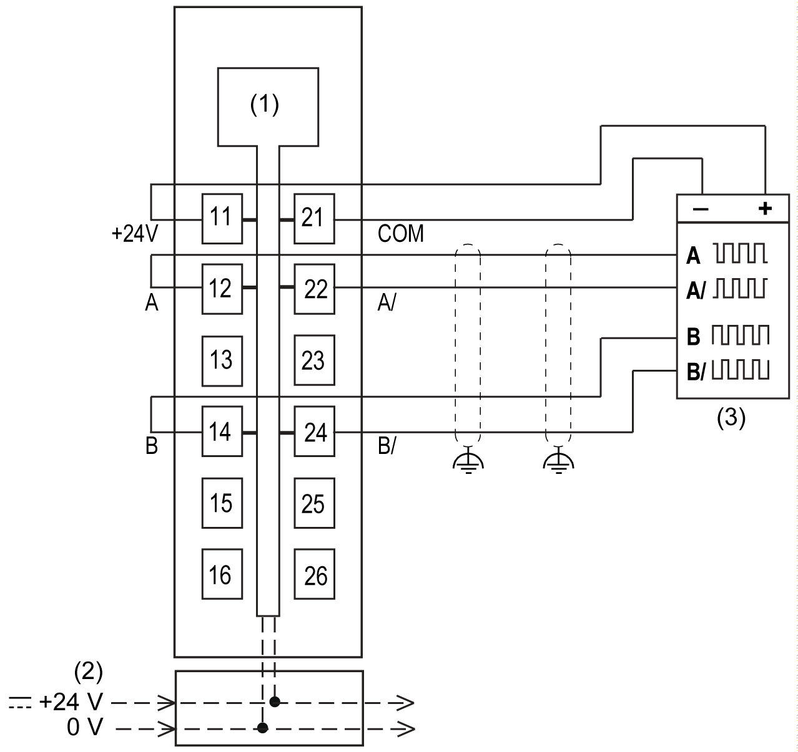

# TM5SDC1FS Wiring

## Pin Assignments / Connection Example

The following figure presents a connection example for the TM5SDC1FS:

**1** Internal electronics

**2** 24 Vdc I/O power segment integrated into the bus bases

**3** 4-channel sensor with internal power supply

| WARNING | |
| --- | --- |
|  | UNINTENDED EQUIPMENT OPERATION  Do not connect wires to unused terminals and/or terminals indicated as “No Connection (N.C.)”.  Failure to follow these instructions can result in death, serious injury, or equipment damage. |

| WARNING | |
| --- | --- |
|  | UNINTENDED EQUIPMENT OPERATION  Use the sensor and actuator power supply only for supplying power to sensors or actuators connected to the module.  Failure to follow these instructions can result in death, serious injury, or equipment damage. |

EIO0000000861.10