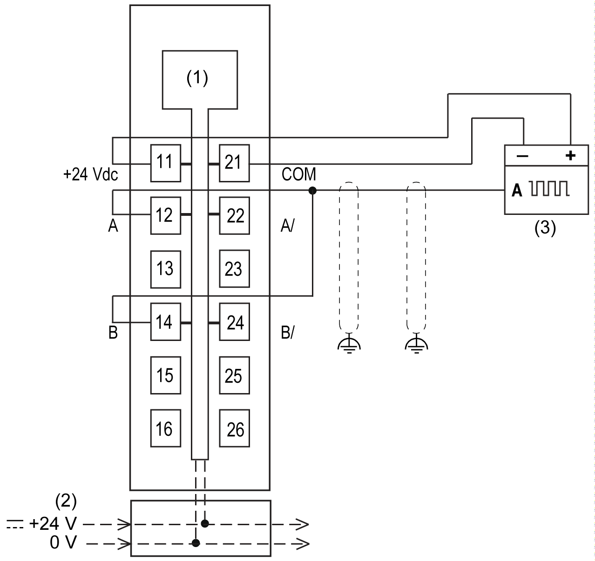
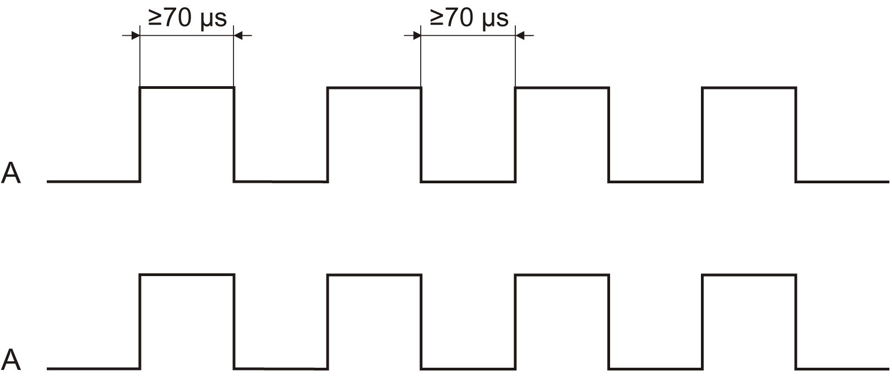
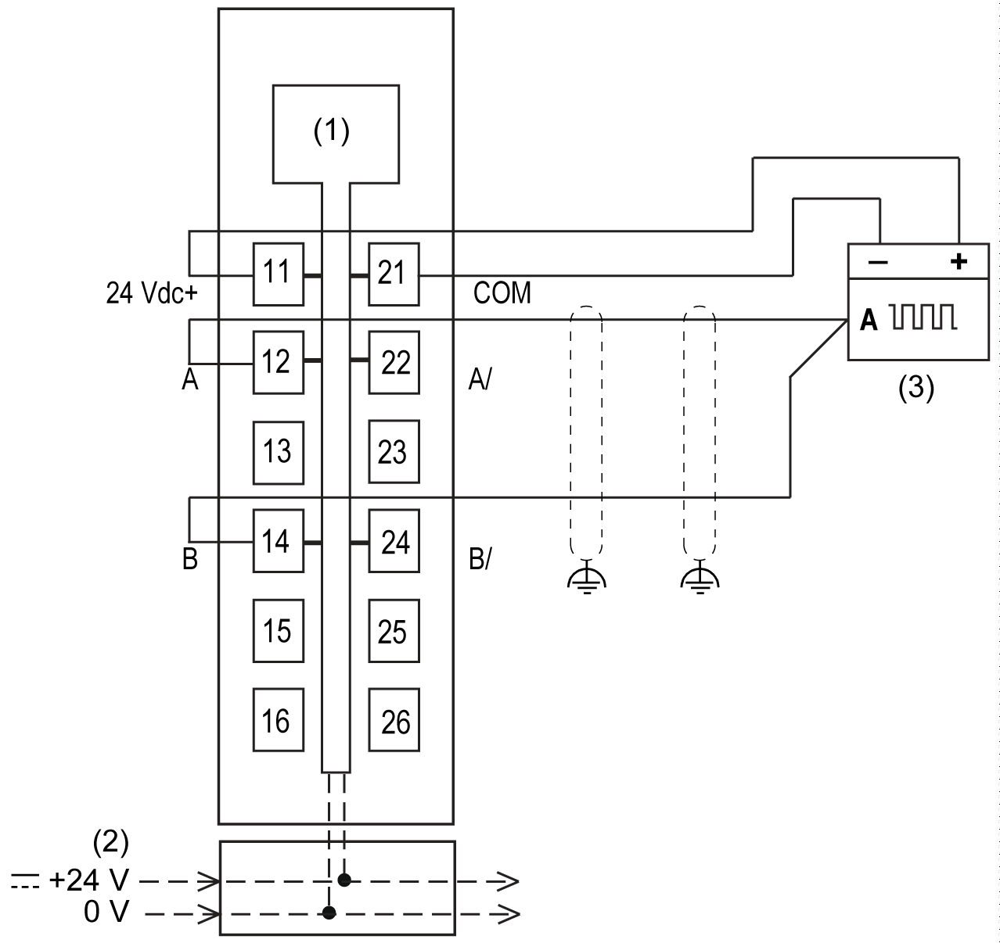
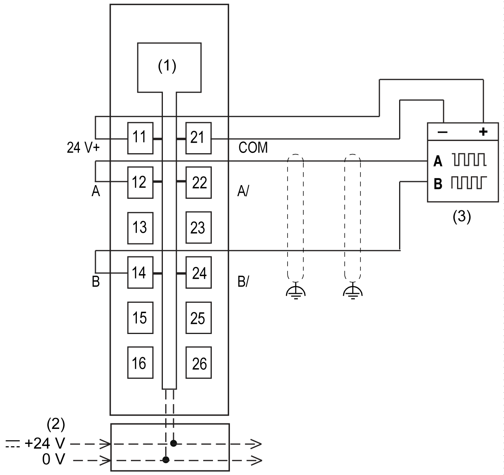
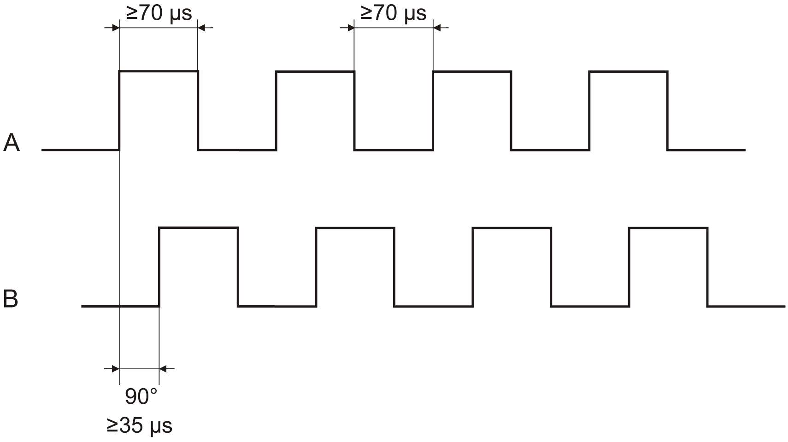
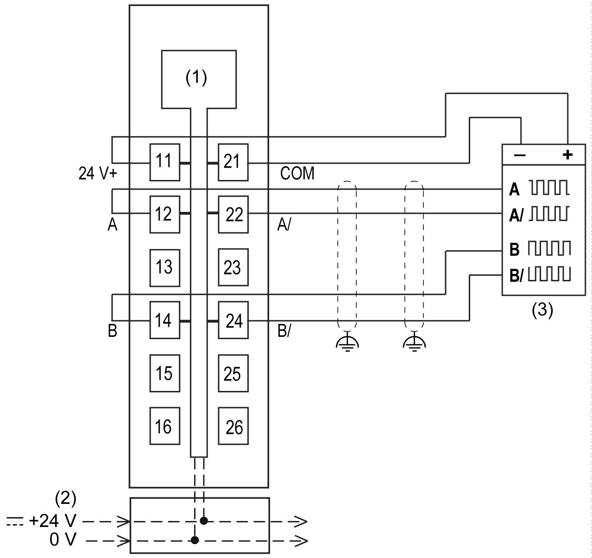
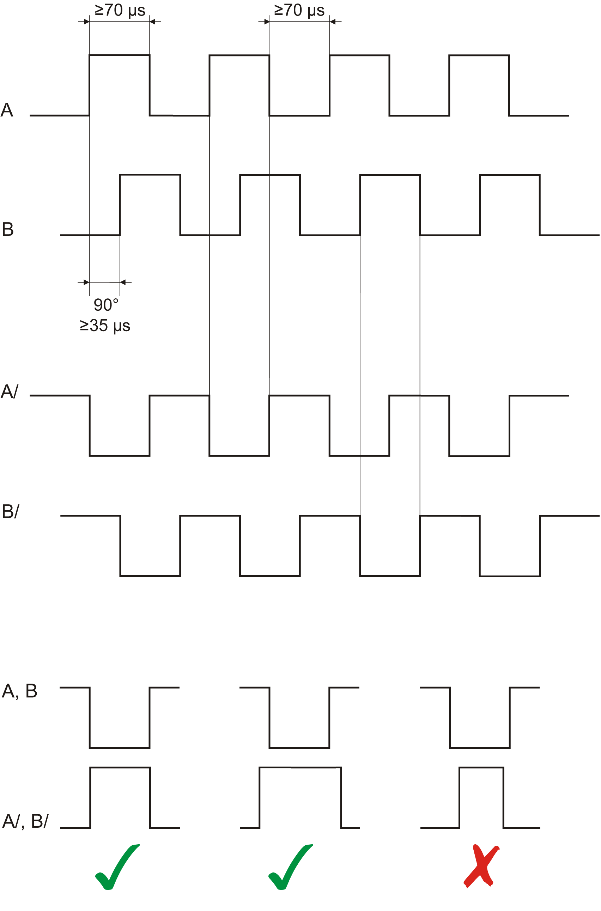

# TM5SDC1FS Function Mode Examples

## Overview

The connection examples in this section only represent a selection of the different wiring methods. You must take error detection into consideration in each case.

## Function Mode A-A: Single-Channel Encoder

Function mode A-A: Single-channel encoder

**1** Internal electronics

**2** 24 Vdc I/O power segment integrated into the bus bases

**3** 1-channel sensor with internal power supply

Signal form A-A

| Safety-related characteristics criteria | Characteristic value |
| --- | --- |
| Category in accordance with EN ISO 13849-1 (module and encoder) | CAT 2 |
| Safety-related recording of the rotary speed | yes if rotary speed >0 |
| Safety-related comparison of the rotary speed | no |
| Safety-related recording of the direction of rotation | no |
| Safety-related stall detection | no |
| **Encoder wiring instructions** | |
| * Use shielded cables for encoder wiring. * Cable length: maximum 30 m (98 ft) | |
| **Information regarding the encoder** | |
| * The encoder must be taken into consideration when assessing and validating the safety-related chain. * Encoders with output signal test pulses (OSSD) are not permitted to be used because the test pulses would result in incorrect measurements on the counter channel. * The encoder signal levels must be compatible with the input channels. Here, the characteristic values listed in the technical data must be taken into account. | |
| **Information regarding the encoder supply** | |
| * The design of the encoder supply must ensure proper operation and the correct signal level (<5 Vdc low, >15 Vdc high). | |

## Function Mode A-A: Two-Channel Encoder

Function mode A-A: Two-channel encoder

**1** Internal electronics

**2** 24 Vdc I/O power segment integrated into the bus bases

**3** 2-channel sensor with internal power supply

Signal form A-A

| Safety-related characteristics criteria | Characteristic value |
| --- | --- |
| Category in accordance with EN ISO 13849-1 (module and encoder) | CAT 4 |
| Safety-related recording of the rotary speed | yes if rotary speed >0 |
| Safety-related comparison of the rotary speed | yes; permissible tolerance is 5 counter pulses per "Timebase"; evaluation using the "SafeFrequencyOK" signal is possible |
| Safety-related recording of the direction of rotation | no |
| Safety-related stall detection | no |
| **Encoder wiring instructions** | |
| * Two separate and shielded lines must be used to wire both encoders. | |
| **Information regarding the encoder** | |
| * The encoder must be taken into consideration when assessing and validating the safety-related chain. * Encoders with output signal test pulses (OSSD) are not permitted to be used because the test pulses would result in incorrect measurements on the counter channel. * The encoder signal levels must be compatible with the input channels. Here, the characteristic values listed in the technical data must be taken into account. * The two "A" signals must be generated by independent encoders. | |
| **Information regarding the encoder supply** | |
| * The design of the encoder supply must ensure proper operation and the correct signal level (<5 Vdc low, >15 Vdc high). | |

## Function Mode A-B

Function mode A-B

**1** Internal electronics

**2** 24 Vdc I/O power segment integrated into the bus bases

**3** 2-channel sensor with internal power supply

Signal form A-B

| Safety-related characteristics criteria | Characteristic value |
| --- | --- |
| Category in accordance with EN ISO 13849-1 (module and encoder) | CAT 4 |
| Safety-related recording of the rotary speed | yes if rotary speed >0 |
| Safety-related comparison of the rotary speed | yes; permissible tolerance is 5 counter pulses per "Timebase"; evaluation using the "SafeFrequencyOK" signal is possible |
| Safety-related recording of the direction of rotation | no |
| Safety-related stall detection | no |
| **Encoder wiring instructions** | |
| * Use shielded cables for encoder wiring. * Cable length: maximum 30 m (98 ft) | |
| **Information regarding the encoder** | |
| * The encoder must be taken into consideration when assessing and validating the safety-related chain. * Encoders with output signal test pulses (OSSD) are not permitted to be used because the test pulses would result in incorrect measurements on the counter channel. * The encoder signal levels must be compatible with the input channels. Here, the characteristic values listed in the technical data must be taken into account. * The "A" and "B" signals must be generated by independent encoders. If "AB" encoders are used, it is necessary to ensure that the "A" signal is generated in the encoder independent of the "B" signal. | |
| **Information regarding the encoder supply** | |
| * The design of the encoder supply must ensure proper operation and the correct signal level (<5 Vdc low, >15 Vdc high). | |

## Function Mode A-A/-B-B/

Function mode A-A/-B-B/

**1** Internal electronics

**2** 24 Vdc I/O power segment integrated into the bus bases

**3** 4-channel sensor with internal power supply

Signal form A-A/-B-B/

| Safety-related characteristics criteria | Characteristic value |
| --- | --- |
| Category in accordance with EN ISO 13849-1 (module and encoder) | CAT 4 |
| Safety-related recording of the rotary speed | yes if rotary speed >0 |
| Safety-related comparison of the rotary speed | no |
| Safety-related recording of the direction of rotation | yes |
| Safety-related stall detection | yes |
| **Encoder wiring instructions** | |
| * Use shielded cables for encoder wiring. * Cable length: maximum 30 m (98 ft) | |
| **Information regarding the encoder** | |
| * The encoder must be taken into consideration when assessing and validating the safety-related chain. * Encoders with output signal test pulses (OSSD) are not permitted to be used because the test pulses would result in incorrect measurements on the counter channel. * The encoder signal levels must be compatible with the input channels. Here, the characteristic values listed in the technical data must be taken into account. * The "A", "A/", "B" and "B/" signals must be generated by independent encoders. If "AA/BB/" encoders are used, it is necessary to ensure that all signals are generated in the encoder independent of the others. | |
| **Information regarding the encoder supply** | |
| * The design of the encoder supply must ensure proper operation and the correct signal level (<5 Vdc low, >15 Vdc high). | |

EIO0000000861.10