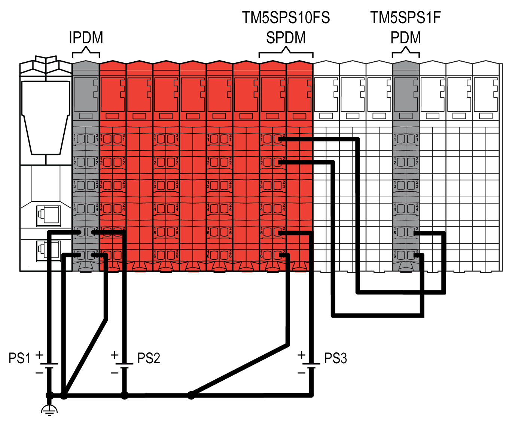
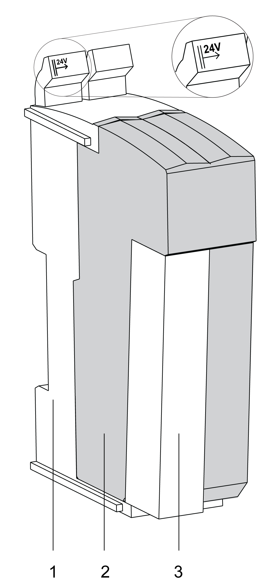
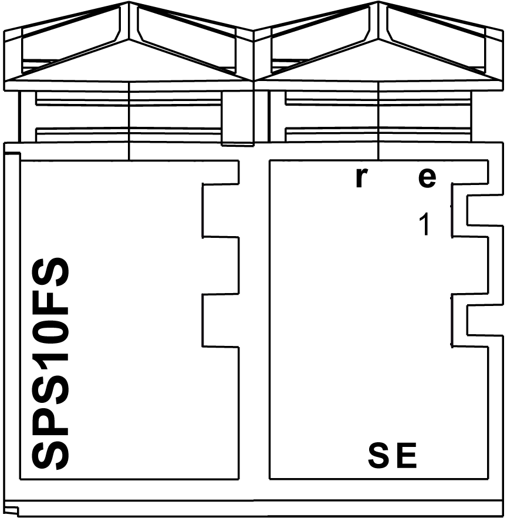

# TM5SPS10FS Presentation

## Introduction

The TM5SPS10FS Safety Power Distribution module (SPDM), in association with its dedicated, left-isolating TM5ACBM4FS Safety bus base, is a power source for specified non-safety-related I/O modules. The Safety Power Distribution module supports the pre-defined safe state of power-off (de-energized) to the I/O modules connected. As illustrated below, the TM5SPS10FS Safety Power Distribution module is used to create an isolated group of non-safety related I/O modules.

**(1)** Sercos III Bus Interface

**(2)** Safety I/O modules

**(3)** TM5SPS10FS Safety Power Distribution module

**(4)** Non-safety-related I/O modules

**(5)** TM5 bus and electronic module power supply

**(6)** 24 Vdc I/O power segment of safety-related I/O modules

**(7)** 24 Vdc I/O power segment of non-safety-related I/O modules

**IDPM** Interface power distribution module

**SDPM** Safety Power Distribution module: TM5SPS10FS

In the case of a safety-related request by the Safety Logic Controller, the Safety Power Distribution module disables the 24 Vdc I/O power segment bus. Consequently, power to the connected sensors and actuators of those I/O modules using the bus within the segment is removed. Likewise, the 24 Vdc safety-related output of the Safety Power Distribution module is disabled.

In an appropriate hardware configuration, the 24 Vdc safety-related output of the Safety Power Distribution module can be used to remove power from an external power supply directly, removing residual connection to power. For example, output voltage and current may need to be removed from, in addition to those connected to the internal 24 Vdc I/O power segment bus, external relays, contactors, drive inputs or other forms of actuators.

Principally, however, the 24 Vdc safety-related output of the Safety Power Distribution module (SDPM) is used to supply a non-safety-related Power Distribution Module (PDM), as illustrated in the following graphic:

**(PS1)** External isolated power supply 24 Vdc

**(PS2)** External isolated power supply 24 Vdc

**(PS3)** External isolated power supply 24 Vdc

An SPDM can only de-energize a maximum of 10 A output current of connected non-safety-related I/O modules.

| WARNING | |
| --- | --- |
|  | UNINTENDED EQUIPMENT OPERATION  * If you need to de-energize more than 10 A, add more SPDM modules. * Make sure that direct voltage is only and exclusively supplied by the SPDM to any non-safety-related I/O module that is to be de-energized. * Make sure that the segment on the right side of the SPDM does not contain any bus base and module combination that can provide external power to the 24 Vdc I/O power segment bus to the left (to the SPDM).  Failure to follow these instructions can result in death, serious injury, or equipment damage. |

| WARNING | |
| --- | --- |
|  | UNINTENDED EQUIPMENT OPERATION  * Only connect the non-safety-related I/O modules specified as compatible by the present documentation to the Safety Power Distribution module. * If using an external source of power to supply sensors and/or actuators of the connected I/O modules, use the 24 Vdc safety-related output of the Safety Power Distribution module to control the removal of power provided by the external source. * Only use one Safety Power Distribution module for the potential group of non-safety-related I/O modules.  Failure to follow these instructions can result in death, serious injury, or equipment damage. |

The following table indicates the compatible non-safety-related I/O modules that you can connect to the TM5SPS10FS Safety Power Distribution module slice:

| (Non-safety-related) reference | Description |
| --- | --- |
| TM5SAO2H(1) | Electronic Module 2AO ±0V/0-20mA 16 Bits |
| TM5SAO2L(1) | Electronic Module 2AO ±0V/0-20mA 12 Bits |
| TM5SAO4H(1) | Electronic Module 4AO ±0V/0-20mA 16 Bits |
| TM5SAO4L(1) | Electronic Module 4AO ±0V/0-20mA 12 Bits |
| TM5SDO12T | Electronic Module 12DO 24 Vdc Tr 0.5 A 1 Wire |
| TM5SDO2T | Electronic Module 2DO 24 Vdc Tr 0.5 A 3 Wires |
| TM5SDO4T | Electronic Module 4DO 24 Vdc Tr 0.5 A 3 Wires |
| TM5SDO4TA | Electronic Module 4DO 24 Vdc Tr 2 A 3 Wires |
| TM5SDO8TA | Electronic Module 8DO 24 Vdc Tr 2 A 1 Wire |
| TM5SDO6T | Electronic Module 6DO 24 Vdc Tr 0.5 A 2 Wires |
| TM5SDO16T | Electronic Module 16DO 24 Vdc Tr 0.5 A 1 Wire |
| TM5SPS1 | PDM Electronic Module 24 Vdc I/O |
| TM5SPS1F | PDM Electronic Module 24 Vdc I/O Fuse 6.3 A |
| TM5ACBM11 | Bus base 24 Vdc |
| TM5ACBM01R | Bus base 24 Vdc for PDM and Receiver modules |
| TM7BAM4CLA(1) | Block 2AI/2AO 0-20 mA |
| TM7BAM4VLA(1) | Block 2AI/2AO ±0 Vdc |
| TM7BAO4CLA(1) | Block 4AO 0-20 mA |
| TM7BAO4VLA(1) | Block 4AO ±0 Vdc |
| TM7BDM16A(1) | Block 16 Configurable DI/DO 24 Vdc |
| TM7BDM16B(1) | Block 16 Configurable DI/DO 24 Vdc |
| TM7BDM8B(1) | Block 8 Configurable DI/DO 24 Vdc |
| TM7BDO8TAB(1) | Block 8DO 24 Vdc Source |
| **(1)** Some modules use the 24 V I/O Power Segment as a source of power for communications on the TM5 bus. When the Safety Power Distribution module removes power from the 24 V I/O Power Segment, these modules cease communication with the Sercos III Bus Interface, which then will produce configuration exceptions. For example, when the Safety Power Distribution module removes power, these modules cannot be found during a Sercos SCAN procedure.  NOTE: All compatible TM5 Electronic Modules must be of a revision PV: 01 / RL: 02 or greater. | |

| DANGER | |
| --- | --- |
|  | INCOMPATIBLE COMPONENTS CAUSE ELECTRIC SHOCK OR ARC FLASH  * Do not associate components of a slice that have different colors. * Verify that correct terminal blocks (minimally, matching colors and correct number of terminals) are installed on the appropriate electronic modules.  Failure to follow these instructions will result in death or serious injury. |

Part of the defined safe state is to achieve the operational definition of the removal of power. After the removal of power to an external power supply, power must remain removed for a period of at least 250 ms, and up to 1 s to prevent the restart of an actuator. This time is required to discharge any internal energy storage to affect the shut-down of the actuators.

The safety-related function initiating the removal of power must fulfill the requirements of the intended overall safety level (Category, PL, etc.) as determined by your risk assessment. The concept of the TM5SPS10FS Safety Power Distribution module can, with an appropriate architecture, achieve a safety objective up to Category 4 / PL e according to EN ISO 13849-1.

## Main Features

The following table describes the main features of the Safety Power Distribution module TM5SPS10FS:

| Main Features | |
| --- | --- |
| Number of outputs | 1 safety-related digital FET output with current monitoring |
| Rated voltage | 24 Vdc |
| Rated output current | 10 A |
| Output protection | Integrated over-current protection and inductive load resistance |
| Module supply | 1 module supply |

This equipment has been designed to operate outside of any hazardous location. Only install this equipment in zones known to be free of a hazardous atmosphere.

| DANGER | |
| --- | --- |
|  | POTENTIAL FOR EXPLOSION  Install and use this equipment in non-hazardous locations only.  Failure to follow these instructions will result in death or serious injury. |

## Ordering Information

The following figure presents the module in combination with the required components:

The following table presents the reference of the module:

| Number | Reference | Description | Color |
| --- | --- | --- | --- |
| 2 | TM5SPS10FS | TM5 Safety Power Distribution module | red |

The following table presents the references for the required components:

| Number | Reference | Description | Color |
| --- | --- | --- | --- |
| 1 | TM5ACBM4FS | TM5 Safety bus base, safety coded, internal I/O supply is interrupted to the left | red |
| 3 | TM5ACTB52FS | TM5 Safety terminal block, 12-pin, safety coded | red |
| NOTE: A TM5 Safety bus base and a TM5 Safety terminal block are required for operation of the module, and are sold separately. For more information, refer to [TM5ACBM4FS Safety bus base](D-SE-0057617.html#D-SE-0057617) and [TM5ACTB52FS Safety terminal block](D-SE-0010863.html#D-SE-0010863). | | | |

NOTE: To identify the bus base type (voltage routing) being used even when an electronic module is inserted, the bus bases with I/O supply left isolated are identified by a marking on the upper locking lever (**||-> 24V**).

| WARNING | |
| --- | --- |
|  | IMPROPER ASSOCIATION OF COMPONENT  Use only the left isolated Safety bus base TM5ACBM4FS in association with the TM5SPS10FS Safety Power Distribution module.  Failure to follow these instructions can result in death, serious injury, or equipment damage. |

## Status LED Indicators

This figure presents the TM5SPS10FS status LED indicators:

The following tables describe the status LED indicators:

| LED indicator | Color | Status | Description |
| --- | --- | --- | --- |
| **r** | off | | Module supply not connected. |
| green | single flash | reset mode |
| double flash | firmware update in progress |
| flashing | pre-operational state |
| on | RUN state |
| **e** | off | | No error detected or module supply not connected. |
| red | flashing | boot loader mode |
| triple flash | firmware update in progress |
| on | Error detected or 24 Vdc I/O power supply not connected. |
| **r**+**e** | steady red/single green flash | | invalid configuration |

| LED indicator | Color | Status | Description |
| --- | --- | --- | --- |
| **1** | - | | Power status |
| red | on | An error has been detected on the output channel. The connection to the Safety Logic Controller is not operational or the start-up phase has not yet been completed. |
| orange | on | nominal 24 Vdc power output |

| LED indicator | Color | Status | Description |
| --- | --- | --- | --- |
| **SE** | off | | RUN state or 24 Vdc supply not present |
| red |  | boot phase or missing TM5 link or non-functioning processor (refer to hazard message below) |
|  | pre-operational state |
|  | communication channel is not OK |
|  | firmware for this module is a non-certified pilot version  NOTE: If you observe this indication, you must immediately replace the module, or update its firmware with a certified version. In all cases, contact your Schneider Electric representative. |
|  | boot phase, inoperable firmware |
| on | Safety-related status is active. |

Whenever the **SE** LED indicator is illuminated continuously, this indicates that the module is inoperative. There is also a diagnostic available in the Safety Logic Controller to indicate this state. Replacement of the module must be made immediately.

| WARNING | |
| --- | --- |
|  | LOSS OF SAFETY FUNCTION  * Immediately replace any and all modules that indicate that they are in an inoperable state. * Ensure that the effect on un-repaired equipment is taken into account in your risk assessment. * Make all necessary repairs to equipment before re-starting, or continuing service of, your machine.  Failure to follow these instructions can result in death, serious injury, or equipment damage. |

EIO0000000861.10