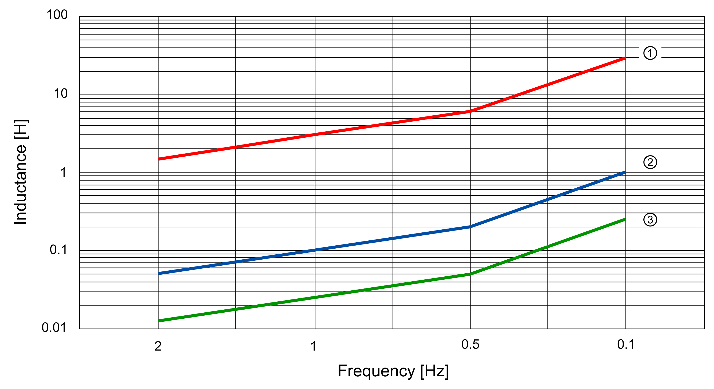
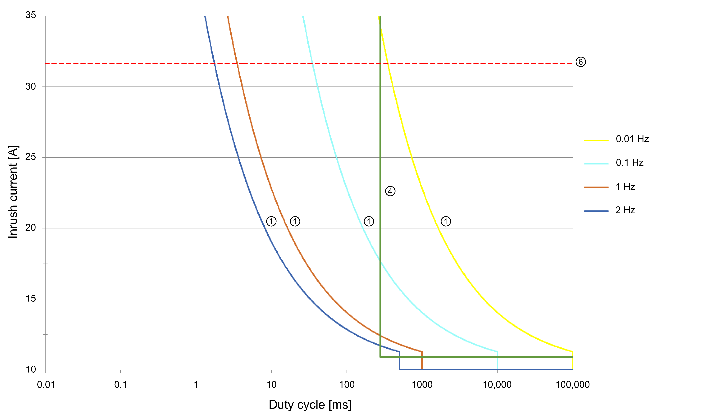

# TM5SPS10FS Characteristics

## Introduction

This section describes the characteristics of the TM5SPS10FS module. See also [TM5 Environmental Characteristics](D-SE-0011034.html#D-SE-0011034).

| DANGER | |
| --- | --- |
|  | FIRE HAZARD  Use only the correct wire sizes for the maximum current capacity of the I/O channels and power supplies.  Failure to follow these instructions will result in death or serious injury. |

| WARNING | |
| --- | --- |
|  | UNINTENDED EQUIPMENT OPERATION  Do not exceed any of the rated values specified in the environmental and electrical characteristics tables.  Failure to follow these instructions can result in death, serious injury, or equipment damage. |

## General Characteristics

The following table lists the general characteristics of the TM5SPS10FS module:

| General characteristics | | |
| --- | --- | --- |
| Rated power supply voltage | | 24 Vdc |
| Status indicators | | * Output status * Operating state * Module status |
| Diagnostics | Module run and detected error | Indicated by status LED indicator and software status. |
| Outputs | Indicated by status LED indicator and software status (output status, current measurement). |
| Electrical isolation(1) | Channel - bus | See note. |
| TM5 Bus 5 Vdc current draw | | 40 mA |
| 24 Vdc I/O segment current draw | | 62.5 mA |
| Maximum switching frequency | | * 2 commutations per 48 s (for EcoStruxure Machine Expert V1.2.x and earlier versions / module FW version ≤ 320) * < 2 Hz (for EcoStruxure Machine Expert V2.0 and later versions / module FW version > 320)   Also refer to section “Switching inductive loads” below. |
| Certifications and standards | | Refer to [www.se.com](https://www.se.com) for the latest information regarding certifications and standards. |
| Maximum internal cycle time | | 800 µs |
| Minimum cycle time | | 200 µs |
| Minimum I/O update time | | 400 µs |
| Maximum I/O update time | | 1600 µs |
| Id code for firmware update | | 7615 dec |

**NOTE** (1) The isolation of the electronic module is 500 Vac RMS between the electronics power by the TM5 bus and those powered by 24 Vdc I/O power segment connected to the module. In practice, the electronic module is installed in the bus base, and there is a bridge between the TM5 power bus and the 24 Vdc I/O power segment. The two power circuits reference the same functional ground (FE) through specific components designed to reduce effects of electromagnetic interference. These components are rated at 30 Vdc or 60 Vdc. This effectively reduces isolation of the entire system from the 500 Vac RMS.

Switching inductive loads:

**1** Maximum permissible output current 1 A

**2** Maximum permissible output current 5 A

**3** Maximum permissible output current 10 A

## Operating Conditions

The following table lists the operating conditions for the TM5SPS10FS module:

| Operating conditions | | |
| --- | --- | --- |
| Mounting orientation | | Horizontal or vertical |
| Operating temperature | Horizontal installation | 0...+55 °C (+32...131 °F), for derating refer to following table1 |
| Vertical installation | 0...+35 °C (+32...95 °F), for derating refer to following table1 |
| Relative humidity | | 5...95%, non-condensing |
| Installation at altitudes above sea level: | 0 up to 2000 m (0 up to 6561 ft) | No derating for altitude |
| > 2000 m (>6561 ft) | Reduction of ambient temperature by 0.5 °C per 100 m (0.9 °F per 328 ft) |
| EN 60529 Protection type | | IP20 |

1 Derating in relation to operating temperature and mounting orientation

| Horizontal installation, 0...+55 °C (+32...131 °F) | Vertical installation, 0...+35 °C (+32...95 °F) |
| --- | --- |
|  |  |
| **T** = temperature  **I** = rated current | |
| NOTE: If a TM5SD000 is installed on the side of the module, the horizontal installation derating is shifted to the right by the following derating bonus:  * TM5SD000 to the left: +2.5 °C (+4.5 °F) * TM5SD000 to the right: +0 °C (+0 °F) * TM5SD000 to the left and right: +5 °C (+9 °F) | NOTE: Using a TM5SD000 does not provide a derating bonus in vertical installation. |

## Storage and Transport Conditions

The following table lists the storage and transport conditions for the TM5SPS10FS module:

| Storage and transport conditions | |
| --- | --- |
| Temperature | -40...+85 °C (-40...+185 °F) |
| Relative humidity | 5...95%, non-condensing |

## Module Supply Characteristics

The following table lists the module supply characteristics for the TM5SPS10FS module

| Module supply characteristics | |
| --- | --- |
| Integrated protection | Overcurrent cutoff, protection for inductive switching |
| Rated voltage | 24 Vdc |
| Voltage range | 20.4...28.8 Vdc |

## Power Output Characteristics

The following table lists the power output characteristics of the TM5SPS10FS module:

| Power output | | |
| --- | --- | --- |
| Number of output channels | | 1 |
| Design | | 2 FETs in series, type B1, output level can be read |
| Rated voltage | | 24 Vdc |
| Rated output current | | 10 A |
| Output protection | | Refer to section “Inrush current behavior for output channels” below. |
| Braking voltage when switching off inductive loads | | 1 Vdc |
| Diagnostics status | | Output monitoring, current measurement (shutdown in the event of overcurrent). |
| Re-arming after overload or short circuit detection | | Power up |
| Leakage current when switched off | | 1 mA |
| Residual voltage | | ≤200 mVdc at rated output current |
| Switching voltage | | Module supply minus residual voltage |
| Maximum capacitive load | | 1 mF |
| Minimum load | | 15 mA |
| Isolation voltage between channel and bus1) | | See note. |
| Error detection time | | 2 s |

**NOTE** (1) The isolation of the electronic module is 500 Vac RMS between the electronics power by the TM5 bus and those powered by 24 Vdc I/O power segment connected to the module. In practice, the electronic module is installed in the bus base, and there is a bridge between the TM5 power bus and the 24 Vdc I/O power segment. The two power circuits reference the same functional ground (FE) through specific components designed to reduce effects of electromagnetic interference. These components are rated at 30 Vdc or 60 Vdc. This effectively reduces isolation of the entire system from the 500 Vac RMS.

In addition to the rated output current specified, the output channels indicate the following for increased inrush current.

Inrush current behavior for output channels:

**1** Limits during cyclic switching operations. These curves show the maximum possible total inrush currents of all channels of the module during cyclic switching operations depending on the switching frequency. Overshooting these values results in overheating of the module.

**4** Current monitoring of the firmware - maximum inrush current per channel. These output channels are equipped with overcurrent detection in the firmware of the module. The curve shows the maximum inrush current per channel. Overshooting results in the shutdown of the output channel.

**6** Component load capacity of the module. This limit shows the total inrush current from which individual components of the module are overloaded. Overshooting can result in irreparable damage to the module.

NOTE: The protective function is provided for maximum 30 minutes for a continuous short circuit.

| WARNING | |
| --- | --- |
|  | UNINTENDED EQUIPMENT OPERATION  Install and operate this equipment according to the conditions described in the Environmental Characteristics.  Failure to follow these instructions can result in death, serious injury, or equipment damage. |

## Safety-Related Characteristics

The following table lists the safety-related characteristics of the TM5SPS10FS module:

| Criteria | Characteristic value for output channels |
| --- | --- |
| EN ISO 13849-1 | Category:CAT 4  PL (maximum performance level): PL e  DC: >94%  MTTFd: 2500 years  Maximum [Life time](D-SE-0018432.html#D-SE-0018432__D-SE-0018432.3): 20 years |
| IEC 61508, IEC 61511, EN 62061 | SIL CL (maximum safety integrity level): SIL 3  SFF: >90%  PFH: <1\*10-10  PFD: <2\*10-5 at a proof test interval of 20 years  PT: 20 years |

EIO0000000861.10