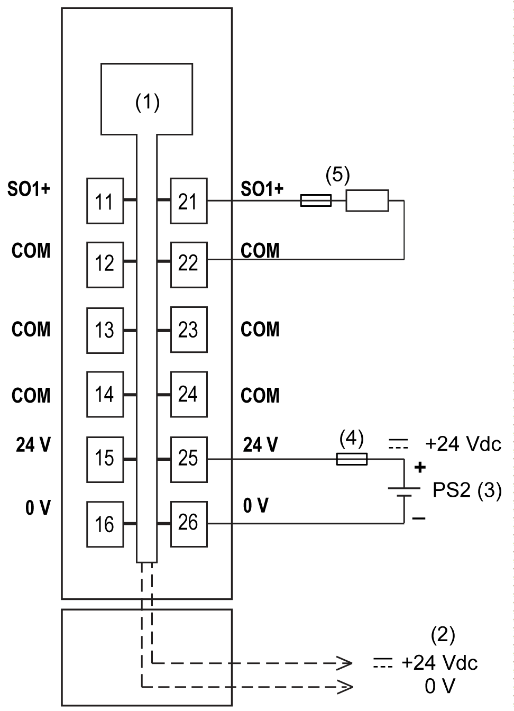

# TM5SPS10FS Wiring

## Pin Assignments / Connection Example

The following figure presents a connection example for the TM5SPS10FS:

**1** Internal electronics

**2** 24 Vdc I/O power segment integrated into the bus bases

**3** PS2: External isolated power supply 24 Vdc

**4** External fuse: 10 A maximum (6.3 A maximum UL), 250 V

**5** TM5SPS1 or TM5SPS1F Power Distribution modules or actuator with current limited to fuse sized to the load: 10 A maximum (6.3 A maximum UL)

| WARNING | |
| --- | --- |
|  | UNINTENDED EQUIPMENT OPERATION  Do not connect wires to unused terminals and/or terminals indicated as “No Connection (N.C.)”.  Failure to follow these instructions can result in death, serious injury, or equipment damage. |

| WARNING | |
| --- | --- |
|  | UNINTENDED EQUIPMENT OPERATION  Use the sensor and actuator power supply only for supplying power to sensors or actuators connected to the module.  Failure to follow these instructions can result in death, serious injury, or equipment damage. |

EIO0000000861.10