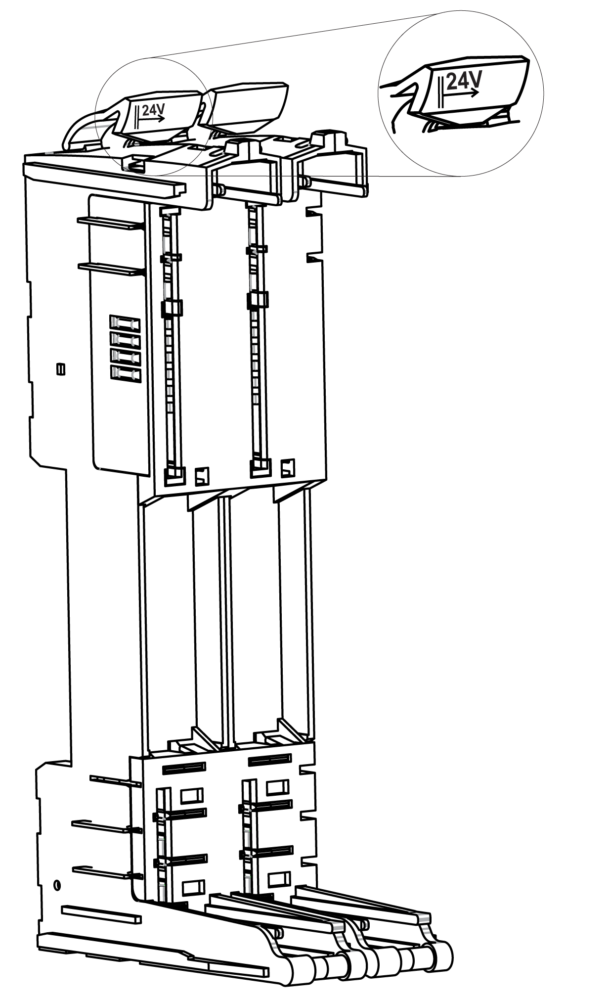

# TM5ACBM4FS Presentation

## Main Features

The TM5ACBM4FS is the Safety bus base for the TM5 Safety Power Distribution module.

The main features of the Safety bus base TM5ACBM4FS are:

* Safety bus base for the TM5 Safety Power Distribution module
* internal I/O supply is left isolated
* safety coded

## Ordering Information

The following figure presents the TM5ACBM4FS Safety bus base:

The following table presents the reference for the Safety bus base:

| Reference | Description | Color |
| --- | --- | --- |
| TM5ACBM4FS | TM5 Safety bus base, safety coded, internal I/O supply is left isolated | red |

| DANGER | |
| --- | --- |
|  | HAZARD OF ELECTRIC SHOCK, EXPLOSION OR ARC FLASH  * Disconnect all power from all equipment including connected devices prior to removing any covers or doors, or installing or removing any accessories, hardware, cables, or wires except under the specific conditions specified in the appropriate hardware guide for this equipment. * Always use a properly rated voltage sensing device to confirm the power is off where and when indicated. * Replace and secure all covers, accessories, hardware, cables, and wires and confirm that a proper ground connection exists before applying power to the unit. * Use only the specified voltage when operating this equipment and any associated products.  Failure to follow these instructions will result in death or serious injury. |

EIO0000000861.10