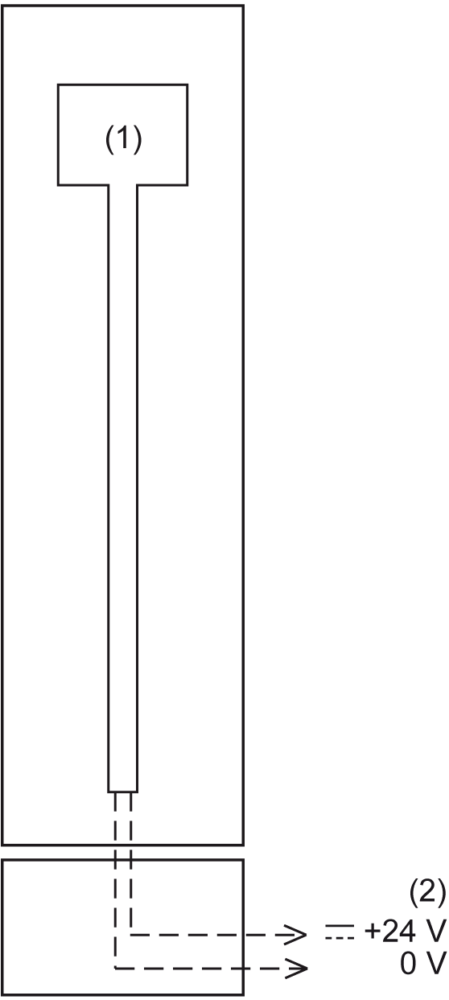

# TM5ACBM4FS Wiring

## Potential Control

The following figure presents the potential control of TM5ACBM4FS:

**1** Internal electronics

**2** 24 Vdc I/O power

NOTE: To identify the bus base type (voltage routing) being used even when an electronic module is inserted, the bus bases with I/O supply left isolated are identified by a marking on the upper locking lever (**||-> 24V**).

EIO0000000861.10