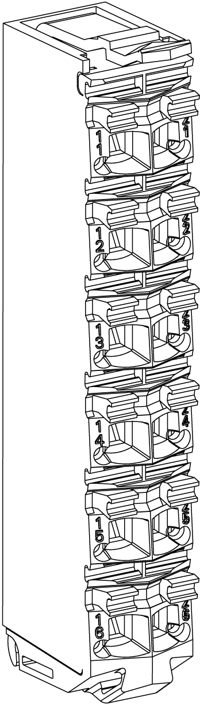

# Safety Terminal Block Presentation

## TM5ACTB52FS Features

The safety-related modules and the Safety Logic Controllers are wired by means of the TM5ACTB52FS Safety terminal block:

| Features | |
| --- | --- |
| Type of terminal block | 12-pin, safety coded terminal block |
| Features | * tool-free wiring with push-in technology * simple wire release using lever * allows labeling of each terminal * allows plain text labeling * test access for standard probes * potential for customer coding |

## Ordering Information

The following figure presents the TM5ACTB52FS Safety terminal block:

The following table presents the reference for the Safety terminal block:

| Reference | Description | Color |
| --- | --- | --- |
| TM5ACTB52FS | 24 Vdc / 230 Vac, 12-pin terminal block for safety-related modules and Safety Logic Controllers, safety coded | red |

| DANGER | |
| --- | --- |
|  | INCOMPATIBLE COMPONENTS CAUSE ELECTRIC SHOCK OR ARC FLASH  * Do not associate components of a slice that have different colors. * Verify that correct terminal blocks (minimally, matching colors and correct number of terminals) are installed on the appropriate electronic modules.  Failure to follow these instructions will result in death or serious injury. |

## Characteristics

This section describes the characteristics of the TM5ACTB52FS Safety terminal block, you can also refer to [TM5 Environmental Characteristics](D-SE-0011034.html#D-SE-0011034).

| DANGER | |
| --- | --- |
|  | FIRE HAZARD  * Use only the correct wire sizes for the maximum current capacity of the I/O channels and power supplies. * For relay output (2 A) wiring, use conductors of at least 0.5 mm2 (AWG 20) with a temperature rating of at least 80 °C (176 °F). * For common conductors of relay output wiring (4 A), or relay output wiring greater than 2 A, use conductors of at least 1.0 mm2 (AWG 16) with a temperature rating of at least 80 °C (176 °F).  Failure to follow these instructions will result in death or serious injury. |

| WARNING | |
| --- | --- |
|  | UNINTENDED EQUIPMENT OPERATION  Do not connect wires to unused terminals and/or terminals indicated as “No Connection (N.C.)”.  Failure to follow these instructions can result in death, serious injury, or equipment damage. |

| WARNING | |
| --- | --- |
|  | UNINTENDED EQUIPMENT OPERATION  Do not exceed any of the rated values specified in the characteristics tables.  Failure to follow these instructions can result in death, serious injury, or equipment damage. |

The following table lists the characteristics of the TM5ACTB52FS:

| Characteristics | | |
| --- | --- | --- |
| Type of terminal block | | Push-in terminal block |
| Distance between contacts | left - right | 4.2 mm / 0.16 in |
| above - below | 10.96 mm / 0.43 in |
| Contact resistance | | ≤ 5 mΩ |
| Maximum current carrying capacity of the connector | | 10 A / contact  NOTE: The electrical characteristics of the individual modules must be respected. |
| Connection cross section | solid wire | 0.08 mm2 ... 2.5 mm2 / AWG 28 ... 14 |
| multi-wire | 0.25 mm2 ... 2.5 mm2/ AWG 24 ... 14 |
| with wire cable ends | 0.25 mm2 ... 1.5 mm2 / AWG 24 ... 16 |
| - | Up to 2x 0.75 mm2 (AWG 2 x 24 ... 2 x 18) with double wire cable ends |
| Cable type | | Copper wires only |

| DANGER | |
| --- | --- |
|  | LOOSE WIRING CAUSES ELECTRIC SHOCK  Do not insert more than one wire per connector of the spring terminal blocks unless using a double wire cable end (ferrule).  Failure to follow these instructions will result in death or serious injury. |

EIO0000000861.10