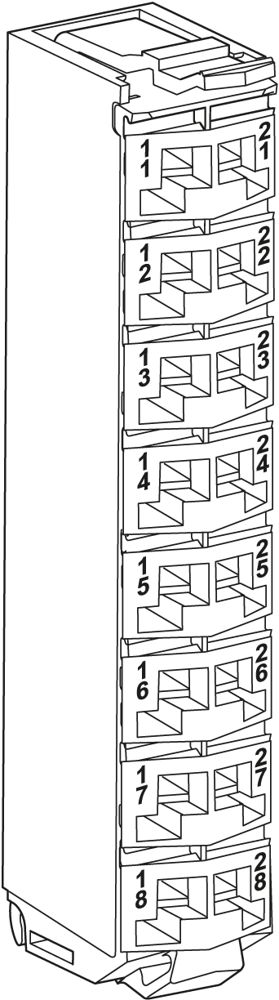

# Safety Terminal Block Presentation

## TM5ACTB5FFS Features

TM5STI4ATCFS Safety Analog Input module is wired by using the TM5ACTB5FFS Safety terminal block:

| Features | |
| --- | --- |
| Type of terminal block | 16-pin, safety coded terminal block |
| Features | * Tool-free wiring with push-in technology * Simple wire release using lever * Allows labeling of each terminal * Allows plain text labeling * Test access for standard probes * Potential for customer coding |

## Ordering Information

The following figure presents the TM5ACTB5FFS Safety terminal block:

The following table presents the reference for the Safety terminal block:

| Reference | Description | Color |
| --- | --- | --- |
| TM5ACTB5FFS | TM5 Safety terminal block, 16-pin, safety coded | Red |

| DANGER | |
| --- | --- |
|  | INCOMPATIBLE COMPONENTS CAUSE ELECTRIC SHOCK OR ARC FLASH  * Do not associate components of a slice that have different colors. * Verify that correct terminal blocks (minimally, matching colors and correct number of terminals) are installed on the appropriate electronic modules.  Failure to follow these instructions will result in death or serious injury. |

## Characteristics

This section describes the characteristics of the TM5ACTB5FFS Safety terminal block, you can also refer to [TM5 Environmental Characteristics](D-SE-0011034.html#D-SE-0011034).

| DANGER | |
| --- | --- |
|  | FIRE HAZARD  Use only the correct wire sizes for the maximum current capacity of the I/O channels and power supplies.  Failure to follow these instructions will result in death or serious injury. |

| WARNING | |
| --- | --- |
|  | UNINTENDED EQUIPMENT OPERATION  Do not exceed any of the rated values specified in the characteristics tables.  Failure to follow these instructions can result in death, serious injury, or equipment damage. |

The following table lists the characteristics of the TM5ACTB5FFS:

| Characteristics | | |
| --- | --- | --- |
| Type of terminal block | | Push-in terminal block |
| Distance between contacts | Left - right | 4.2 mm / 0.16 in |
| Above - below | 8.25 mm / 0.32 in |
| Contact resistance | | ≤ 5 mΩ |
| Maximum current carrying capacity of the connector | | 2 A / contact  NOTE: The electrical characteristics of the modules must be respected. |
| Rated voltage | | 24 Vdc |
| Maximum voltage | | 50 Vdc |
| Connection cross section | Solid wire | 0.08 mm2 - 1.5 mm2 / AWG 28 - 16 |
| Multi-wire | 0.25 mm2 - 1.5 mm2/ AWG 24 - 16 |
| With wire cable ends | 0.25 mm2 - 0.75 mm2 / AWG 24 - 20 |
| Cable type | | Copper wires only |

EIO0000000861.10