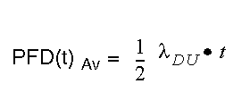

# PFD

probability of failure on demand

(definition IEC 61508)

For a single channel system the average probability of a failure on demand is calculated as follows:

For a dual channel system the average probability of a failure on demand is calculated as follows:

For a dual channel system, also the Common Cause effect (CC) must be considered. The common cause effect ranges from 1% to 10% of PFDCH1 and PFDCH2 (=1/RRF).

EIO0000000861.10