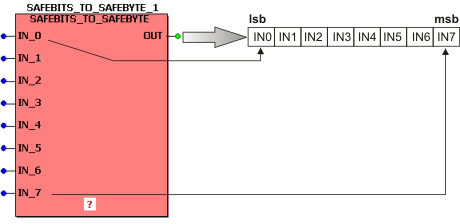
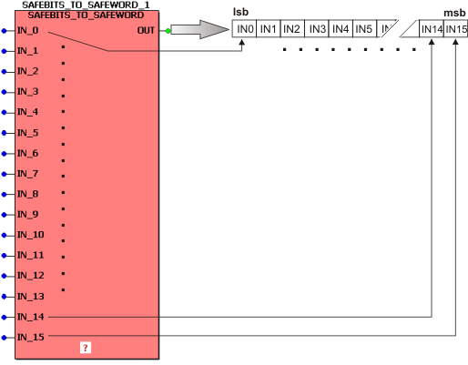
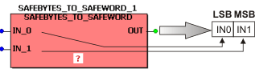
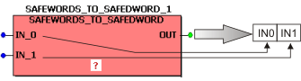
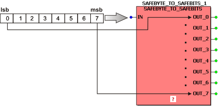
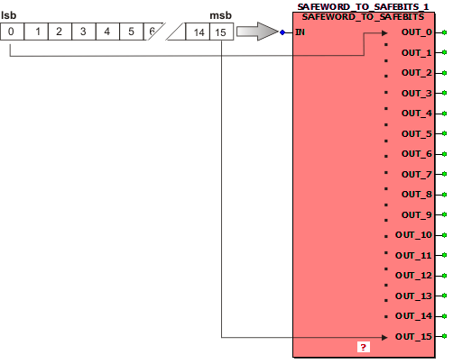
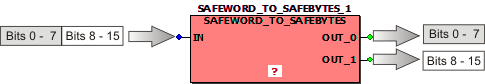
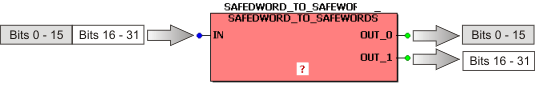

# Assembling/splitting of BOOL/BYTE/WORD/DWORD

EcoStruxure Machine Expert - Safety provides function blocks with assembling/splitting functionality.

**Why assembling/splitting signals?**

To improve the clarity of the safety logic and to process signals as a bundle, assembly function blocks are available to combine (summarize) individual binary signals (BOOLean variables) to groups of 8, 16 or 32 bits and handle them as BYTE, WORD or DWORD data type respectively.

After summarizing the individual bits, bitwise access is only possible after using a splitting function block which separates a BYTE, WORD or DWORD into individual bits (BOOL) again.

**Available assembly FBs:**

* [BITS\_TO\_BYTE / SAFEBITS\_TO\_SAFEBYTE](MuxDemuxFBs.html#MuxDemuxFBs__Mux_Bool2Byte)
* [BITS\_TO\_WORD / SAFEBITS\_TO\_SAFEWORD](MuxDemuxFBs.html#MuxDemuxFBs__Mux_Bool2Word)
* [BYTES\_TO\_WORD / SAFEBYTES\_TO\_SAFEWORD](MuxDemuxFBs.html#MuxDemuxFBs__Mux_Byte2Word)
* [WORDS\_TO\_DWORD / SAFEWORDS\_TO\_SAFEDWORD](MuxDemuxFBs.html#MuxDemuxFBs__Mux_Word2Dword)

**Available splitting FBs:**

* [BYTE\_TO\_BITS / SAFEBYTE\_TO\_SAFEBITS](MuxDemuxFBs.html#MuxDemuxFBs__DeMux_Byte2Bool)
* [WORD\_TO\_BITS / SAFEWORD\_TO\_SAFEBITS](MuxDemuxFBs.html#MuxDemuxFBs__DeMux_Word2Bool)
* [WORD\_TO\_BYTES / SAFEWORD\_TO\_SAFEBYTES](MuxDemuxFBs.html#MuxDemuxFBs__DeMux_Word2Bytes)
* [DWORD\_TO\_WORDS / SAFEDWORD\_TO\_SAFEWORDS](MuxDemuxFBs.html#MuxDemuxFBs__DeMux_Dword2Words)

## Assemble: SAFEBITS\_TO\_SAFEBYTE / BITS\_TO\_BYTE

This function block summarizes eight (SAFE)BOOL input variables to one (SAFE)BYTE output variable.

**Bit valence**: In the output Byte, the bit read at IN\_0 is inserted as least significant bit (lsb) as shown below. IN\_7 is considered as most significant bit (msb).

**NOTE:**

The same bit allocation applies to the standard FB BITS\_TO\_BYTE (displayed as gray block symbol).

[Top of page (overview on assembly/splitting FBs)](MuxDemuxFBs.html#MuxDemuxFBs)

## Assemble: SAFEBITS\_TO\_SAFEWORD / BITS\_TO\_WORD

This function block summarizes 16 (SAFE)BOOL input variables to one (SAFE)WORD output variable.

**Bit valence**: In the output Word, the bit read at IN\_0 is inserted as least significant bit (lsb) as shown below. IN\_15 is considered as most significant bit (msb).

**NOTE:**

The same bit allocation applies to the standard FB BITS\_TO\_WORD (displayed as gray block symbol).

[Top of page (overview on assembly/splitting FBs)](MuxDemuxFBs.html#MuxDemuxFBs)

## Assemble: SAFEBYTES\_TO\_SAFEWORD / BYTES\_TO\_WORD

This function block summarizes two (SAFE)BYTE input variables to one (SAFE)WORD output variable.

**Byte valence**: In the output Word, the Byte read at IN\_0 is inserted as least significant Byte (LSB) as shown below. IN\_1 is considered as most significant Byte (MSB).

**NOTE:**

The same Byte allocation applies to the standard BYTES\_TO\_WORD FB (displayed as gray block symbol).

[Top of page (overview on assembly/splitting FBs)](MuxDemuxFBs.html#MuxDemuxFBs)

## Assemble: SAFEWORDS\_TO\_SAFEDWORD / WORDS\_TO\_DWORD

This function block summarizes two (SAFE)WORD input variables to one (SAFE)DWORD output variable.

**Word valence**: In the output DWord, the Word read at IN\_0 is inserted as least significant Word (LSW). IN\_1 is inserted as most significant Word (MSW).

**NOTE:**

The same Word allocation applies to the standard FB WORDS\_TO\_DWORD (displayed as gray block symbol).

[Top of page (overview on assembly/splitting FBs)](MuxDemuxFBs.html#MuxDemuxFBs)

## Split: SAFEBYTE\_TO\_SAFEBITS / BYTE\_TO\_BITS

This function block splits one (SAFE)BYTE input variable to eight (SAFE)BOOL output variables.

**Bit valence**: The least significant bit (lsb), i.e., bit 0 of the input Byte, is applied to output OUT\_0. The most significant bit (msb) of the input Byte is output at OUT\_7.

**NOTE:**

The same bit allocation applies to the standard BYTE\_TO\_BITS FB (displayed as gray block symbol).

[Top of page (overview on assembly/splitting FBs)](MuxDemuxFBs.html#MuxDemuxFBs)

## Split: SAFEWORD\_TO\_SAFEBITS / WORD\_TO\_BITS

This function block splits one (SAFE)WORD input variable to 16 (SAFE)BOOL output variables.

**Bit valence**: The least significant bit (lsb), i.e., bit 0 of the input Word, is applied to output OUT\_0. The most significant bit (msb) of the input Word is output at OUT\_15.

**NOTE:**

The same bit allocation applies to the standard FB WORD\_TO\_BITS (displayed as gray block symbol).

[Top of page (overview on assembly/splitting FBs)](MuxDemuxFBs.html#MuxDemuxFBs)

## Split: SAFEWORD\_TO\_SAFEBYTES / WORD\_TO\_BYTES

This function block splits one (SAFE)WORD input variable to two (SAFE)BYTE output variables.

**Bit valence**: Bits 0 to 7 of the input Word are output as Byte variable at OUT\_0. Bits 8 to 15 of the input Word are output as Byte variable at OUT\_1.

**NOTE:**

The same bit allocation applies to the standard FB WORD\_TO\_BYTES (displayed as gray block symbol).

[Top of page (overview on assembly/splitting FBs)](MuxDemuxFBs.html#MuxDemuxFBs)

## Split: SAFEDWORD\_TO\_SAFEWORDS / DWORD\_TO\_WORDS

This function block splits one (SAFE)DWORD input variable to two (SAFE)WORD output variables.

**Bit valence**: Bits 0 to 15 of the input DWord are output as Word variable at OUT\_0. Bits 16 to 31 of the input DWord are output as Word variable at OUT\_1.

**NOTE:**

The same bit allocation applies to the standard DWORD\_TO\_WORDS FB (displayed as gray block symbol).

[Top of page (overview on assembly/splitting FBs)](MuxDemuxFBs.html#MuxDemuxFBs)

EIO0000002267.00

© 2021

Schneider Electric.

All rights reserved.