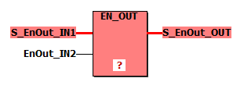

# EN\_OUT - Enable output

This safety-related bitwise Boolean function represents an AND logic with a safety-related signal and a standard signal as inputs to set a safety-related output signal. Using the EN\_OUT function, the enable principle can be realized.

**NOTE:**

The Safety Logic Controller has access to all safety-related I/Os and is exclusively able to set safety-related outputs. This can be carried out directly or in conjunction with a standard signal of the standard controller program (enable principle).

Programming the enable principle is only allowed using the EN\_OUT function without negations or any further signal processing.

| WARNING | |
| --- | --- |
|  | **UNINTENDED EQUIPMENT OPERATION**   * Verify that the EN\_OUT function is used without negations or any further signal processing. * Verify that the influence of a standard signal via the EN\_OUT function cannot result in an unintended or hazardous behavior of the entire system.   **Failure to follow these instructions can result in death, serious injury, or equipment damage.** |

Example:

| Parameter | Data types | Description |
| --- | --- | --- |
| IN1 | SAFEBOOL | Safety-related input value |
| IN2 | BOOL | Standard input value |
| OUT | SAFEBOOL | Safety-related output value |

## Example

EIO0000002267.00

© 2021

Schneider Electric.

All rights reserved.