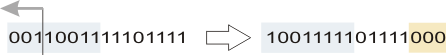

# SHL\_WORD (standard only)

This standard bit-string function performs a bitwise left shift operation on the standard WORD operand connected to the IN input. N specifies the number of bits to be shifted.

The following **rules** apply:

* The "empty bit positions" resulting from the shifting operation are filled with zeros.
* When shifting with N < 0, the function delivers the output value 0 because the N parameter is considered as an unsigned integer value.

Example: bitwise left shifting with N = 3 bits.

| **Parameter** | **Data types** | **Description** |
| --- | --- | --- |
| IN | WORD | Input value |
| N | INT | Number of bits to be shifted |
| OUT | WORD | Shifted output value |

**Further Information:**

See also the [SHR\_WORD](SHR_WORD.html#SHR_WORD) standard function.

EIO0000002267.00

© 2021

Schneider Electric.

All rights reserved.