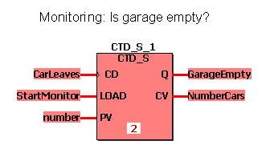
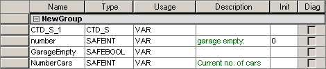
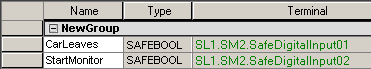

# CTD / CTD\_S - Counter Down

This counter function block counts down. In case of a rising edge at the input CD and LOAD = FALSE, CV decrements by one. When CV reaches the value 0, Q is set to TRUE and the function block stops counting. If LOAD = TRUE, the counter is initialized by the value of the input PV. To enable the counting process, the input LOAD must be FALSE. Otherwise the counter will always be re-initialized.

The function block is available as standard function block CTD and safety-related function block CTD\_S.

## CTD

| Parameter | Data types | Description |
| --- | --- | --- |
| CD | BOOL | If a rising edge is detected, CV decrements by one. |
| LOAD | BOOL | If TRUE, the counter is initialized with PV.  If FALSE, counting is enabled. |
| PV | INT | Preset value |
| Q | BOOL | TRUE if CV = 0 |
| CV | INT | Counter result |

## CTD\_S

| Parameter | Data types | Description |
| --- | --- | --- |
| CD | SAFEBOOL | If a rising edge is detected, CV decrements by one. |
| LOAD | SAFEBOOL | If TRUE, the counter is initialized with PV.  If FALSE, counting is enabled. |
| PV | SAFEINT | Preset value |
| Q | SAFEBOOL | TRUE if CV = 0 |
| CV | SAFEINT | Counter result |

**NOTE:**

Function blocks have to be instantiated. Like variables, instances have to be declared **before** they can be inserted in a code body. Instances must be unique within the POU. In the following example, the instance name 'CTD\_S\_1' is used.

## Example for a safety-related function block declaration CTD\_S

## Variables declarations

Local declarations:

Global declarations (I/O variables):

**NOTE:**

If you want to use the standard function block CTD in your code worksheet, you have to select the data type 'CTD' for the function block instance in the local variables worksheet. Accordingly, the data types 'BOOL' and 'INT' must be used instead of 'SAFEBOOL' and 'SAFEINT'.

EIO0000002267.00

© 2021

Schneider Electric.

All rights reserved.