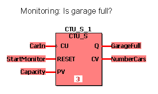
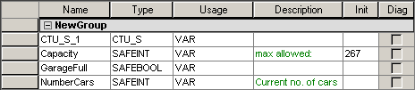
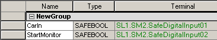

# CTU / CTU\_S - Counter Up

This counter function block counts up. In case of a rising edge at the input CU and RESET = FALSE, CV is increased by one. When CV reaches the value specified at PV, Q is set to TRUE and the function block stops counting. If RESET = TRUE, the counter is initialized with 0. To enable the counting process, RESET must be FALSE. Otherwise the counter will always be re-initialized.

The function block is available as standard function block CTU and safety-related function block CTU\_S.

## CTU

| Parameter | Data types | Description |
| --- | --- | --- |
| CU | BOOL | If a rising edge is detected, CV is increased by one. |
| RESET | BOOL | If TRUE, the counter is initialized with 0.  If FALSE, counting is enabled. |
| PV | INT | Preset value |
| Q | BOOL | TRUE if CV = PV |
| CV | INT | Counter result |

## CTU\_S

| Parameter | Data types | Description |
| --- | --- | --- |
| CU | SAFEBOOL | If a rising edge is detected, CV is increased by one. |
| RESET | SAFEBOOL | If TRUE, the counter is initialized with 0.  If FALSE, counting is enabled. |
| PV | SAFEINT | Preset value |
| Q | SAFEBOOL | TRUE if CV = PV |
| CV | SAFEINT | Counter result |

**NOTE:**

Function blocks have to be instantiated. Like variables, instances have to be declared *before* they can be inserted in a code body. Instances must be unique within the POU. In the following example, the instance name 'CTU\_S\_1' is used.

## Example for a safety-related function block declaration CTU\_S

## Variables declarations

Local declarations:

Global declarations (I/O variables):

**NOTE:**

If you want to use the standard function block CTU in your code worksheet, you have to select the data type 'CTU' for the function block instance in the local variables worksheet. Accordingly, the data types 'BOOL' and 'INT' must be used instead of 'SAFEBOOL' and 'SAFEINT'.

EIO0000002267.00

© 2021

Schneider Electric.

All rights reserved.