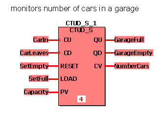
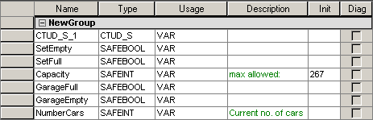

# CTUD / CTUD\_S - Counter Up/Down

This counter function block counts up or down. In case of a rising edge at the input CU, CV is increased by one. In case of a rising edge at the input CD, CV decrements by one. If CV = PV, QU is set to TRUE. If CV = 0, QD is set to TRUE. If RESET = TRUE, the counter is initialized with 0. If LOAD = TRUE, the counter is initialized with PV. To enable the counting process, the inputs RESET and LOAD must be FALSE. Otherwise the counter will always be re-initialized.

The function block is available as standard function block CTUD and safety-related function block CTUD\_S.

## CTUD

| Parameter | Data types | Description |
| --- | --- | --- |
| CU | BOOL | If a rising edge is detected, CV is increased by one. |
| CD | BOOL | If a rising edge is detected, CV decrements by one. |
| RESET | BOOL | If TRUE, the counter is initialized with 0.  If FALSE, counting is enabled. |
| LOAD | BOOL | If TRUE, the counter is initialized with PV.  If FALSE, counting is enabled. |
| PV | INT | Preset value |
| QU | BOOL | TRUE if CV = PV |
| QD | BOOL | TRUE if CV = 0 |
| CV | INT | Counter result |

## CTUD\_S

| Parameter | Data types | Description |
| --- | --- | --- |
| CU | SAFEBOOL | If a rising edge is detected, CV is increased by one. |
| CD | SAFEBOOL | If a rising edge is detected, CV decrements by one. |
| RESET | SAFEBOOL | If TRUE, the counter is initialized with 0.  If FALSE, counting is enabled. |
| LOAD | SAFEBOOL | If TRUE, the counter is initialized with PV.  If FALSE, counting is enabled. |
| PV | SAFEINT | Preset value |
| QU | SAFEBOOL | TRUE if CV = PV |
| QD | SAFEBOOL | TRUE if CV = 0 |
| CV | SAFEINT | Counter result |

**NOTE:**

Function blocks have to be instantiated. Like variables, instances have to be declared **before** they can be inserted in a code body. Instances must be unique within the POU. In the following example, the instance name 'CTUD\_S\_1' is used.

## Example for a safety-related function block declaration CTUD\_S

## Variables declarations

Local declarations:

Global declarations (I/O variables):

**NOTE:**

If you want to use the standard function block CTUD in your code worksheet, you have to select the data type 'CTUD' for the function block instance in the local variables worksheet. Accordingly, the data types 'BOOL' and 'INT' must be used instead of 'SAFEBOOL' and 'SAFEINT'.

EIO0000002267.00

© 2021

Schneider Electric.

All rights reserved.