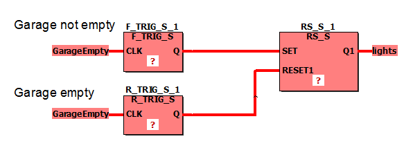
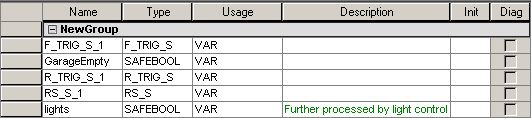

# F\_TRIG / F\_TRIG\_S - Falling edge detector

This edge detection function block detects a falling edge. If a falling edge is detected at the input CLK, the output Q changes from FALSE to TRUE. Q remains TRUE until the next call of the function block. If the function block is called for the first time, Q is FALSE until the first falling edge is detected.

The function block is available as standard function block F\_TRIG and safety-related function block F\_TRIG\_S.

## F\_TRIG

| Parameter | Data types | Description |
| --- | --- | --- |
| CLK | BOOL | Detects a falling edge |
| Q | BOOL | If a falling edge is detected, Q changes from FALSE to TRUE |

## F\_TRIG\_S

| Parameter | Data types | Description |
| --- | --- | --- |
| CLK | SAFEBOOL | Detects a falling edge |
| Q | SAFEBOOL | If a falling edge is detected, Q changes from FALSE to TRUE |

**NOTE:**

Function blocks have to be instantiated. Like variables, instances have to be declared **before** they can be inserted in a code body. Instances must be unique within the POU. In the following example, the instance name 'F\_TRIG\_S\_1' is used for the F\_TRIG\_S FB.

## Example for a safety-related function block declaration F\_TRIG\_S

## Variables declarations in this example

**NOTE:**

If you want to use the standard function block F\_TRIG in your code worksheet, you have to select the data type 'F\_TRIG' for the function block instance in the local variables worksheet. Accordingly, the data type 'BOOL' must be used instead of 'SAFEBOOL'.

EIO0000002267.00

© 2021

Schneider Electric.

All rights reserved.