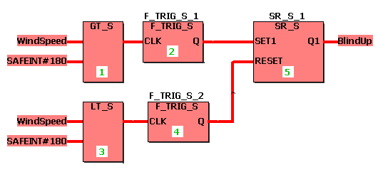
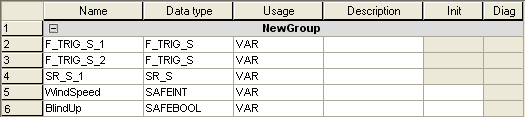

# SR / SR\_S - Set dominant

This bistable function block realizes a prior set of the output Q1. If the input SET1 = TRUE, the output Q1 is set. Q1 remains set even if SET becomes FALSE. Q1 is reset, if RESET = TRUE. If SET1 and RESET1 are TRUE, Q1 is set by SET1 to TRUE. If the function block is called for the first time, Q1 is FALSE.

The function block is available as standard function block SR and safety-related function block SR\_S.

## SR

| Parameter | Data types | Description |
| --- | --- | --- |
| SET1 | BOOL | If TRUE, Q1 is set dominant |
| RESET | BOOL | If TRUE, Q1 is reset |
| Q1 | BOOL | Output |

## SR\_S

| Parameter | Data types | Description |
| --- | --- | --- |
| SET1 | SAFEBOOL | If TRUE, Q1 is set dominant |
| RESET | SAFEBOOL | If TRUE, Q1 is reset |
| Q1 | SAFEBOOL | Output |

**NOTE:**

Function blocks have to be instantiated. Like variables, instances have to be declared **before** they can be inserted in a code body. Instances must be unique within the POU. In the following example, the instance name 'SR\_S\_1' is used for the SR\_S FB.

## Example for a safety-related function block declaration SR\_S

The following example realizes a simple blind control: Blinds are raised at wind speeds > 180.

## Variables declarations in this example

**NOTE:**

If you want to use the standard function block SR in your code worksheet, you have to select the data type 'SR' for the function block instance in the local variables worksheet. Accordingly, the data types 'BOOL' and 'INT' must be used instead of 'SAFEBOOL' and 'SAFEINT'.

EIO0000002267.00

© 2021

Schneider Electric.

All rights reserved.