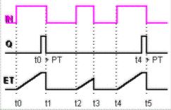
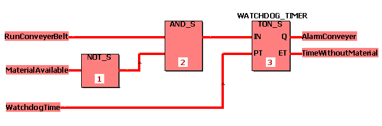

# TON / TON\_S - On-delay timer

This timer function block realizes an on-delay timing.

If the input IN changes from FALSE to TRUE, switching on is delayed for the time interval set at the input PT. After the delay time set at PT has elapsed, Q is set to TRUE. The already elapsed time is indicated at ET.

The function block is available as standard function block TON and safety-related function block TON\_S.

## TON

| Parameter | Data types | Description |
| --- | --- | --- |
| IN | BOOL | If a rising edge is detected, the on-delay timing is started. |
| PT | TIME | Preset time interval for the delay |
| Q | BOOL | TRUE if IN = TRUE and ET >= PT.  FALSE if IN = FALSE or ET < PT. |
| ET | TIME | Elapsed time interval |

## TON\_S

| Parameter | Data types | Description |
| --- | --- | --- |
| IN | SAFEBOOL | If a rising edge is detected, the on-delay timing is started. |
| PT | SAFETIME | Preset time interval for the delay |
| Q | SAFEBOOL | TRUE if IN = TRUE and ET >= PT.  FALSE if IN = FALSE or ET < PT. |
| ET | SAFETIME | Elapsed time interval |

**NOTE:**

Function blocks have to be instantiated. Like variables, instances have to be declared **before** they can be inserted in a code body. Instances must be unique within the POU. In the example, the instance name 'WATCHDOG\_TIMER' is used.

## Timing diagram

**NOTE:**

If the value applied at PT (Preset Time) is 0 or lower than the system's cycle time and a rising edge occurs at input IN, output Q is not set to TRUE until the next cycle.

## Example for safety-related function block declaration TON\_S

## Variables declarations in this example

**NOTE:**

If you want to use the standard function block TON in your code worksheet, you have to select the data type 'TON' for the function block instance in the local variables worksheet. Accordingly, the data types 'BOOL' and 'TIME' must be used instead of 'SAFEBOOL' and 'SAFETIME'.

EIO0000002267.00

© 2021

Schneider Electric.

All rights reserved.