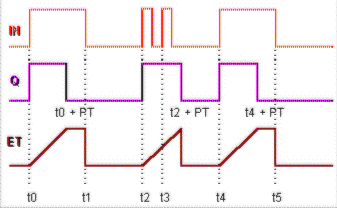
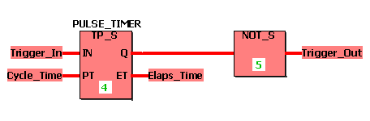
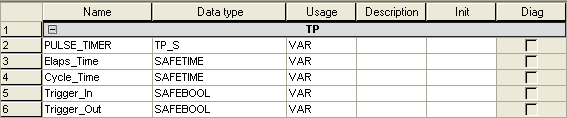

# TP / TP\_S - Pulse

This timer function block creates a pulse.

If the input IN changes from FALSE to TRUE, a pulse is created at output Q for the time interval set at the input PT. The elapsed time while Q=TRUE is output at ET. If IN becomes TRUE for a second time before the time set at PT has elapsed, Q remains unchanged.

The function block is available as standard function block TP and safety-related function block TP\_S.

## TP

| Parameter | Data types | Description |
| --- | --- | --- |
| IN | BOOL | If a rising edge is detected, a pulse is created. |
| PT | TIME | Preset time interval for the pulse |
| Q | BOOL | TRUE if IN = TRUE and ET < PT.  FALSE if IN = FALSE and ET >= PT. |
| ET | TIME | Elapsed time interval |

## TP\_S

| Parameter | Data types | Description |
| --- | --- | --- |
| IN | SAFEBOOL | If a rising edge is detected, a pulse is created. |
| PT | SAFETIME | Preset time interval for the pulse |
| Q | SAFEBOOL | TRUE if IN = TRUE and ET < PT.  FALSE if IN = FALSE and ET >= PT. |
| ET | SAFETIME | Elapsed time interval |

**NOTE:**

Function blocks have to be instantiated. Like variables, instances have to be declared **before** they can be inserted in a code body. Instances must be unique within the POU. In the following example, the instance name 'PULSE\_TIMER' is used for the TP\_S FB.

## Timing diagram

## Example for safety-related function block declaration TP\_S

## Variables declarations in this example

**NOTE:**

If you want to use the standard function block TP in your code worksheet, you have to select the data type 'TP' for the function block instance in the local variables worksheet. Accordingly, the data types 'BOOL' and 'TIME' must be used instead of 'SAFEBOOL' and 'SAFETIME'.

EIO0000002267.00

© 2021

Schneider Electric.

All rights reserved.