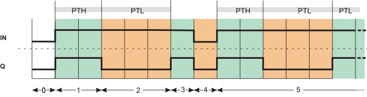
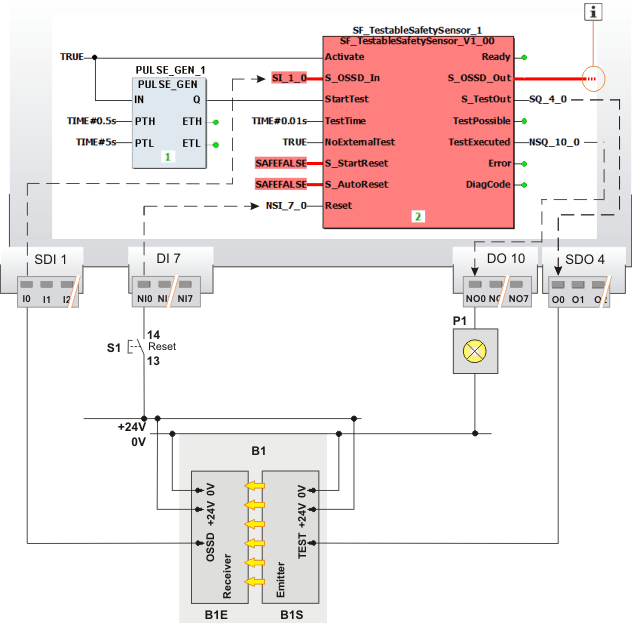

# PULSE\_GEN / PULSE\_GEN\_S - Pulse Generator

This pulse generator function block generates a pulse signal with a configurable pulse/pause ratio. The pulse/pause ratio is set using the function block inputs PTH and PTL.

The generated pulse signal can be used to control other safety-related and standard functions/function blocks.

**NOTE:**

The pulse generator function block is available twice: as standard version (PULSE\_GEN) with formal parameters of standard data types and as safety-related version (PULSE\_GEN\_S) with formal parameters of safety-related data types. In the sections below, always Boolean states **TRUE/FALSE** are mentioned. Correspondingly, the Safeboolean states **SAFETRUE/SAFEFALSE** apply for the safety-related PULSE\_GEN\_S version.

| WARNING | |
| --- | --- |
|  | **UNINTENDED EQUIPMENT OPERATION**  Verify that the connection of the pulse signal generated by PULSE\_GEN/PULSE\_GEN\_S cannot lead to undesirable behavior of the safety-related application.1  **Failure to follow these instructions can result in death, serious injury, or equipment damage.** |

|  |  |
| --- | --- |
| 1 | This could occur, for example, if the Q output of the PULSE\_GEN FB is connected to the Reset input of a safety-related function block, thereby causing potentially hazardous cyclic resetting. |

This topic contains information on the following:

* [Description of formal parameters](ClockPulseGenerator.html#ClockPulseGenerator__PGen_FPs)
* [Exception avoidance](ClockPulseGenerator.html#ClockPulseGenerator__faultavoidance_PULSEGEN)
* [Timing diagram](ClockPulseGenerator.html#ClockPulseGenerator__signaldiagrams_PULSEGEN)
* [Application example](ClockPulseGenerator.html#ClockPulseGenerator__applicationexample_PULSEGEN)

## Formal parameters of PULSE\_GEN/PULSE\_GEN\_S

| Parameter | Data types | Description |
| --- | --- | --- |
| IN | BOOL (standard FB)  SAFEBOOL (safety-related FB) | State-controlled input for activating the FB. Connect this input to a TRUE constant or a Boolean/Safeboolean input signal:  * **TRUE**  The FB is activated, the time inputs PTH and PTL are evaluated, and the pulse signal is output accordingly at Q.  **NOTE:**  The Q output is set to TRUE immediately when the FB is activated (IN = TRUE). Each pulse train always starts with a rising edge at the Q output. States are not considered relevant when the FB is deactivated. * **FALSE**  The FB is not activated. The Q output is switched to FALSE.  **NOTE:**  If the FB is connected to the safety-related function block SF\_TestableSafetySensor (TSS) in such a way that a positive edge of the Q output signal at the StartTest input of the TSS function block will trigger the sensor test, the IN input of the pulse generator FB **must always** be connected to the TRUE constant as shown in the [application example](ClockPulseGenerator.html#ClockPulseGenerator__applicationexample_PULSEGEN) below. You must always validate the entire safety function. |
| PTH  PTL | TIME (standard FB)  SAFETIME (safety-related FB) | Inputs for specifying the pulse ratio of the output signal:   * The PTH input defines the duration of the TRUE state at the Q output (pulse duration). * The PTL input defines the duration of the FALSE state at the Q output (pause time).  **NOTE:**  The pulse duration and pause time can be set to different values.  Pulse duration (PTH) > pause time (PTL) and vice versa are permitted.  A time value that is set incorrectly can cause hazards. Refer to the warning below this table.  **NOTE:**  Only time values which are higher than the Safety Logic Controller's cycle time are compatible.  The FB does not recognize incorrectly set time values. As such, **no error message** will be output if the time slot is set too large or too small. |
| Q | BOOL (standard FB)  SAFEBOOL (safety-related FB) | Outputs the generated pulse signal with the pulse/pause ratio according to the time values set at the inputs PTH and PTL (example: ratio 2:3 in the timing diagram shown below).  **NOTE:**  The Q output is set to TRUE immediately when the function block is activated (IN = TRUE). Each pulse train always starts with a rising edge at the Q output. States are not considered relevant when the FB is deactivated. |
| ETH  ETL | TIME (standard FB)  SAFETIME (safety-related FB) | ETH (Elapsed Time High) shows the elapsed pulse time while Q = TRUE. ETL (Elapsed Time Low) shows the elapsed pause time while Q = FALSE. |

| WARNING | |
| --- | --- |
|  | **UNINTENDED EQUIPMENT OPERATION**  Verify that the time values applied to PTH and PTL correspond to the time values from the risk analysis you carried out for your application.  **Failure to follow these instructions can result in death, serious injury, or equipment damage.** |

## Exception avoidance

Validating the entire safety function is the only way to detect incorrectly set time values at the PTL and PTH inputs.

| WARNING | |
| --- | --- |
|  | **UNINTENDED EQUIPMENT OPERATION**  Validate the entire safety function to ensure correct time values set at the PTL and PTH inputs.  **Failure to follow these instructions can result in death, serious injury, or equipment damage.** |

**Impermissible signals at the IN input:**

If no further measures for exception avoidance are taken, signal levels at the IN input which change or toggle sporadically will cause the pulse generator to restart on each and every positive edge. A TRUE pulse at the Q output will be set to FALSE immediately on a negative edge.

**Undesirable connection of the IN input:**

If no further measures for exception avoidance are taken, the undesirable connection of the IN input to a signal not designated for this purpose will cause the signal connected in error to control pulse generation. As a result, the pulse generator will be restarted on every positive edge. A TRUE pulse at the Q output will be set to FALSE immediately on a negative edge.

**Impermissible static TRUE signal at the IN input (operating current principle):**

If no further measures for exception avoidance are taken, a static TRUE signal at the IN input will cause the pulse generator to run continuously and it will not be possible to stop it.

**Impermissible static FALSE signal at the IN input (closed-circuit current principle):**

If no further measures for exception avoidance are taken, a static FALSE signal at the IN input will cause the pulse generator to be idle continuously and it will not be possible to start it.

**Connection with safety-related function block SF\_TestableSafetySensor: Impermissible FALSE signal or no connection at the IN input.**

If the pulse generator FB is connected to the safety-related function block SF\_TestableSafetySensor (TSS) in such a way that a positive edge of its Q output signal at the StartTest input of the TSS function block will trigger the sensor test, the IN input of the pulse generator FB **must always** be connected to the TRUE constant as shown in the [application example](ClockPulseGenerator.html#ClockPulseGenerator__applicationexample_PULSEGEN) below. You must always validate the entire safety function.

**Causes of the named error sources and how to rectify them**

The above mentioned signals may be caused by:

* Programming errors in the application program (user errors)
* Cross-circuit, short-circuit and cable break (user errors, wiring errors)

To prevent this, the following measures can be taken, depending on the safety function:

* Use of safety-related device signals
* Use of options for cross-circuit detection
* Verification of the safety-related logic in the code editor and subsequent validation of the entire safety-related application code

## Timing diagram

The following example shows the timing sequence for the pulse ratio 2:3 (for example, PTH = 2.0 s and PTL = 3.0 s).

|  |  |
| --- | --- |
| 0 | The FB is not yet active (IN = FALSE). Consequently, the output is FALSE. |
| 1 | Once the FB has been activated by means of IN = TRUE, the output is set to TRUE immediately; it retains this state for the time set at the PTH input. |
| 2 | Once the pulse duration PTH has expired, the output is set to FALSE; it retains this state for the time set at the PTL input. |
| 3 | The FB is deactivated during PTH (IN changes to FALSE). The Q output immediately switches to FALSE. |
| 4 | The FB remains deactivated (IN = FALSE). Consequently, the output remains FALSE. |
| 5 | The FB is reactivated (IN = TRUE). The pulse train starts again, the Q output switches to TRUE immediately.  The output will toggle between TRUE and FALSE in accordance with the time set (PTH and PTL) for as long as IN = TRUE. |

## Application example

In this example, the pulse generator starts a sensor test periodically. For this purpose the Q output of the pulse generator is connected to the StartTest input of the safety-related function block SF\_TestableSafetySensor. A positive edge at this input starts the sensor test of the connected safety sensor.

Exception avoidance when using the pulse generator FB with the safety-related function block SF\_TestableSafetySensor: With the correct connection shown in the example graphic below, a pulse at the Q output of PULSE\_GEN does not guarantee that the sensor test will actually be carried out.

This is because in order for the sensor test to be carried out, the SF\_TestableSafetySensor function block must permit it. In other words, the TestPossible TSS output must be set to TRUE when the pulse generated by PULSE\_GEN is present at the StartTest TSS input. You must take this into account in the context of your risk analysis.

| WARNING | |
| --- | --- |
|  | **UNINTENDED EQUIPMENT OPERATION**  Validate the entire safety function in terms of the correct interaction of the function blocks PULSE\_GEN and SF\_TestableSafetySensor, if they are used in the way described in this application example.  **Failure to follow these instructions can result in death, serious injury, or equipment damage.** |

**NOTE:**

In this application with the safety-related function block SF\_TestableSafetySensor, the IN input of the PULSE\_GEN FB **must** **always** be connected to the TRUE constant as shown in the graphic below.

The frequency of the sensor test (test interval) is thus set using PTL input of the pulse generator. The pulse duration (PTH input) is of no relevance to this application.

**Further Information:**

You will find more detailed information about the safety-related function block SF\_TestableSafetySensor and how it is connected underneath the graphic, as well as in the online help for the SF\_TestableSafetySensor function block.

|  |  |
| --- | --- |
| S1 | Reset |
| B1  B1S  B1E | ESPE - optoelectronic sensor: Single-channel light grid with test input  Optoelectronic emitter  Optoelectronic receiver |
| P1 | Signal lamp |
|  | See note below |

The connected sensor is a single-channel connected light grid. The SF\_TestableSafetySensor function block is connected/configured as follows:

* Both function blocks are permanently activated by the TRUE constant at the IN input (PULSE\_GEN) and the Activate input (TSS).
* The sensor's status signal is connected to the input terminal I0 of the safety-related input device SDI 1. This terminal is assigned to the global input variable SI\_1\_0 which is fed to the function block input S\_OSSD\_In for evaluation.
* The function block output S\_TestOut outputs the start signal for the sensor test to the sensor. The sensor's test input is connected to output O0 of the safety-related output device SDO 4 (assigned to the global output variable SQ\_4\_0).
* The function block output TestExecuted signals the successfully executed sensor test. It is connected to a standard global output variable which is in turn assigned to terminal NO0 of the standard output device DO 10. A signal lamp is connected to this terminal.
* Input S\_StartReset = SAFEFALSE specifies a start-up inhibit after the controller has been started up or the function block has been activated. In addition, S\_AutoRestart = SAFEFALSE specifies a restart inhibit for the function block after the TRUE signal returns at the S\_OSSD\_In input (in other words, the safety sensor's light beam is no longer interrupted). These two start-up inhibits are only removed when there is a positive signal edge at the Reset input. To this end, the S1 reset button is connected to terminal NI0 of the standard input device DI 7. This standard device terminal is assigned to the global standard input variable NSI\_7\_0.

**NOTE:**

The **S\_OSSD\_Out enable output of the SF\_TestableSafetySensor function block** is connected to a global output variable (i.e., to an output terminal of the application), either directly or via other safety-related functions/function blocks.

EIO0000002267.00

© 2021

Schneider Electric.

All rights reserved.