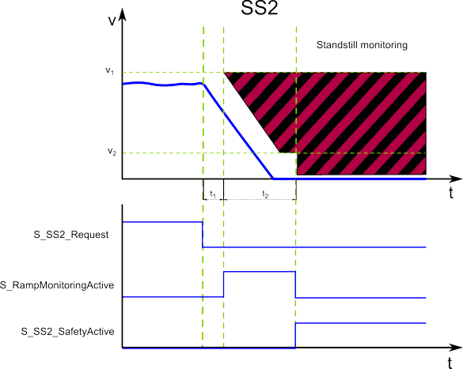

# SS2 - Safe Stop 2 Function

## General Function Description

The Safe Stop 2 function monitors the rapid and controlled stopping of a motor. When the drive is signaled to decelerate, the function block monitors the ramp-down as well as the standstill. As a result, the motor is still supplied with power, thus being able to resist external forces and the position control remains active to perform a standstill monitoring.

SS2 can realize a safety-related stop in accordance with **stop category 2** according to EN 60204-1.

## Monitoring by the safety-related FB/Safety Logic

The monitoring behavior by the function block depends on the parameterization of the safety logic:

* If ramp monitoring is **deactivated**, monitoring is passive until the t2 time interval has elapsed (see figure and description below).
* If ramp monitoring is **activated**, the safety logic monitors the motor deceleration rate specified by the deceleration ramp.

In both cases, the SS2 function monitors the motor and then performs the SS2 standstill monitoring. Note that the safety-related function only monitors the movement. Controlling the axis is done by the safety logic autonomously and independent of the FB.

The request of the safety-related function occurs at the beginning of the  t1 time interval ('S\_SS2\_Request' signal in the diagram). t1 is set with the device parameter `SS2_StartDelayTime[t1].`

Within the t1 time interval, the standard (non-safety-related) controller also receives the request from the connected process and initiates the motion control function according to the logic and drive parameterization defined in the standard (non-safety-related) application.

After t1 has elapsed, the deceleration of the drive is executed. The maximum allowed duration t2 of this ramp-down phase is defined by the device parameter `SS2_RampMonitoringTime[t2]`.

At the end of t2, speed must be zero and standstill monitoring (similar to the SOS function) is activated.

During t2, the deceleration can be monitored by setting the device parameter `SS2_RampMonitoring = Activated.`

If ramp monitoring is **deactivated**, the deceleration curve is not monitored. Even acceleration is allowed during the t2 interval. Standstill has to be achieved the latest before t2 elapses. Otherwise, STO is activated as the defined fallback function.

If ramp monitoring is **activated**, the deceleration curve is monitored and must follow the parameterized ramp (as shown in the figure). Otherwise, STO is activated as the defined fallback function.

After zero speed has been achieved and while t2 has not yet elapsed, a **velocity tolerance** of the axis is allowed and monitored relative to v2.

If the SS2 monitored standstill is successfully achieved, the function block switches S\_SS2\_SafetyActive = SAFETRUE (see diagram).

Otherwise, if the STO fallback function has been activated due to an error detected as described above, this is indicated by S\_STO\_SafetyActive = SAFETRUE.

## Fallback Function

If the parameterized `SS2_RampMonitoringTime[t2]` value is exceeded, or (in case of activated ramp monitoring) if the parameterized deceleration ramp is not respected as defined, or if the position tolerance (sTol) is exceeded, the STO function is automatically executed as the fallback function.

## Application

The SS2 function is used if a controlled deceleration of the drive with a following standstill monitoring is required, for example, during commissioning or after a safety-relevant event.

SS2 is suitable to bring a large flywheel mass as quickly as possible to a halt or to slow down and come to a standstill from high drive speeds as fast as possible. Typical examples are grinding spindles, centrifuges, storage and retrieval devices.

## Relevant Safety Logic/Safety Module Device Parameters

How to edit the relevant safety-related device parameters: In the EcoStruxure Machine Expert - Safety 'Devices' window, ...

1. Click the Safety Module in the devices tree.
2. In the Device Parameterization editor on the right, scroll to the relevant parameter section (see table heading below).
3. Specify the parameters listed in the table below for this safety-related function.

**NOTE:**

For the most part, the parameters entered here are **monitoring parameters**. They define the monitoring behavior and thus determine if a safety-related function is executed as defined or if a fallback function is to be executed due to error detection. The drive parameterization (such as deceleration parameters, etc.) is defined in EcoStruxure Machine Expert. See topic "[Functional description](function_MotionFB.html#function_MotionFB)".

For detailed information on the value ranges and default values for these parameters, refer to the corresponding chapter for the Safety Module used in the "Safety Module Parameters and Process Data Items" guide.

| Parameter section: Safe\_Stop\_2 | |
| --- | --- |
| `SS2_StartDelayTime[t1]` | Delay time after which the monitoring of the safety-related function is started.  This value must correspond to the time period, the entire motion control system needs to react, that is to say, the time after which the standard (non-safety-related) controller is able to initiate the requested safety-related function after receiving the request coded as process data control word via the SERCOS bus.  This interval is referred to as t1 in the timing diagram shown above.  The value set here must be equal or greater than the entire system response time including the standard system response time. The value must not be smaller than the shortest possible overall response time of the involved components, which is the earliest point in time when the drive is able to decelerate. |
| `SS2_RampMonitoring` | * **Deactivated**: No ramp monitoring. Standstill has to be achieved at the time specified with `SS2_RampMonitoringTime[t2]`. As the deceleration curve is not monitored, even acceleration is allowed during the deceleration period. * **Activated**: Ramp monitoring. The deceleration curve must follow the parameterized ramp.  The gradient of the ramp is automatically calculated by the system using the parameters `SS2_StartDelayTime[t1]`, `SS2_MaxRampVelocity[v1]`, `SS2_MinRampVelocity[v2]` and `SS2_RampMonitoringTime[t2]`. |
| `SS2_MaxRampVelocity[v1]` | Parameter is only relevant if ramp monitoring is activated (see previous table line).  The value influences the gradient of the deceleration ramp (see parameter `SS2_RampMonitoring`). |
| `SS2_RampMonitoringTime[t2]` | The parameter defines the duration in milliseconds after which speed zero has to be achieved (t2 in the figure) and SS2 standstill monitoring (similar to SOS) is activated.  If ramp monitoring is activated, the value influences the gradient of the deceleration ramp (see parameter `SS2_RampMonitoring`). |
| `SS2_MinRampVelocity[v2]` | Allowed velocity deviation (maximum speed) during standstill (v2 in the figure above). If the deviation exceeds the defined value, the [STO](STO.html#STO) function is activated as the fallback function.  For the SS2 function, the position is monitored after zero speed has been achieved and while t2 has not yet elapsed, that is to say, as long as SS2 standstill monitoring (similar to SOS) is not yet active.  If ramp monitoring is activated, the value influences the gradient of the deceleration ramp (see parameter `SS2_RampMonitoring`). |
| `SS2_PositionTolerance[sTol]` | Allowed deviation from the monitored standstill position. If the deviation exceeds the defined value, the STO function is activated as the fallback function. |

**NOTE:**

The SS2 function operates like an SOS function if no values are specified in the related device parameter section.

| WARNING | |
| --- | --- |
|  | **NON-CONFORMANCE TO SAFETY FUNCTION REQUIREMENTS**   * Verify that the device parameters for the safety logic correspond to your risk analysis. * Be sure that your risk analysis includes an evaluation for setting incorrectly device parameter values. * Validate the overall safety-related function with regard to the set device parameter values and thoroughly test the application.   **Failure to follow these instructions can result in death, serious injury, or equipment damage.** |

## Relevant FB Inputs/Outputs and Bit in Status Word

* Function monitoring request via FB input S\_SS2\_Request = SAFEFALSE.
* Function status indication via FB output S\_SS2\_SafetyActive (SAFETRUE = safety-related function activated) and Bit **7** in the DWORD output at AxisStatus (TRUE = safety-related function activated).

EIO0000002271.03