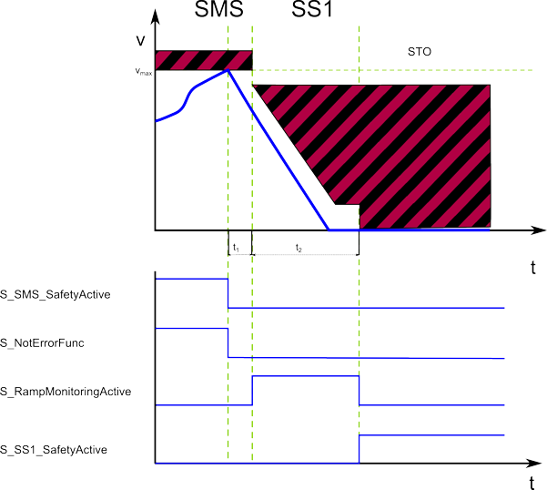

# SMS - Safe Maximum Speed Function

## General Function Description

The safety logic continuously monitors the parameterized Safe Maximum Speed (SMS) (set via the device parameter `SMS_MaxSpeed`) regardless of the requested safety-related functions.

## Monitoring by the Safety-related FB/Safety Logic

As the SMS monitoring function is continuously active, no function block input is available/required to request it. However, a function block output for indicating its activity is provided.

For the SMS safety-related function, no delay or monitoring times have to be parameterized.

In contrast to other safety-related functions, the Safe Maximum Speed (Vmax in the figure) is continuously monitored.

STO and SMS have the highest priority of the available safety-related functions.

## Fallback Function

If the defined Safe Maximum Speed is exceeded, first the SS1 function and afterwards the STO function are automatically executed as the fallback functions.

An active fallback function is indicated by switching the corresponding function block S\_SS1\_SafetyActive or S\_STO\_SafetyActive to SAFETRUE.

**NOTE:**

For information on the encoder resolution of the motor used, refer to the SH3/MH3 motor user manual which is part of the EcoStruxure Machine Expert online help (Lexium SH3 Motor - Product Manual or Lexium MH3 Motor - Product Manual).

Determine the resolution as follows:

* Digit 10 in the type code of the motor indicates the implemented encoder system.
* Section "Type code" in chapter 1 of the motor manual provides information on the number of Sin/Cos periods per revolution.

Motor manual example

## Relevant Safety Logic/Safety Module Device Parameters

How to edit the relevant safety-related device parameters: In the EcoStruxure Machine Expert - Safety 'Devices' window, ...

1. Click the Safety Module in the devices tree.
2. In the Device Parameterization editor on the right, scroll to the relevant parameter section (see table heading below).
3. Specify the parameters listed in the table below for this safety-related function.

**NOTE:**

For the most part, the parameters entered here are **monitoring parameters**. They define the monitoring behavior and thus determine if a safety-related function is executed as defined or if a fallback function is to be executed due to error detection. The drive parameterization (such as deceleration parameters, etc.) is defined in EcoStruxure Machine Expert. See topic "[Functional description](function_MotionFB.html#function_MotionFB)".

For detailed information on the value range and default value for the parameter, refer to the corresponding chapter for the safety module used in the "Safety Module Parameters and Process Data Items" guide.

| Parameter section: Safe\_Maximum\_Speed | |
| --- | --- |
| `SMS_MaxSpeed` | Defines the maximum speed which must not be exceeded at any point of time.  The `units/s` value depends on the resolution of the shaft encoder. |

## Relevant FB Inputs/Outputs and Bit in Status Word

* As the speed monitoring is continuously executed, no FB input is provided to request the monitoring of the SMS function.
* Function status indication via FB output S\_SMS\_SafetyActive (SAFETRUE = safety-related function activated) and Bit **15** in the DWORD output at AxisStatus (TRUE = safety-related function activated).

EIO0000002271.03