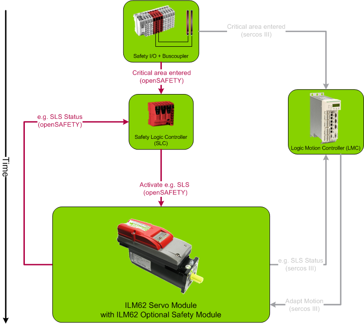
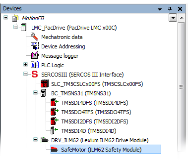

# Functional Description

This topic contains information on the following:

* [Interaction of involved components](function_MotionFB.html#function_MotionFB__FuncDescr_Interaction)
* [Hardware modules: Inserting into the devices tree](function_MotionFB.html#function_MotionFB__Hardware_SafeModule)
* [Illustration: System overview and component communication](function_MotionFB.html#function_MotionFB__FuncDescr_Illustrations)
* [Priority of safety-related functions](function_MotionFB.html#function_MotionFB__FuncDescr_Priority)
* [Start-up inhibit and restart inhibit](function_MotionFB.html#function_MotionFB__FuncDescr_Inhibits)
* [STO hard-wired](function_MotionFB.html#function_MotionFB__STOhardwired)
* [Closed-circuit principle](function_MotionFB.html#function_MotionFB__FuncDescr_ClosedCircuitPrinciple)

## Interaction of Involved Components

Schneider Electric drive modules, such as the LXM62 or ILM62, are standard modules which are controlled by the standard (non-safety-related) controller (LMC x00C or LMCx01C). The safety-related functionality is encapsulated in what is referred to herein as the safety logic. The safety logic resides in either a physical safety module, as is the case for the ILM62 drive, or embedded in the firmware, as it is for the LXM 62 drive.

The motion control application must be programmed and parameterized in the standard development environment EcoStruxure Machine Expert and is controlled by the standard (non-safety-related) controller. This also includes motions resulting for the safety-related functions described here, such as a deceleration due to an SS1 function (Safe Stop 1 with torque-free axis).

For that purpose, the standard (non-safety-related) controller also reads the signals (requests for the safety-related function) coming from the safety-related devices/sensors via the SERCOS bus and evaluates them by means of standard motion control function blocks used in the standard (non-safety-related) controller application program. It then controls the standard drive module accordingly, for example by commanding the acceleration or deceleration of the axis.

For the **monitoring** of safety-related motion functions requested by the connected process, however, the SLC safety-related application is responsible, programmed in EcoStruxure Machine Expert - Safety using the SF\_SafeMotionControl function block:

If the function block is activated (Activate = TRUE) and a valid SafeAxisIn data item applies at the S\_AxisIN input and a SafeAxisOut data item is connected to the S\_AxisOUT output, the S\_\*\_Request input signals are evaluated for that purpose. (\* stands for the [respective safety-related function](sfmotionfb.html#sfmotionfb__SafetyFunctions_Basics), for example, STO). If a safety-related function is requested by the connected process, the safety-related function block requests the monitoring of this safety-related function by the safety logic.

In case that a safety-related function is not activated correctly and as requested (due to reasons such as inoperable hardware or errors relative to parameter values), the safety logic initiates the fallback function defined for the unsuccessful safety-related function. This may be the STO function, thus executing stop category 0 or the SS1 function (stop category 1). Refer to the detailed [safety-related function descriptions](sfmotionfb.html#sfmotionfb__SafetyFunctions_Basics) for further information.

Based on the status information received from the safety logic, the safety-related function block sets its outputs accordingly, thus **visualizing** the safety-related function states. Additionally, the function block outputs a status word at its AxisStatus formal parameter which can be further evaluated in the safety-related application.

This way, the SF\_SafeMotionControl function block serves as a process data transport mechanism building a unique link between the implemented safety-related functions and the safety logic/drive combination.

**NOTE:**

For the most part, the parameters entered in EcoStruxure Machine Expert - Safety are **monitoring parameters**. They define the monitoring behavior and thus determine if a safety-related function is executed as defined or if a fallback function is to be executed due to error detection. The drive parameterization (such as deceleration parameters, etc.) is defined in EcoStruxure Machine Expert and the motion control is done by the standard (non-safety-related) controller.

This means that each safety-related function to be implemented must also be considered and handled in the EcoStruxure Machine Expert application program of the standard (non-safety-related) controller. Here, suitable standard motion function blocks are available and parameters of the standard drive module can be set.

Refer to the EcoStruxure Machine Expert documentation for further information.

## Illustration: System Overview and Component Communication

The following figure illustrates the interaction of the involved components. An LXM62 drive module can be used instead of the ILM62 module shown below.

## Hardware Modules: Inserting into the Devices Tree

Before you can use the SF\_SafeMotionControl function block, the required devices must be inserted in the EcoStruxure Machine Expert 'Devices' tree using the 'Add Device...' contextual menu item of the tree node. For this example, the following devices are required:

* A drive module of the type ILM62 or LXM62.

  In case of an ILM62 drive, a Safety Option Module is required. This is the safety-related component of the ILM62 drive. It manages the controlling and monitoring of the drive, thus implementing the safety-related functionality in the drive.
* Safe digital input devices, such as TM5SDI\*, for connecting the safety-related command devices and sensors.

**Click here** to see a possible bus structure as it may look in EcoStruxure Machine Expert...

## Start-up/Restart Inhibit

According to the IEC 60204-1 standard, the safety logic provides both an internal start-up inhibit and a restart inhibit (only for STO and SS1). Both inhibits are fixed, that means that you cannot deactivate them.

The function block reflects these internal inhibits in the safety-related application programming and enables their resetting via the Reset input.

* **Start-up inhibit**: After the SLC has been started up and/or the function block has been activated at the Activate input, the start-up inhibit is active. The start-up inhibit is only removed if there is a rising edge at the Reset input of the safety-related function block.

  After its start-up, the safety logic automatically enters the STO defined safe-state. According to the relevant IEC 60204-1 standard, the STO function executes **stop category 0**. This stop category implies a subsequent start-up inhibit.
* A **restart inhibit** is activated following an STO or SS1 function request in order to help prevent the unintended restart of the axis. For the other safety-related functions no restart inhibit is available. The restart inhibit is only removed if there is a rising edge at the Reset input of the safety-related function block.

  According to the relevant IEC 60204-1 standard, the STO function executes **stop category 0** and the SS1 function executes **stop category 1**. Both stop categories imply a subsequent restart inhibit.

Removing an active start-up/restart inhibit by means of a rising edge at the Reset input of the safety-related function block can directly cause the switching of outputs (depending on the states of the remaining inputs) and influence the speed and behavior of the axis to be controlled.

| WARNING | |
| --- | --- |
|  | **UNINTENDED START-UP**   * Include in your risk analysis the impact of removing an active start-up/restart inhibit by means of a rising edge at the Reset input. * Make certain that appropriate procedures and measures (according to applicable sector standards) have been established to help avoid hazardous situations when resetting the function block. * Do not enter the zone of operation when resetting the function block. * Ensure that no other persons can access the zone of operation when resetting the function block. * Use appropriate safety interlocks where personnel and/or equipment hazards exist.   **Failure to follow these instructions can result in death, serious injury, or equipment damage.** |

## Priority of Safety-related Functions

If several safety-related functions are requested simultaneously, the following fixed priority applies:

1. [STO](STO.html#STO), [SMS](SMS.html#SMS) (continuous speed monitoring)
2. [SS1](SS1.html#SS1)
3. [SOS](SOS.html#SOS)
4. [SS2](SS2.html#SS2)
5. [SLS1 to SLS4](SLS.html#SLS), [SDIneg/SDIpos](SDI.html#SDI)

**NOTE:**

If several functions of the same type are requested at the same time, the lowest number has the highest priority. Examples: SLS1 higher than SLS4.

**NOTE:**

If SDIpos and SDIneg are requested at the same time, the [SS1 function](SS1.html#SS1) is automatically executed as the defined fallback function.

## STO hard-wired

Depending on the parameterization of the safety logic, the [STO function](STO.html#STO) can be requested

* hard-wired via a direct signal link to the drive module.
* by software via the S\_STO\_Request input parameter of the function block.

  (The function block writes the STO request into the internal process data control word which is transferred to the safety logic via the SERCOS bus.)

Whether the STO function can be requested only via software or **additionally** via the hard-wired signal link depends on the safety-related `HW_STO` parameter.

This way it is, for example, possible to further use existing conventional safety-related implementations in already existing machines/plants while switching successively to the software safety-related solution with STO request via the SERCOS field bus.

How to edit the relevant safety-related device parameters: In the EcoStruxure Machine Expert - Safety 'Devices' window, ...

1. Click the Safety Module in the devices tree.
2. In the Device Parameterization editor on the right, specify the `HW_STO` parameter contained in the `Basic` parameter section (see table below for a description).

The possible settings of the `HW_STO` parameter have the following meaning:

* `HW_STO` = **Activated**:

  The hard-wired signal link can also be used. The STO function can be requested via the function block (S\_STO\_Request input = SAFEFALSE) as well as via the direct hard-wired signal link on the drive.

  |  |  |  |
  | --- | --- | --- |
  |  | HW: request | HW: no request |
  | SW: request | STO activated | STO activated |
  | SW: no request | STO activated | no STO activation |
  | SW = software STO request via the S\_STO\_Request input of the function block  HW = hard-wired STO request | | |
* `HW_STO` = **Deactivated**:

  The hard-wired signal link **cannot** be used. The STO function can solely be requested via the function block (S\_STO\_Request input = SAFEFALSE).

  |  |  |  |
  | --- | --- | --- |
  |  | HW: request | HW: no request |
  | SW: request | STO activated | STO activated |
  | SW: no request | no STO activation | no STO activation |
  | SW = software STO request via the S\_STO\_Request input of the function block  HW = hard-wired STO request | | |

## Closed-circuit Principle

The request of the safety-related functions at the function block inputs works according to the closed-circuit principle:

A SAFEFALSE value applied to an S\_\*\_Request function block input requests the respective safety-related function. Therefore, these inputs must be connected to safety-related devices with normally closed (N/C) contacts.

EIO0000002271.03