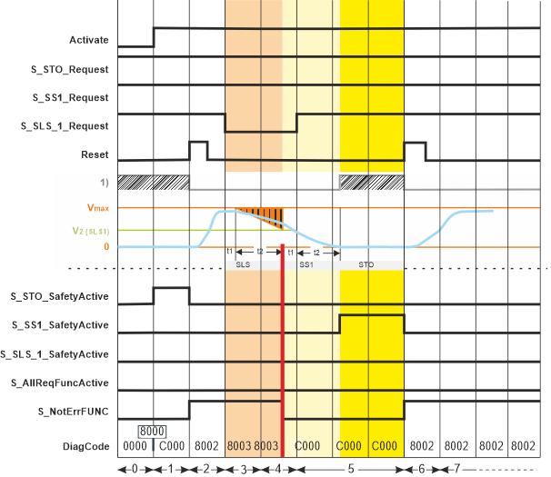

# Additional Signal Sequence Diagram

**NOTE:**

The signal sequence diagrams in this documentation possibly omit particular diagnostic codes. For example, a diagnostic code is possibly not shown if the function block state is a temporary transition state and only active for one cycle of the Safety Logic Controller.

Only typical input signal combinations are illustrated. Other signal combinations are possible.

**NOTE:**

The signal sequence diagram is simplified and is intended to explain the functionality of the SF\_SafeMotionControl function block. Therefore, this example is not intended as a practical solution implemented as shown and described in this document.

The most significant areas within the signal sequence diagrams are highlighted in color.

**Further Information:**

Also refer to the diagram found in the [overview](sfmotionfb.html#sfmotionfb) for this function block.

In the following example sequence, the SLS1 safety-related function requested by a safety-related command device (a key switch for a door open request, for example) cannot be activated successfully. Therefore, first SS1 and then STO are activated which are defined as the fallback functions of the SLS1 safety-related function.

Ramp monitoring is deactivated for both the SLS1 and the SS1 safety-related monitoring function by setting the corresponding device parameter `*_RampMonitoring` to `Deactivated`.

1) Internal startup/ restart inhibit

|  |  |
| --- | --- |
| 0 | The function block is not activated (Activate = FALSE). As a result, the outputs are FALSE/SAFEFALSE. |
| 1 | After starting up, the safety logic automatically enters the STO defined safe-state (8000). After its activation (by switching Activate = TRUE), the function block indicates this state by S\_STO\_SafetyActive = SAFETRUE. As a consequence of the STO state, the internal start-up inhibit is active.  (According to the relevant IEC 60204-1 standard, the STO function executes stop category 0. This stop category implies a subsequent start-up inhibit.)  With the block activation, the S\_NotErrFUNC output switches to SAFETRUE indicating that the function block has not detected any error.  Then, the FB automatically transitions to the error state C000. During C000 (indicated by S\_NotErrFUNC = SAFEFALSE), the STO state is maintained. |
| 2 | With the FALSE > TRUE edge at the Reset input of the safety-related function block, the start-up inhibit is removed. With this reset, the STO state is terminated.  As no safety-related function is now requested, the S\_STO\_SafetyActive output switches back to SAFEFALSE while the other function block outputs keep their previous states.  On that condition, the standard (non-safety-related) controller can start the drive operation by accelerating the axis to the desired target speed. |
| 3 | The [SLS1](SLS.html#SLS) safety-related function is requested: The signal at the S\_SLS\_1\_Request input switches to SAFEFALSE, for example, by unlocking a key switch.  Within the t1 time interval, the standard (non-safety-related) controller also receives the request from the connected process and initiates the motion control function according to the logic and drive parameterization defined in the standard (non-safety-related) application. t1 is to be defined in the safety logic device parameters (`SLS*_StartDelayTime[t1]`).  After t1 has elapsed, the deceleration of the drive to target speed V2 is executed by the standard (non-safety-related) controller according to the drive parameterization defined in the standard application. During the deceleration (ramp-down) phase t2, SLS1 ramp monitoring is deactivated in our example. This means that monitoring is inactive during t2 but the target speed is verified at the end of t2. |
| 4 | The parameterized limited target speed V2 is **not** achieved before the defined monitoring time t2 has elapsed.  As a result of the detected speed error,   * the SS1 function is activated which is defined as SLS1 fallback function. The S\_SS1\_SafetyActive output, however, remains SAFEFALSE as the SS1 defined safe-state is not yet achieved. * output S\_NotErrFUNC switches to SAFEFALSE to signal the error. * the outputs S\_SLS\_1\_SafetyActive and S\_AllReqFuncActive remain SAFEFALSE, thus signaling that the requested SLS1 safety-related function is not active. |
| 5 | After t1 (SS1 function) has elapsed, the deceleration of the drive to stop the axis is executed by the standard (non-safety-related) controller. During the deceleration (ramp-down) phase t2, SS1 ramp monitoring is deactivated in our example. This means that monitoring is inactive during SS1 t2 but speed must be zero at the end of SS1 t2.  At time t2, speed is zero and STO is activated. The drive is torque-free and standstill is monitored.  The S\_SS1\_SafetyActive output switches to SAFETRUE to indicate the active SS1 function.  Meanwhile, the machine is made ready for a restart by removing the cause for the detected error. The request for the SLS1 safety-related function is also removed by switching the S\_SLS\_1\_Request input back to SAFETRUE (for example, by locking the key switch).  The drive, however, remains torque-free due to the implemented restart inhibit. |
| 6 | With the FALSE > TRUE edge at the Reset input of the safety-related function block, the restart inhibit is removed.  The S\_SS1\_SafetyActive output switches back to SAFEFALSE and S\_NotErrFUNC = SAFETRUE signalizes that no error is detected.  As no safety-related function is requested, the standard (non-safety-related) controller can accelerate the axis until it achieves its programmed speed (parameterized in the standard (non-safety-related) motion application) without exceeding the defined and permanently monitored safe maximum speed (Vmax). |

EIO0000002271.03