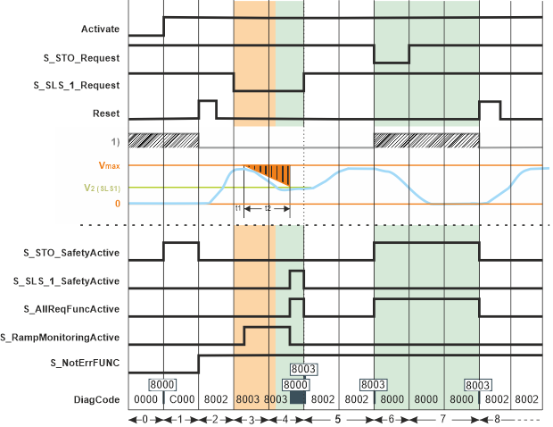
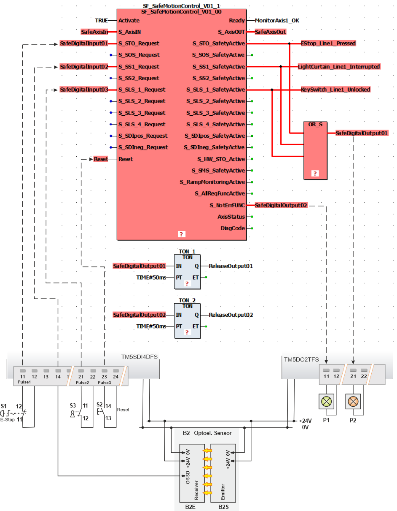

# Motion FB SF\_SafeMotionControl

## Short Description

The SF\_SafeMotionControl function block acts as interface between the Safety Logic Controller and the safety logic of the drive (whether in the Safety Option Module of the ILM62 or the embedded safety functionality of the LXM62) which is the safety-related component of those drives.

|  |  |
| --- | --- |
| The main purpose of the SF\_SafeMotionControl function block is to **request safety-related monitoring functions** in the safety logic and to **visualize the safety logic state**.  It performs the following tasks:  * Evaluates the signals of the connected safety-related devices/sensors such as, for example, key switches, safety doors, emergency-stop buttons or light curtains. * **Requests the monitoring** (based on the signal evaluation mentioned above), whether the safety-related function requested at the evaluated inputs has actually been applied correctly in the safety logic and therefore on the drive.  The safety logic performs the monitoring autonomously and independently from the safety-related function block and reports the status to the safety-related function block.  In addition, the function block requests a defined **fallback function** (STO or SS1) in the safety logic if the monitored status does not correspond to the requested status. * **Visualizes** the states of the safety-related function by reflecting the status of each implemented safety-related function as well as the error state of the safety logic and the axis status at the function block outputs. |  |

The drive to be monitored and controlled is identified via an axis ID which is to be applied at the S\_AxisIN function block input as well as to the S\_AxisOUT output. This way, a unique assignment between the function block and the physical axis is done.

The safety logic provides an internal [start-up/restart inhibit](function_MotionFB.html#function_MotionFB__FuncDescr_Inhibits) that cannot be deactivated. The function block reflects this internal start-up/restart inhibit in the safety-related application programming and enables its resetting.

## Supported Safety-related Functions

The following safety-related monitoring functions are supported by the SF\_SafeMotionControl function block. Click the links to get detailed information.

* [STO - Safe Torque Off function](STO.html#STO)
* [SOS - Safe Operation Stop function](SOS.html#SOS)
* [SS1 - Safe Stop 1 function](SS1.html#SS1)
* [SS2 - Safe Stop 2 function](SS2.html#SS2)
* [SLS1 to SLS4 - four separate Safely Limited Speed functions](SLS.html#SLS)
* [SDIpos - Safe Direction Positive function](SDI.html#SDI)
* [SDIneg - Safe Direction Negative function](SDI.html#SDI)
* [SMS - Safe Maximum Speed function](SMS.html#SMS)

**NOTE:**

The safety-related functions fulfill the safety requirements **up to SIL3**.

The various safety-related functions are subject to a fixed [priority](function_MotionFB.html#function_MotionFB__FuncDescr_Priority), whereby STO has the highest one.

## Function Block Inputs

Click the corresponding hyperlinks to obtain detailed information on the items below.

| Name | Short description | Value |
| --- | --- | --- |
| [Activate](act_MotionFB.html#act_MotionFB) | State-controlled input for activating the function block.  Data type: BOOL  Initial value: FALSE | * **FALSE**: Function block inactive * **TRUE**: Function block active |
| [S\_AxisIN](motionFB_AxisInInput.html#motionFB_AxisInInput) | Input for specifying the axis to be controlled and monitored.  Data type: SAFEDWORD  Initial value: 0x0 | This input **must** be connected to the SafeAxisIn data item provided (in the 'Devices' window) by the safety logic which is controlling the respective drive or axis.  Therefore, its value is determined and provided by this safety logic. |
| [S\_\*\_Request](motionFB_SRequestInputs.html#motionFB_SRequestInputs) | State-controlled input for requesting one of the safety-related monitoring functions.  The \* placeholder stands for:  * [STO - Safe Torque Off function](STO.html#STO) * [SOS - Safe Operation Stop function](SOS.html#SOS) * [SS1 - Safe Stop 1 function](SS1.html#SS1) * [SS2 - Safe Stop 2 function](SS2.html#SS2) * [SLS1 to SLS4 - four separate Safely Limited Speed functions](SLS.html#SLS) * [SDIpos - Safe Direction Positive function](SDI.html#SDI) * [SDIneg - Safe Direction Negative function](SDI.html#SDI)  Data type: SAFEBOOL  Initial value depends on the input:   * SAFEFALSE for S\_STO\_Request. * SAFETRUE for the other request inputs.  **NOTE:**  As the SMS (Safe Maximum Speed) monitoring function is active at any time, no function block input is available/required to request it. However, a function block output for indicating its activity is provided. | * **SAFEFALSE**: respective safety-related monitoring function is requested * **SAFETRUE**: respective safety-related monitoring function is **not** requested  **NOTE:**  The S\_STO\_Request input must be connected.  **NOTE:**  For drive operation (rotation), SAFETRUE must apply to the S\_STO\_Request input. |
| [Reset](reset_MotionFB.html#reset_MotionFB) | Edge-triggered input for the reset signal.  * Resetting function block error states when the cause of the error is no longer present. * Manual resetting of the **start-up inhibit** which is active by default after starting up the Safety Logic Controller and after activating the function block. * Manual resetting of a **restart inhibit** which is active by default following an STO or SS1 function request in order to help prevent the unintended restart of the axis.  Data type: BOOL  Initial value: FALSE  **NOTE:**  Resetting does not occur with a falling edge (TRUE > FALSE), as specified by standard EN ISO 13849-1, but with a rising edge (FALSE > TRUE).  Refer to the hazard message below this table. | * **FALSE**: Reset is not requested * Rising edge **FALSE > TRUE**: Reset is requested |

Removing an active start-up/restart inhibit by means of a rising edge at the Reset input of the safety-related function block can directly cause the switching of outputs (depending on the states of the remaining inputs) and influence the speed and behavior of the axis to be controlled.

| WARNING | |
| --- | --- |
|  | **UNINTENDED START-UP**   * Include in your risk analysis the impact of removing an active start-up/restart inhibit by means of a rising edge at the Reset input. * Make certain that appropriate procedures and measures (according to applicable sector standards) have been established to help avoid hazardous situations when resetting the function block. * Do not enter the zone of operation when resetting the function block. * Ensure that no other persons can access the zone of operation when resetting the function block. * Use appropriate safety interlocks where personnel and/or equipment hazards exist.   **Failure to follow these instructions can result in death, serious injury, or equipment damage.** |

## Function Block Outputs

Click the corresponding hyperlinks to obtain detailed information on the items below.

| Name | Short description | Value |
| --- | --- | --- |
| [Ready](ready_MotionFB.html#ready_MotionFB) | Output for signaling "Function block activated/not activated".  Data type: BOOL | * **TRUE**: Function block is activated (Activate = TRUE) and the output parameters represent the state of the safety-related function. * **FALSE**: Function block is not activated (Activate = FALSE) and the outputs of the function block are switched to FALSE or SAFEFALSE. |
| [S\_AxisOUT](motionFB_AxisOUToutput.html#motionFB_AxisOUToutput) | Output for indicating the controlled/monitored axis.  Data type: SAFEDWORD | This output **must** be connected to the SafeAxisOut data item provided (in the 'Devices' window) by the safety logic which is controlling the respective drive or axis. |
| [S\_\*\_SafetyActive](SafetyActiveOut_MotionFB.html#SafetyActiveOut_MotionFB) | Outputs for signaling the status of a safety-related function.  The \* placeholder stands for:  * [STO - Safe Torque Off function](STO.html#STO) * [SOS - Safe Operation Stop monitoring function](SOS.html#SOS) * [SS1 - Safe Stop 1 monitoring function](SS1.html#SS1) * [SS2 - Safe Stop 2 monitoring function](SS2.html#SS2) * [SLS1 to SLS4 - four separate Safely Limited Speed monitoring functions](SLS.html#SLS) * [SDIpos - Safe Direction Positive monitoring function](SDI.html#SDI) * [SDIneg - Safe Direction Negative monitoring function](SDI.html#SDI) * [SMS - Safe Maximum Speed monitoring function](SMS.html#SMS)  Data type: SAFEBOOL | * **SAFEFALSE**:    + Safety-related function is not active, or   + the function block is not activated, or   + the function block has detected an error, or   + the start-up/restart inhibit is active.  (Not valid for S\_STO\_SafetyActive. Observe the note below.) * **SAFETRUE**:    + Safety-related function is active, and   + the function block is activated, and   + the function block has not detected an error, and   + the start-up/restart inhibit is not active.  (Not valid for S\_STO\_SafetyActive. Observe the note below.)  **NOTE:**  In case of an active start-up/restart inhibit, S\_STO\_SafetyActive = SAFETRUE and the other SafetyActive outputs are SAFEFALSE. |
| [S\_HW\_STO\_Active](HWInverterEnableActive_MotionFB.html#HWInverterEnableActive_MotionFB) | Output for signaling that the **STO** safety-related function has been requested via the direct hard-wired signal link.  Data type: SAFEBOOL  **NOTE:**  This output is only relevant if the `HW_STO` device parameter of the safety logic is set to `Activated`. Only with this setting, the use of the hard-wired STO request is possible (see section "[STO hard-wired](function_MotionFB.html#function_MotionFB__STOhardwired)"). | * **SAFEFALSE**:    + STO function is not requested via the hard-wired signal link. If a request is present, it was generated via the function block, or   + STO function is not requested at all, or   + the function block is not activated. * **SAFETRUE**:    + STO function is requested via the hard-wired direct signal link of the safety logic, and   + the function block is activated. |
| [S\_RampMonitoringActive](RampMonitoringActive_MotionFB.html#RampMonitoringActive_MotionFB) | Output for signaling the active ramp monitoring for the requested safety-related monitoring function(s). | * **SAFEFALSE**:  + Ramp monitoring is inactive for the requested safety-related monitoring function(s), or   + the function block is not activated. * **SAFETRUE**:  + Ramp monitoring is active for at least one requested safety-related monitoring function, and   + the function block is activated. |
| [S\_AllReqFuncActive](AllReqFuncActive_MotionFB.html#AllReqFuncActive_MotionFB) | Output for signaling the overall status of the requested safety-related functions.  Data type: SAFEBOOL | * **SAFEFALSE**:    + No safety-related function is requested, or   + at least one of the requested safety-related functions has not yet achieved its defined safe-state, or   + an error has been detected on the safety logic, or   + the function block is not activated. * **SAFETRUE**:    + The requested safety-related functions are executed correctly, that is to say, are in the functional defined safe-state, and   + the function block is activated. |
| [S\_NotErrFUNC](NotErrFunc_MotionFB.html#NotErrFunc_MotionFB) | Output for signaling the error state of the safety logic.  Data type: SAFEBOOL | * **SAFEFALSE**:    + An error has been detected on the safety logic, or   + a safety-related function has not been respected as defined, or   + the function block is not activated. * **SAFETRUE**:    + No error has been detected on the safety logic, and   + the safety-related functions have been respected as defined, and   + the function block is activated. |
| [AxisStatus](AxisStatus_MotionFB.html#AxisStatus_MotionFB) | Output for reporting the axis status.  Data type: DWORD | Bitwise status output as DWORD data type. Every Boolean FB output is mapped to one bit of this status DWORD which can be further processed and evaluated in the application (see [table in topic "AxisStatus output"](AxisStatus_MotionFB.html#AxisStatus_MotionFB)). |
| [DiagCode](diag_MotionFB.html#diag_MotionFB) | Output for diagnostic message.  Data type: WORD | Diagnostic message of the function block.  The possible values are listed and described in the topic "[Diagnostic codes](codes_MotionFB.html#codes_MotionFB)". |

## Signal Sequence Diagram

This diagram relates to a sample application of the SF\_SafeMotionControl FB: The states of two safety-related command devices, an emergency-stop control button and a key switch, are evaluated by the function block. The emergency-stop control button requests the STO function and the key switch requests the SLS1 function.

According to the example requirements, the axis speed must be reduced before personnel may enter the zone of operation. Only with reduced speed, for example, a safety door can be opened to grant access to the zone of operation without requesting the STO function.

**NOTE:**

The signal sequence diagrams in this documentation possibly omit particular diagnostic codes. For example, a diagnostic code is possibly not shown if the function block state is a temporary transition state and only active for one cycle of the Safety Logic Controller.

Only typical input signal combinations are illustrated. Other signal combinations are possible.

**NOTE:**

The signal sequence diagram is simplified and is intended to explain the functionality of the SF\_SafeMotionControl function block. Therefore, this example is not intended as a practical solution implemented as shown and described in this document.

1) Internal startup/ restart inhibit

**Further Information:**

Also take the other [signal sequence diagram](signaldiagram_MotionFB.html#signaldiagram_MotionFB) into account.

|  |  |
| --- | --- |
| 0 | The function block is not activated (Activate = FALSE). As a result, the outputs are FALSE/SAFEFALSE. |
| 1 | After starting up, the safety logic automatically enters the STO defined safe-state(8000). After its activation (by switching Activate = TRUE), the function block indicates this state by S\_STO\_SafetyActive = SAFETRUE. As a consequence of the STO state, the internal start-up inhibit is active.  (According to the relevant IEC 60204-1 standard, the STO function executes stop category 0. This stop category implies a subsequent start-up inhibit.)  With the block activation, the S\_NotErrFUNC output switches to SAFETRUE indicating that the function block has not detected any error.  Then, the FB automatically transitions to the error state C000. During C000 (indicated by S\_NotErrFUNC = SAFEFALSE), the STO state is maintained. |
| 2 | With the FALSE > TRUE edge at the Reset input of the safety-related function block, the start-up/restart inhibit is removed. With this reset, the STO state is terminated.  As no safety-related function is now requested, the S\_STO\_SafetyActive output switches back to SAFEFALSE while the other function block outputs keep their previous states.  On that condition, the standard (non-safety-related) controller can start the drive operation by accelerating the axis to the target speed parameterized in the standard (non-safety-related) motion application. |
| 3 | The [SLS1](SLS.html#SLS) safety-related function is requested: The signal at the S\_SLS\_1\_Request input switches to SAFEFALSE, for example, by unlocking a key switch.  Within the t1 time interval, the standard (non-safety-related) controller also receives the request from the connected process and initiates the motion control function according to the logic and drive parameterization defined in the standard (non-safety-related) application. t1 is to be defined in the safety logic device parameters (`SLS*_StartDelayTime[t1]`).  After t1 has elapsed, the deceleration of the drive to target speed V2 is executed by the standard (non-safety-related) controller according to the drive parameterization defined in the standard application.  During the deceleration (ramp-down) phase t2, ramp monitoring is parameterized in our example for the SLS1 safety-related function. For that purpose, the corresponding safety logic parameter `SLS1_RampMonitoring` is set to `Activated`. Active ramp monitoring is indicated by the output S\_RampMonitoringActive = SAFETRUE. Exceeding the defined ramp results in the immediate request of the STO function. |
| 4 | The parameterized limited target speed V2 (set with the `SLS1_Speed[v2]` parameter) is achieved before the defined monitoring time t2 has elapsed **and** the ramp monitoring did not detect any speed errors during the ramp monitoring period t2.  This means the requested SLS1 safety-related function is activated correctly and the function block does not detect any error (S\_NotErrFUNC remains SAFETRUE).  As a result, S\_SLS\_1\_SafetyActive switches to SAFETRUE when t2 elapses, indicating that SLS1 has entered its defined safe-state. Then, for the example, the safety door can be opened and access to the zone of operation is possible without a subsequent emergency stop.  S\_AllReqFuncActive simultaneously switches to SAFETRUE signaling that each requested safety-related function is activated correctly and as parameterized.  As long as the request for the safety-related function is maintained by further applying SAFEFALSE to the S\_SLS\_1\_Request input, the target speed V2 is monitored. Any exceeding of the target speed V2 results in the immediate request of the STO function and switches S\_SLS\_1\_SafetyActive to SAFEFALSE. |
| 5 | The request for the SLS1 safety-related function is removed by switching the signal at the S\_SLS\_1\_Request input back to SAFETRUE (for example by locking the key switch after closing a safety door).  The outputs S\_SLS\_1\_SafetyActive and S\_AllReqFuncActive directly switch back to SAFEFALSE, thus signaling that no safety-related function is active anymore.  As no restart inhibit is required following the SLS function, the standard (non-safety-related) controller can accelerate the axis without any reset signal as soon as the request for the safety-related function is removed at S\_SLS\_1\_Request.  The axis achieves the speed (parameterized in the standard (non-safety-related) motion application) without exceeding the defined and permanently monitored safe maximum speed (Vmax). |
| 6 | The [STO](STO.html#STO) safety-related function is requested: By pressing the monitored emergency-stop control button, the signal at the S\_STO\_Request input switches to SAFEFALSE.  As a result, the safety logic directly sets the drive torque-free and the axis coasts down.  S\_STO\_SafetyActive switches to SAFETRUE, indicating that STO is activated. As STO is the only requested safety-related function at that time, S\_AllReqFuncActive also shows SAFETRUE. |
| 7 | The request for the STO function is removed by unlocking the emergency-stop control button before the axis has reached the standstill. As a result, the signal from the emergency stop button, connected to the S\_STO\_Request input, switches back to SAFETRUE.  The drive, however, remains torque-free due to the implemented restart inhibit and the axis keeps on coasting down until v = 0.  S\_STO\_SafetyActive and S\_AllReqFuncActive remain SAFETRUE as long as the restart inhibit is active. |
| 8 | With the FALSE > TRUE edge at the Reset input of the safety-related function block, the restart inhibit is removed.  As no safety-related function is requested, the standard (non-safety-related) controller can accelerate the axis until it achieves its programmed speed (parameterized in the standard (non-safety-related) motion application) without exceeding the defined and permanently monitored safe maximum speed (Vmax). |

## Application Example

In the example shown below, the Safety Logic Controller processes the input signals coming from a TM5 safety-related extension module. Here, an emergency-stop control button, a key switch and a light curtain are connected. These devices are connected via global I/O variables to the respective function block request inputs.

At the safety-related output device two signal lamps are connected: The green lamp signals "Safety Module OK" and the red one indicates "Safety-related function requested".

**Further Information:**

Also take [the details on this application example and the accompanying notes](applicationexample_MotionFB.html#applicationexample_MotionFB) into account.

Only you, the user, machine builder or system integrator can be aware of all the conditions and factors realized in the design of your application for the machine. Therefore, only you can determine the automation equipment and the related safeties and interlocks which can be properly used, and validate such usage.

| WARNING | |
| --- | --- |
|  | **NON-CONFORMANCE TO SAFETY FUNCTION REQUIREMENTS**   * Specify the requirements and/or measures to be implemented in the risk analysis you perform. * Verify that your safety-related application complies to applicable safety regulations and standards. * Make certain that appropriate procedures and measures (according to applicable sector standards) have been established to help avoid hazardous situations when operating the machine. * Use appropriate safety interlocks where personnel and/or equipment hazards exist. * Validate the overall safety-related function and thoroughly test the application.   **Failure to follow these instructions can result in death, serious injury, or equipment damage.** |

**NOTE:**

The application example is simplified and is intended to explain the functionality of the SF\_SafeMotionControl function block. Therefore, this example is not intended as a practical solution implemented as shown and described in this document.

## Detailed Information

Additional information is available in the following sections:

* [Hardware module: Inserting into the devices tree](function_MotionFB.html#function_MotionFB__Hardware_SafeModule)
* [Functional description](function_MotionFB.html#function_MotionFB)
* [Additional signal sequence diagram](signaldiagram_MotionFB.html#signaldiagram_MotionFB)
* [Details on the application example](applicationexample_MotionFB.html#applicationexample_MotionFB)
* [Exception avoidance](faultavoidance_MotionFB.html#faultavoidance_MotionFB)
* [Implementation of safety requirements from applicable standards](safetyrequirements_MotionFB.html#safetyrequirements_MotionFB)

EIO0000002271.03