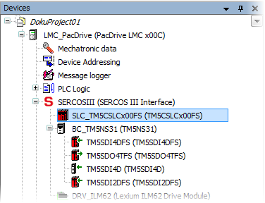

# Launching Machine Expert – Safety - Login

## Launching Machine Expert – Safety from Machine Expert

Machine Expert – Safety interacts with the Machine Expert automation suite. Machine Expert includes, among other tools, the Logic Builder used for programming the standard controller application, and a Devices Tree for configuring the bus structure. After adding a Safety Logic Controller (SLC) to the bus structure in the Machine Expert Devices Tree, Machine Expert – Safety can be launched from this SLC tree icon.

Example:

To launch Machine Expert – Safety, right-click the Safety Logic Controller icon (SLC\_TM5CSLCx00FS in the example above), and select 'Machine Expert - Safety > Edit Project' from the context menu. Machine Expert – Safety is then started and the login dialog appears as described below.

The related project is automatically opened. If no safety-related project yet exists, a new project is automatically created. In doing so, the safety-related devices are automatically imported into the Machine Expert – Safety 'Devices' window (Bus Navigator). Here, the safety-related devices can be parameterized and the I/O process data items are available for using them in the project.

## Login

After starting Machine Expert – Safety the login dialog appears. Select a project level and enter the appropriate project password in the 'Project log on' dialog.

**Further Information:**

Read the topic ["Password Protection for Project and Safety Logic Controller"](PasswordProtection.html#PasswordProtection) for further information.

EIO0000002147.09