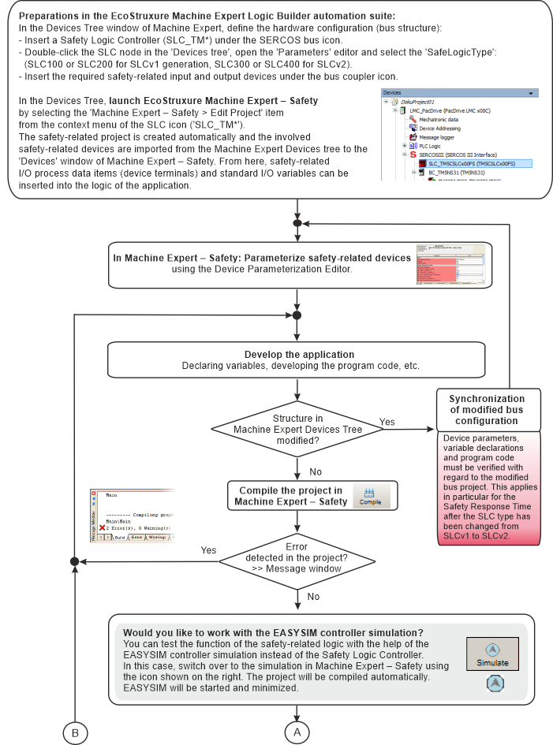
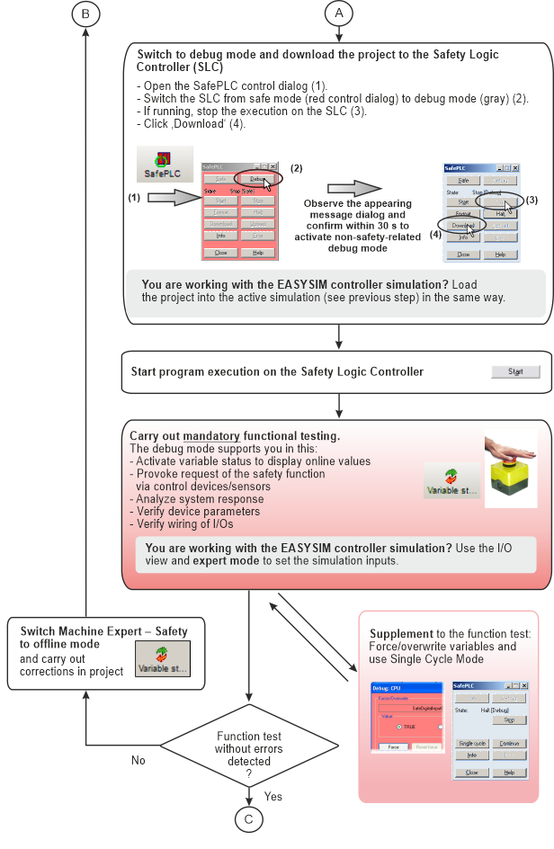
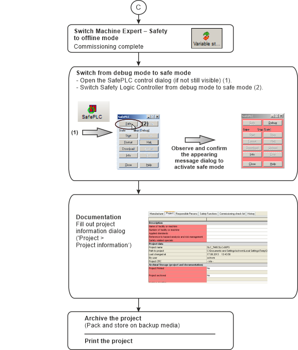

# General Project Steps

This diagram shows a simplified workflow, i.e., the general procedure to develop a project.

You can print this topic by clicking the 'Print' button of the online help window.

**NOTE:**

The login to the project and Safety Logic Controller is not considered in the diagram.

EIO0000002147.09