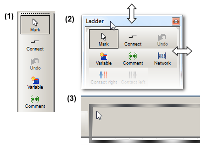

# Toolbars

Frequently used menu items can also be accessed via toolbar icons and default [shortcuts](keyboardshortcuts.html#keyboardshortcuts).

Toolbar icons provide a tooltip and a short description displayed in the status bar when hovering the mouse pointer.

Toolbars can be undocked, moved, and docked elsewhere in the user interface as follows:

1. Double-click the dotted line to undock the toolbar (1 in the figure below).
2. The size of an undocked window can be adapted by dragging the window border (see 2).

   To move an undocked window, drag it at its title bar.
3. To redock a window, drop it at the desired position on the border of the Machine Expert – Safety window (see 3).

**Hiding/showing toolbars**

To hide or show a certain toolbar, proceed as follows:

1. Select 'Project > Options'.
2. Open the 'Toolbars' dialog page.
3. Activate/deselect the respective checkboxes.

By default all toolbars are visible.

**Large or small toolbar icons?**

Select 'Project > Options', open the 'Toolbars' tab and select/clear the option 'Show large buttons' to specify whether Machine Expert – Safety appears with large or small toolbar icons.

EIO0000002147.09