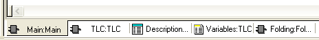

# Workspace

In the workspace, code worksheets are opened in the respective editor and variables worksheets are edited. By default, the workspace view is set to 'Workbook Style': if several worksheets are opened, a sheet tab is assigned to each opened worksheet at the lower border. To activate a particular worksheet, click the corresponding tab or browse the open worksheets by repeatedly pressing <Ctrl> + <TAB>.

To show or hide the worksheet tabs, select 'Project > Options'. In the ['Options' dialog](customizingtheuserinterface_dialog_options.html#customizingtheuserinterface_dialog_options), click the 'General' tab and activate or deselect the 'Workbook Style' checkbox.

To arrange several worksheet windows, use the commands in the 'Window' menu (for example, 'Cascade' or 'Tile').

To maximize the workspace, you can hide windows by either clicking the appropriate toolbar button or by activating the **auto-hide function** as described in the topic ["Adjusting windows"](customizingtheuserinterface_dialog_options.html#customizingtheuserinterface_dialog_options__AdjustingUIWindows).

EIO0000002147.09