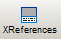
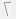

# Cross References Window

In the cross references window you can generate a list of variables and FB instances (and their declarations) displaying the locations where the variables/instances are used. By analyzing the correlations and interaction of variables, cross references are helpful for debugging the application.

The cross references list contains variables/FB instances which are used in the project, i.e., which are declared in a variables worksheet **and** written/read or called in the code. Variables which are not used in the project are shown with the unused icon (overlaid on the icon of the variable, see table below).

**NOTE:**

Every POU contains its own local data. That means that if you open a particular code worksheet, the local variables used in this worksheet are automatically updated in the cross references list.

To display the cross references window, select 'View > Cross References Window' or press <Alt> + <F2> or click the 'XReferences' icon:

## Contents of the cross references window

|  |  |
| --- | --- |
| Variable | Type and name of the variable or FB instance. An active filter is indicated in the column header.  The displayed symbol represents the variable type:  = local variable  = global variable (I/O variable or global symbolic variable)  = input variable of a function block POU (VAR\_INPUT)  = output variable of a function block POU (VAR\_OUTPUT)  = function block instance  = unused variable. Overlay icon shown on the icon of the variable if not used in the project. (Example: unused global variable ) |
| POU | Name of the POU where the variable/FB is declared and code worksheet where it is used. |
| Access | Access to a variable can be 'Read' or 'Write'. For FB instances 'Call' is entered. |

## How to...

How to build the cross references

* Press the <F12> key
* or select the 'Build > Build Cross References' menu item
* or right-click into the cross references window and select the 'Build Cross References' item from the context menu.

How to access a worksheet from the cross references list

Double-clicking an entry in the cross references window directly accesses the corresponding code worksheet and marks the particular variable/FB instance. Furthermore, a variable is marked in the cross references window if you select the variable in an editor.

How to sort the cross references list

* Left-click the column header you want to use as sort criterion (e.g., 'Variable'). An arrow indicates the set sort order:   Ascending or descending sort order.
* Click once more on the same column name to reverse the sort order.

How to filter the cross references list - 'Cross Reference Filter' dialog

The cross references list can be filtered in order to show only a particular subset of variables and/or function block instances. For example, you can use the filter function to show only "unused" variables.

1. Right-click into the cross references window and select 'Filter...' from the context menu.

   The 'Cross Reference Filter' dialog appears.
2. Mark the checkboxes of the elements to be displayed.

   You can also include 'Unused variables' by selecting the related box.
3. To filter the list for a specific name or access type, mark the corresponding checkbox in order to activate the text field/combo box. In the 'Name' text field you can use wildcards (see note below).
4. After confirming the dialog, the cross references window only shows elements which match the filter settings. The 'Variable' column header indicates the applied filter settings: 

**Using wildcards in the 'Cross Reference Filter' dialog:** in the text field, the wildcard symbol '\*' is supported. A wildcard serves as a placeholder for any characters and is used in conjunction with other characters. You can use a wildcard at the beginning of an identifier as well as at the end.

**Example**: The filter string 'var\*' displays the variables var1, var2 up to var10 in the cross references list.

How to adjust the window

You can adjust the window by undocking it, modifying its size, moving it to another screen position, etc. Further information can be found in the topic "[Adjusting windows](customizingtheuserinterface_dialog_options.html#customizingtheuserinterface_dialog_options__AdjustingUIWindows)".

Auto-hide function (floating windows): Use the [auto-hide function](customizingtheuserinterface_dialog_options.html#customizingtheuserinterface_dialog_options__AdjustingUIWindows) to automatically hide (minimize) the window if it is unused. For that purpose switch on the auto-hide function by clicking the  icon on the window control bar. If the auto-hide function is switched on for that window, the  icon is shown. In this case, position the mouse pointer over the minimized window to show it again.

EIO0000002147.09