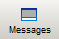

# Message Window

The message window outputs the following information on various window tabs:

* Build steps during [project compilation](compiling.html#compiling).
* Compiler errors and alerts occurred during compilation.
* Compiler errors detected by the [continuous background verification](TextEd_Intro.html#TextEd_Intro__FeaturesTextEd) of the text editor.
* Errors reported by the Safety Logic Controller.
* System messages.

To display the message window, click the 'Messages' icon, or select 'View > Message Window', or press <Ctrl> + <F2>.

## How to...

How to access a worksheet in which an error was detected

To directly access a worksheet in which an error was detected, double-click on the corresponding message. The corresponding worksheet is opened with the suspected setting/code position marked.

Pressing <Ctrl> + <F12> jumps to the worksheet with the next error.

To get help on an error message, left-click the particular entry in the message window and press <F1>. A context-sensitive help topic opens supplying information on the error reason and providing solutions for elimination.

How to adjust the window

You can adjust the window by undocking it, modifying its size, moving it to another screen position, etc. Further information can be found in the topic "[Adjusting windows](customizingtheuserinterface_dialog_options.html#customizingtheuserinterface_dialog_options__AdjustingUIWindows)".

Auto-hide function (floating windows): Use the [auto-hide function](customizingtheuserinterface_dialog_options.html#customizingtheuserinterface_dialog_options__AdjustingUIWindows) to automatically hide (minimize) the window if it is unused. For that purpose switch on the auto-hide function by clicking the  icon on the window control bar. If the auto-hide function is switched on for that window, the  icon is shown. In this case, position the mouse pointer over the minimized window to show it again.

EIO0000002147.09