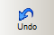

# Undo/Redo in the FBD/LD Editor

To undo the last editing steps performed in the editor, select 'Edit > Undo', press <Ctrl> + <Z>, or click 'Undo' on the toolbar:

To execute an action again, i.e., to revoke the 'undo' operation, either select 'Edit > Redo' or press <Ctrl> + <Y>.

EIO0000002147.09