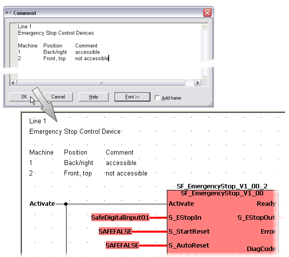

# Inserting Comments - 'Comment' Dialog

Comments are descriptive texts for documentation purposes. You can insert comments at any position in FBD/LD code worksheets or assign them to an LD network. Comments may overlap other objects.

Comments are inserted/edited using the 'Comment' dialog.

| Dialog element | Meaning |
| --- | --- |
| Comment | Comment text. |
| Font >> | Calls the 'Font selection' dialog where you can modify the font, font size, etc. |
| Add frame | The comment appears in the worksheet with a frame. |

## How to...

How to insert "free" comments

1. Left-click at the desired worksheet position.
2. Select 'Objects > Text (Comment)...' or click the 'Comment' icon on the toolbar.
3. In the 'Comment' dialog, enter a comment and modify the font if desired.

   The general editing functions of the comment editor are described below.

How to insert network comments associated to an LD network

Network comments are automatically assigned to and displayed at the left power rail of an LD network.

1. Double-click on the left power rail.
2. In the 'Comment' dialog, enter a comment and modify the font if desired.

   The general editing functions of the comment editor are described below.

## Functions of the comment editor

The 'Comment' dialog provides the basic editing functions of a standard text editor:

* Double-click a word to select the entire word.
* Right-click selected text to open the context menu containing commands for copying, deleting, cutting, and pasting, as well as for selecting all text.

  Copying/pasting/cutting can alternatively be done with the usual Windows standard shortcuts <Ctrl> + <C>/<V>/<X>.
* The 'Undo' command (context menu) reverts the latest editing action.
* Left-click into the dialog and press <Ctrl> + <A> to select the entire content of the 'Comment' dialog.
* Comment text can be copied from the 'Description' field of the 'Variable' dialog/variables worksheet to the 'Comment' dialog and vice versa. For that purpose either use the context menu items 'Copy' and 'Paste' or the shortcuts <Ctrl> + <C>/<Ctrl> + <V>.

  **NOTE:**

  When copying multiline comment text into the 'Description' field/column, only the first line is copied. Further lines in the 'Comment' dialog are not considered.
* Text can be separated in "columns" using the <Tab> key. Example:

  

EIO0000002147.09