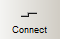
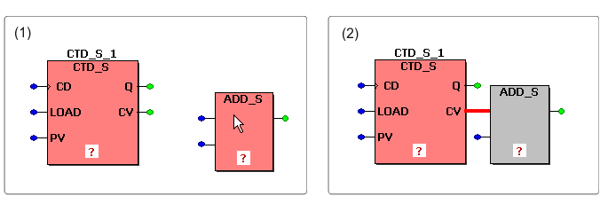
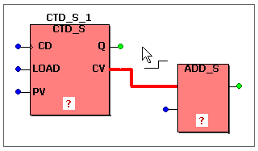

# Connecting Objects in FBD/LD

Objects can only be connected at object connection points. Input connection points are represented in blue and outputs are green. To connect objects in the FBD/LD code editor you have the following possibilities:

* [Connecting objects in connection mode](connectingobjectsinthegraphiceditor.html#connectingobjectsinthegraphiceditor__connectingobjectsusingtheconnectionmode)
* [Connecting objects by drag & drop](connectingobjectsinthegraphiceditor.html#connectingobjectsinthegraphiceditor__connectingobjectsbydrag_drop)
* [Connecting a new object directly on insertion](connectingobjectsinthegraphiceditor.html#connectingobjectsinthegraphiceditor__connectingobjectswhileinsertinganewobject)

**NOTE:**

Objects must not be connected in a way that result in an explicit feedback.

## Connecting objects in connection mode

The editor provides auto-routing. Auto-routing means that the editor automatically defines the best routing for a new line. Auto-routing is only active if you connect an input to an output or vice versa. If the connection starts at another line (branching), auto-routing is inactive.

Objects can only be connected to horizontal lines.

How to connect objects with auto-routing

1. Click the 'Connect objects' icon on the toolbar.

   

   A connection symbol is added to the cursor.
2. Left-click on the connection point where the line is to start.
3. Drag the mouse towards the destination connection point. While dragging the mouse, the new connection line is shown red.

   If the mouse pointer reaches its destination and the new connection is valid (e.g., output to input), the line is shown green.
4. Left-click the destination point to establish the connection. The editor automatically routes the connection line.

How to connect objects without auto-routing

1. Click the 'Connect objects' icon on the toolbar.

   

   A connection symbol is added to the cursor.
2. Left-click on the connection point where the line is to start.
3. Drag the mouse and left-click at each position where a corner point (path node) is to be set, i.e., a new line segment should start.
4. Left-click the destination point to establish the connection.

## Connecting objects by drag & drop

1. Click on the object to be connected and hold the mouse button down (see (1) in the figure below).
2. Drag the object to the desired destination connection point. Existing connections are automatically rearranged if the new object position allows to maintain connections (see (2) in the figure).

   

   Release the mouse button when both connection points overlap.
3. If desired, move the object to a free position. The connection line is routed automatically.

## Connecting a new object directly on insertion

You can connect new objects to already existing objects on insertion.

1. Left-click on the block formal parameter or contact/coil to be connected to the object you will insert next.

   In the example below, the counter output 'CV' was selected before inserting the 'ADD' function.
2. Insert the new object using the Edit Wizard or the appropriate icons on the toolbar. The new object is inserted and automatically connected to the previously selected connection point/object. (In case of a variable or FB, the 'Variable' dialog appears first before the object is inserted into the code.)
3. You can now move objects to a free position.

   

Click here for related topics

EIO0000002147.09