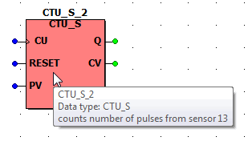
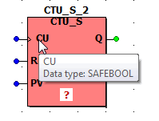
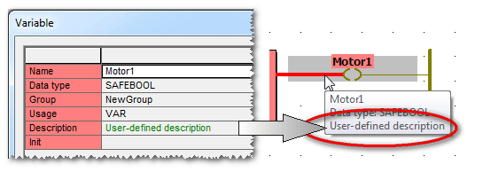
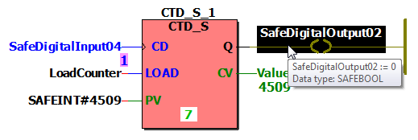

# Tooltips: Quick Information on Objects

Tooltips are short, descriptive texts available for toolbar buttons and, in FBD/LD code worksheets, for variables, LD objects, and functions/function blocks. The tooltip appears when you hover the cursor over the object/element without clicking it.

Examples:

Tooltip of a coil.

Tooltip of a safety-related counter function block.

For FBs, tooltips are also available for each formal parameter:

## User-defined variable description included in tooltip

For documentation purposes, you can specify a 'Description' for each variable and FB instance. This comment can be edited in the 'Variables' dialog and in the respective variables worksheet.

If a description is available for a variable, it is also included in the tooltip of the variable/FB instance.

Example:

## Online tooltips showing online values

In [online mode](DisplayVariableStatus.html#DisplayVariableStatus), tooltips of variables show the variable status, i.e., the online value of the variable read from the Safety Logic Controller (or simulation).

Example:

EIO0000002147.09