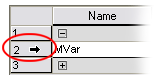

# Variables Worksheets

This topic contains information on the following:

* [Structure of the variables worksheet: columns and groups](variablegridworksheets_generaldescription.html#variablegridworksheets_generaldescription__VarGrid_Structure)
* [Important notes on different variables worksheets](variablegridworksheets_generaldescription.html#variablegridworksheets_generaldescription__ImportantNotesOnVarGrids)
* [How to open variables worksheets](variablegridworksheets_generaldescription.html#variablegridworksheets_generaldescription__VarGrid_HowToOpen)
* [Groups in variables worksheets](variablegridworksheets_generaldescription.html#variablegridworksheets_generaldescription__handlingdeclarationinavariablesgrid)
* [Managing declarations in variables worksheets](variablegridworksheets_generaldescription.html#variablegridworksheets_generaldescription__handlingdeclarationinavariablesgrid)
* [Searching and replacing variables](variablegridworksheets_generaldescription.html#variablegridworksheets_generaldescription__findingtextelementsdialogfind_2)
* [Naming conventions: DIN qualifiers in variable names](variablegridworksheets_generaldescription.html#variablegridworksheets_generaldescription__namingConventions_DINidentifiers)

Each variable/FB instance to be used in a code worksheet has to be declared in the corresponding variables worksheet (see section ["Various variables worksheets"](variablegridworksheets_generaldescription.html#variablegridworksheets_generaldescription__ImportantNotesOnVarGrids) below). These worksheets are realized as grids. Declarations are not entered as plain text (as described in the IEC 61131 standard) but in the form of a grid.['Type' and 'Usage'](columnsinvariablesgridworksheets.html#columnsinvariablesgridworksheets) of a variable are selected from combo boxes.

Error detection and prevention in variables worksheets: since the various attributes of one variable depend on each other, only logically rational settings are possible. If a specific property cannot be selected for a variable, the appropriate field is grayed-out, preventing from specifying incorrect combinations of properties.

The variables worksheet detects errors such as variable names which are used twice or unconnected global variables. The affected fields are shown red without manually compiling the variables worksheet.

**Further Information:**

Refer to the topic ["Variables/FB Instances: Declaring in Variables Worksheets"](declaringvariables.html#declaringvariables) for information how to insert and edit a declaration into a variables worksheet.

**NOTE:**

Instead of declaring variables and instances manually in the variables worksheet, you can declare new variables directly while inserting them into the code with the 'Variable' dialog.

## Structure of the variables worksheet: columns and groups

* Each line of the grid contains the declaration of one variable or FB instance.
* Declarations can be organized in [groups](variablegridworksheets_generaldescription.html#variablegridworksheets_generaldescription__variablesgroup).
* The properties of each variable are specified in various [columns](columnsinvariablesgridworksheets.html#columnsinvariablesgridworksheets).

Symbols in the 'Data type' and 'Usage' combo boxes

Clicking into a field in one of the columns 'Usage' or 'Data type' or pressing the shortcut <Alt> + <arrow down> in a field, opens a drop-down combo box. Each provided item is shown with a symbol representing its type.

The 'Data type' combo box provides the elementary data types as well as all available FB types for selection.

|  |  |
| --- | --- |
|  | Elementary standard (non-safety-related) data type |
|  | Elementary safety-related data type |
|  | User-defined function block used in the present project |
|  | Standard IEC 61131-defined function block |
|  | Safety-related function block |

In the 'Usage' combo box, the variable declaration keyword can be selected. The list is context-sensitive. Only keywords are provided for selection which are allowed for the present POU type.

|  |  |
| --- | --- |
|  | VAR (local variable) |
|  | VAR\_IN (input variable of a function block POU) |
|  | VAR\_OUT (output variable of a function block POU) |

**NOTE:**

In the global variables worksheet, the 'Usage' column is not visible because the keyword is set to VAR\_GLOBAL by default.

## Various variables worksheets available

* Each POU contains one local variables worksheet with the local variables declarations. A local variable is only valid within the POU where it is declared.

  Also function block instances have to be declared in the local variables worksheet of the POU where the function block is used.
* Each project contains one global variables worksheet with the **global variables** declarations of the project. A global variable can be used (i.e., is valid) in all graphical POUs of the project.

  Two different types of global variables are distinguished: global **symbolic** variables and global **I/O** variables. Refer to the topic ["Variables (General Description)"](variable.html#variable) for details.

## How to open variables worksheets

|  |  |
| --- | --- |
|  | First open the code worksheet and then press the shortcut <Ctrl> + <D> or click the 'Toggle WS' icon on the toolbar while the code worksheet window is active.  You can also double-click the respective variables worksheet icon in the project tree. |
|  | The declaration worksheet for global variables is not visible in the project tree. To open this worksheet, click the 'Global decl.' icon on the toolbar. |

## Groups in variables worksheets

Groups are used to organize the declarations in variables worksheets. Each group can contain any number of declarations. Similar to folders in the Windows File Explorer, a group can be displayed opened or closed, i.e., the contained variables are visible or not. To expand a closed group click on the  symbol below the group name or press the right arrow key. Accordingly, an opened group is closed by clicking on the  symbol or pressing the left arrow key.

By [cutting and pasting](variablegridworksheets_generaldescription.html#variablegridworksheets_generaldescription__handlingdeclarationinavariablesgrid) grid lines, you can move declarations between groups.

Group names can be defined and edited directly in the corresponding grid line.

How to insert a new variables group

1. Right-click into the grid row below which you want to insert a new group.
2. Select 'New group' from the context menu.

   A new group line is inserted with the default group name 'NewGroup'.
3. Left-click the default group name and modify it as desired.

## Managing declarations in variables worksheets

How to select (mark) variables and groups in a variables worksheet

Left-click into the first cell of the grid line as shown in the following figure for variable 'Var1'. 

Multi-selection can be done by pressing the <Ctrl> key or <Shift> key while clicking on the desired grid line(s). The shortcut <Ctrl> + <A> selects all grid lines.

How to cut, copy and paste declarations

You can cut/copy individual lines or a range of lines which may contain variables and groups. It is, for example, possible to cut/copy several declarations even if they are located in different groups, or to cut/copy single declarations together with entire groups (opened or closed).

By cutting and pasting grid lines you can move declarations between groups.

1. Select the grid line(s) to be cut as described above.
2. Cut: Press <Ctrl> + <X> to move the selected lines to the clipboard.

   Copy: Press <Ctrl> + <C> to copy the selected lines to the clipboard.
3. To paste the lines from the clipboard at any position in this or another variables worksheet, select the position where you want to insert the lines and press <Ctrl> + <V>.

How to delete declarations and/or groups

You can delete individual lines or a range of lines which may contain variables and groups. It is, for example, possible to delete several variables even if they are located within different groups, or to delete single variables together with entire groups.

When deleting a group, the contained declarations are automatically moved to the group above.

1. Select the declaration(s) or group(s) to be deleted.
2. Click the right mouse button to open the context menu and select 'Delete variable/group' or press <Del>.

## Searching and replacing variables

Finding and replacing variables in variables worksheets and in the FBD/LD code is done using the 'Find/Replace' dialog (globally or locally). You perform the same steps regardless whether you search/replace a variable or any other text string.

**Further Information:**

Refer to the topic ["'Find/Replace' Dialog"](findingtextelementsdialogfind.html#findingtextelementsdialogfind).

## Naming conventions: DIN qualifiers in variable names

According to the IEC 61131 standard, variable names can consist of letters, digits, and underscores. The identifier has to begin with a letter or an underscore. The use of any other character causes the compiler error "Illegal identifier".

This naming convention has been expanded in Machine Expert – Safety in a way that IEC 61131 variable names may also contain DIN qualifiers:

* The characters **- + < >** can be used at any position in the name and as last character. However, they cannot be used as first character of a variable name.
* The DIN qualifiers **/ \* #** and the numbers **0** to **9** can be used at any position in the variable name.

**Rules** for using DIN qualifiers in IEC 61131 variable names

* Variable names must at least contain one alphabetical character.
* Variables must not have the name of an IEC 61131 data type, such as BOOL, INT, WORD, REAL, etc.
* Variable names must not be defined as they are for literal values. Literals are used in the code by first specifying the literal data type, followed by a hash sign: `<literal_prefix>#<value>`. For example, `SAFEINT#5` and `WORD#32767` are literals. Therefore, a variable declaration such as `safeint#MyVar` would be invalid.

  Literal prefixes are not case-sensitive and include the following keywords:

  BOOL, REAL, LREAL, SINT, USINT, INT, UINT, DINT, UDINT, LINT, ULINT, BYTE, WORD, DWORD, LWORD, TIME, T, DATE, D, TIME\_OF\_DAY, TOD, DATE\_AND\_TIME, DT, STRING, TIMEDATE48, WEIGHT, ANALOG, UNIFRACT, BIFRACT200, FIXED, BOOLEAN2, BCD4, ENUM4, SAFEBOOL, SAFEBYTE, SAFEDWORD, SAFEINT, SAFEDINT, SAFETIME, SAFEWORD

Click here for related topics

EIO0000002147.09