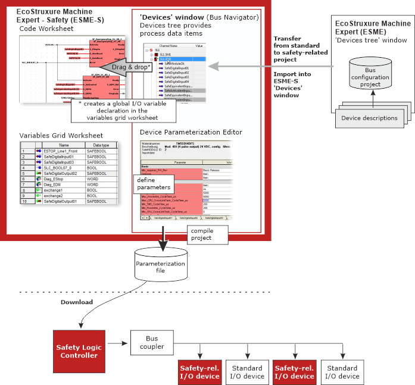

# 'Devices' window (Bus Navigator)

This topic contains information on the following:

* [Purpose of the Bus Navigator](BusNavigatorGeneral.html#BusNavigatorGeneral__BusNav_Purpose)
* [What happens with the bus/device related data?](BusNavigatorGeneral.html#BusNavigatorGeneral__BusNav_WhatHappensWithData)
* [Structure of the 'Devices' window (Bus Navigator)](BusNavigatorGeneral.html#BusNavigatorGeneral__BusNavigatorStructure)
* [Sorting devices/terminals in the tree view](BusNavigatorGeneral.html#BusNavigatorGeneral__BusNav_Sort)
* [Device parameterization grids (tabs)](BusNavigatorGeneral.html#BusNavigatorGeneral__BusNav_TabsInDevicesWindow)

## Purpose of the Bus Navigator

The Bus Navigator is visible in the 'Devices' window. Select 'Project > Devices' to show/hide the window.

The 'Devices' window contains the bus configuration which belongs to the safety-related project. The bus configuration has been created by the application engineer when designing the bus structure in Machine Expert. Normally, this bus project contains safety-related and standard devices.

**Transfer of device list and process data items**

After starting Machine Expert – Safety from Machine Expert (by selecting 'Machine Expert - Safety > Edit Project' from the context menu of the Safety Logic Controller icon in the Machine Expert Devices tree), the corresponding safety-related project is automatically loaded in Machine Expert – Safety and the bus structure is automatically imported into the Machine Expert – Safety 'Devices' window.

The safety-related devices involved are visible as device tree nodes in the 'Devices' window. Each device terminal can be dragged as process data item from the device tree into a Machine Expert – Safety code worksheet thus creating a related global I/O variable.

**NOTE:**

Safety-related devices (bus nodes) that are connected to the bus but have **not** been inserted to the bus project in Machine Expert are treated as follows:

* The devices are considered as "not configured" and are therefore not imported to Machine Expert – Safety. They cannot be used in the safety-related project.
* The "unconfigured" safety-related devices always remain in the defined safe-state and cannot become active at the bus.

**In the 'Devices' window (Bus Navigator) you can**

* get information about the connected Safety Logic Controller and the involved safety-related devices.
* [connect process data items to global I/O variables](SE_AssignProcessDataItems.html#SE_AssignProcessDataItems).
* use the [Device Parameterization Editor](DeviceParamEditor.html#DeviceParamEditor) to set parameter values for the safety-related devices.

## What happens with the bus and device related data?

When compiling the project in Machine Expert – Safety, a parameterization file is generated from the device/parameterization data. This file is part of the project downloaded to the Safety Logic Controller. The implementation of the Bus Navigator is illustrated below:

Click here for related topics

## Structure of the Bus Navigator

The Bus Navigator in the 'Devices' window is composed of two panes.

* The devices tree on the left contains the safety-related devices of the bus structure. The elements in this tree were previously defined in the Machine Expert 'Devices' tree.

  The Safety Logic Controller is the root element (e.g., SL1). The available safety-related and standard I/O devices are contained as child elements. Each device node name is preceded by the name of the higher-level Safety Logic Controller (e.g., SL1.SM1).

  The tree structure cannot be edited here.

  By selecting a tree node, its parameters and properties are loaded into the grid-based editor on the right (see next item).
* The Device Parameterization Editor on the right lists the device parameters (see next section).

## Sorting devices/terminals in the devices tree

The devices tree acts as a grid at the same time: on the left, device nodes can be expanded and collapsed as known from a tree while details on each item are provided in grid-form to the right of the tree.

The entries in the grid can be sorted by clicking into the column header to be used as sort criterion. Due to the "tree/grid mix", two ways of sorting are possible:

* When sorting by the 'Channel Name' or the 'CPU address', tree view and grid data are visible.
* When sorting by any other column, the tree view is hidden and only the grid data with the available process data items is visible.

  To display the devices tree again, click the 'Channel Name' column header again.

## Device parameterization grids (tabs) in the 'Devices' window

The ['Device Parameterization Editor'](DeviceParamEditor.html#DeviceParamEditor) on the right shows the parameters of the device selected in the tree on the left. Depending on the device type, one or several safety-related grids/tabs are visible. The parameters are read from the related device description file.

Possible settings (depending the selected device):

* Parameterization of the device terminals by setting pulse modes or times, filter settings, etc.
* Definition of safety response time-relevant settings calculated using the Response Time Calculator.

  The parameters relevant for the Safety Response Time differ depending on the controller/device generation (SLCv1 and SLCv2).

  **NOTE:**

  Which device generation (selected in Machine Expert) you are configuring is visible at the end of the short device description above the parameter grid (while the corresponding device is selected in the tree on the left).

  Click the link relevant to your system generation:

  + [Safety Response Time for SLCv1](wp100881.html#wp100881)
  + [Safety Response Time for SLCv2](SLCv2_wp100881.html#SLCv2_wp100881)

How to adjust the window

You can adjust the window by undocking it, modifying its size, moving it to another screen position, etc. Further information can be found in the topic "[Adjusting windows](customizingtheuserinterface_dialog_options.html#customizingtheuserinterface_dialog_options__AdjustingUIWindows)".

Auto-hide function (floating windows): Use the [auto-hide function](customizingtheuserinterface_dialog_options.html#customizingtheuserinterface_dialog_options__AdjustingUIWindows) to automatically hide (minimize) the window if it is unused. For that purpose switch on the auto-hide function by clicking the  icon on the window control bar. If the auto-hide function is switched on for that window, the  icon is shown. In this case, position the mouse pointer over the minimized window to show it again.

Click here for related topics

EIO0000002147.09