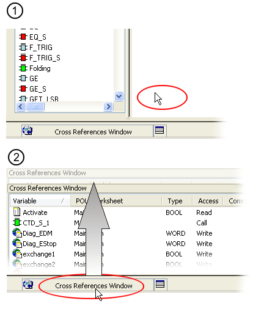

# Customizing the User Interface

You have the following options for adapting the user interface:

* In the ['Options' dialog](customizingtheuserinterface_dialog_options.html#customizingtheuserinterface_dialog_options__AdjustingUIWindows), define general program and editor settings as well as directory paths.
* [Position and show/hide](customizingtheuserinterface_dialog_options.html#customizingtheuserinterface_dialog_options__AdjustingUIWindows) windows and controls as required.

## 'Options' Dialog

The 'Project' menu provides the command 'Options...' which calls the 'Options' dialog. This dialog can be used to customize the user interface. The dialog is divided into several tabs:

| **Dialog tab** | **Meaning** |
| --- | --- |
| 'Toolbars' | To hide a particular toolbar, deactivate the related checkbox.  If the 'Show large buttons' checkbox is selected, all toolbar icons appear large with text. |
| 'General' | General settings for the user interface.  * **'Language'**: This setting has no function. Instead, the user interface language depends on the setting in Machine Expert ('Tools > Options | International Settings'). * **'Access Timeout'**: If no user activity is detected for the specified duration, you will be automatically logged off from both the project and the Safety Logic Controller. You can specify an access timeout value between 10 and 60 minutes.  Refer to the topic ["Password Protection for Projects and Safety Logic Controller"](PasswordProtection.html#PasswordProtection). * **'Workbook Style'**: Activates the tabbed worksheet display, i.e., worksheets are organized and can be activated by tabs. * **'Restore default toolbar configuration on program start'**: If activated, the position and size of the toolbars and windows are saved when exiting the program. * **'Open last project on program start'**: If activated, the last project is opened automatically when starting Machine Expert – Safety the next time. |
| 'Directories' | Default paths for the project directory and the device parameterization file directory.  Click the corresponding browse button '...' to open the 'Select folder' browse dialog. |
| 'Graphical Editor' | Default settings for graphical worksheets.  * **'Worksheet height/width'**: Specifies the default worksheet size for new graphical worksheets.  The size is only applied if all existing code worksheets are still large enough for existing FBD/LD code. If the size is possible, it is also applied as default size for future worksheets. If the size is too small for at least one worksheet, the specified values are rejected and the worksheet size remains unmodified in the present project and for future worksheets. * **'LD network width'**: Specifies the width for LD networks which are going to be inserted in the code editor. * **'Contact width'**: Specifies the default width for contacts which are going to be inserted in the code editor. You can overwrite this default setting for the **present worksheet** using the ['Contact width' dialog](changingthewidthofcontactsorcoils.html#changingthewidthofcontactsorcoils). |
| 'Text Editor' | Default settings for textual worksheets.  * **'Tab size'**: Defines the default tabulator size. * **'Show tabs'**: If activated, tabulators are represented by the symbol '>>'. * **'Insert spaces'**: If activated, pressing the <TAB> key inserts spaces instead of tabulators. * **'Keep tabs'**: If activated, pressing the <TAB> key inserts tabulators instead of spaces. * **'Font'**: Clicking this button calls the font settings dialog used to define the default font type, font size, and font attribute. * **'Show line numbers'**: If activated, line numbers are shown in textual worksheets. |

## Adjusting Windows and Controls

The user interface can be adjusted by undocking windows and controls, docking them elsewhere, moving, and showing/hiding them.

* Double-click the title bar of a window to undock the window from the user interface.
* Drag an undocked window with the mouse at the title bar.
* Modify the size of an undocked window by dragging the edge or corner of the window.
* An undocked window is automatically re-docked if dropped at a suitable position.
* To move a window without redocking it, hold the <Ctrl> key down while dragging the window.
* Auto-hide function: each window provides an auto-hide function which can be used to show/hide the window automatically depending on the cursor position. This function is particularly useful when working with a small monitor.

  Enable and disable the auto-hide function via the pin symbol on the title bar of the window:

   : Auto-hide disabled. When moving the cursor outside of the window, the window remains displayed. (See (1) in the figure below.)

   : Auto-hide is enabled. When moving the cursor outside of the window, the window is minimized. Point to the minimized window to show the window again. (See (2) in the figure below.)

  
* Close window: click the  symbol in the title bar of the window, or select the corresponding menu item from the 'View' menu.

EIO0000002147.09