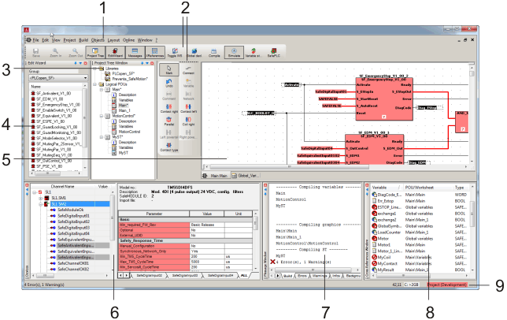

# User Interface Reference

The Machine Expert – Safety user interface basically consists of the following parts:

* [Menu bar](menubar.html#menubar) (no. 1 in the figure below)
* [Toolbars](toolbars.html#toolbars) (2)
* Main screen composed of [project tree](projecttree_overview.html#projecttree_overview) (3), [Edit Wizard](editwizard_generaldescription.html#editwizard_generaldescription) (4), and [workspace](workspace.html#workspace) (5))
* ['Devices' window (Bus Navigator)](BusNavigatorGeneral.html#BusNavigatorGeneral) with devices tree on the left and safety-related 'Device Parameterization Editor' on the right
* [Message window](messagewindow.html#messagewindow) (7)
* [Cross references window](crossreferencewindow.html#crossreferencewindow) (8)
* [Status bar](statusbar.html#statusbar) (9)
* The [watch window](watchwindow.html#watchwindow) used for debugging is not visible in the graphic.

The graphic above shows one possible arrangement of the various controls at delivery. The arrangement after [adjusting controls](customizingtheuserinterface_dialog_options.html#customizingtheuserinterface_dialog_options__AdjustingUIWindows) may differ.

**NOTE:**

The user interface can be customized using the ['Options' dialog](customizingtheuserinterface_dialog_options.html#customizingtheuserinterface_dialog_options).

EIO0000002147.09