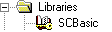

# Libraries: Inserting and Deleting

The 'Libraries' folder in the project tree contains the [firmware libraries](librariesinSafeFOX.html#librariesinSafeFOX) which have been added to the project. Libraries contain reusable function blocks which are, for example, provided by the controller manufacturer.

This topic describes how to add and delete libraries in the project tree. Basic information on the project tree and procedures for managing tree icons are described in the topic ["Project Tree - Overview"](projecttree_overview.html#projecttree_overview).

Observe the following notes on libraries

* A library cannot be inserted into the project if it contains a function block that is already contained in the project with an identical name.
* Worksheets of included libraries cannot be opened.
* Libraries can only be added/deleted if you are logged-on with the correct [project password](PasswordProtection.html#PasswordProtection) ('Project > Project Log On').
* Machine Expert – Safety versions before V2.0 did not support libraries which contain nested FB POUs (e.g., library FB A calls library FB B) if both library FBs are instantiated in the project. Recreate such libraries with a Machine Expert – Safety V2.0 or newer.

How to include a library - 'Insert Library' dialog

1. In the project tree, right-click the 'Libraries' folder and select 'Insert Library...' from the context menu.

   Or:

   Select 'Project > Add Library'.
2. In the 'Insert Library' dialog select the desired library and click 'OK'.

The library icon appears in the project tree as shown in the following example for the included library 'SCBasic':

How to delete included libraries

1. Left-click the library you want to delete.
2. Press the <Del> key.
3. Confirm the deletion in the appearing message dialog.

EIO0000002147.09