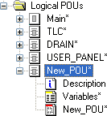

# FB POUs: Adding, Deleting, Renaming

This topic describes how to add and rename FB POUs in the 'Logical POUs' project tree folder. This folder contains all POUs of your project.

**Further Information:**

Refer to the topic ["Managing objects in the project tree"](projecttree_overview.html#projecttree_overview__handlingobjectsintheprojecttree) for information how to copy & paste, move or delete POUs.

## General notes on POUs

* A project contains exactly one POU of the type 'Program' titled 'Main'. No further program POUs are allowed in addition to the 'Main' POU. The 'Main' POU is always the first POU in the 'Logical POUs' folder. It can neither be copied, moved, deleted nor renamed.
* User-defined FB POUs can be added and programmed.
* POUs can only be inserted/deleted if you have logged-on with the correct [project password](PasswordProtection.html#PasswordProtection) ('Project > Project Log On' menu item).

**NOTE:**

Machine Expert – Safety provides a certification manager for certifying the completed project after successful commissioning. A certified project is protected by password against modifications. (Such modifications would result in a new project acceptance procedure and certification.)

If you can't edit the project although you are logged-on correctly, verify whether the project is already certified. This is indicated in the status bar (rightmost):

Refer to the topic "[Project certification](CertificationManager.html#CertificationManager)" for detailed information.

## How to add FB POUs - 'Insert Function Block' dialog

1. To insert a new POU below the last node in the 'Logical POUs' folder, select 'Project > Add Function Block' or right-click the 'Logical POUs' folder icon and select 'New Function Block...' from the context menu.

   To insert a new POU at a particular position in the 'Logical POUs' folder, right-click the POU icon after which the new POU is to be inserted and select 'New Function Block...' from the context menu.
2. In the 'New Function Block' dialog, enter a name for the new FB POU.

   Observe the [rules applying to POU names](identifier.html#identifier).
3. Select the desired programming language FBD/LD (graphical) or ST (textual). (The selected programming language cannot be changed later.)
4. Confirm the dialog.

   The new FB POU appears in the project tree at the desired position. It is marked with an asterisk, thus indicating that it has not yet been compiled.

   

**Further Information:**

Refer to the topic ["Project Tree - Overview"](projecttree_overview.html#projecttree_overview) for information on the various types of worksheets.

You can [add further code worksheets](InsertWorksheetInPOU.html#InsertWorksheetInPOU) to the POU. Further variables/description worksheets are not allowed.

## How to rename or delete FB POUs

* To rename a POU, right-click its icon and select 'Properties...' from the context menu. In the appearing 'Function Block Properties' dialog, edit the name.
* To delete a POU, right-click its icon and select 'Delete' from the context menu or press the <Del> key. Confirm the appearing message with 'OK'.

EIO0000002147.09