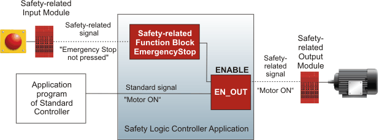

# Programming the Enable Principle

The non-safety-related controller program (referred to as standard controller program in the following) has read and write access to non safety-related I/Os. Safety-related I/Os (SDIOs) can also be read by the standard controller program and indirectly written via the Safety Logic Controller. "Indirectly" means that safety-related outputs will only be connected if enabled by the Safety Logic Controller. This logical mechanism is referred to as enable principle.

The Safety Logic Controller has access to the safety-related I/Os and is exclusively able to set safety-related outputs. This can be done either directly or by using a standard signal of the controller program.

| WARNING | |
| --- | --- |
|  | **UNINTENDED EQUIPMENT OPERATION**  Verify the impact of standard signals which influence safety-related outputs by an AND connection or via the EN\_OUT function.  **Failure to follow these instructions can result in death, serious injury, or equipment damage.** |

Enabling can be programmed using the EN\_OUT function as shown in the following example (if, for example, the final signal has to be processed in the user program).

|  |
| --- |
| The enable principle can also be realized by [mixing safety-related and standard variables in one network](MixingSafeAndNonSafeVariables.html#MixingSafeAndNonSafeVariables). The easiest realization is the AND connection of a safety-related LD contact with a standard LD contact. |
| Example: |
| **Further Information:**  Refer to the topic ["Mixing safety-related and standard variables in one network"](MixingSafeAndNonSafeVariables.html#MixingSafeAndNonSafeVariables) for further information and related safety rules. |

**NOTE:**

The enable principle cannot be realized in ST code.

EIO0000002147.09