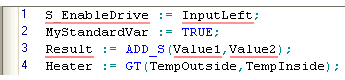

# ST Code Elements

**NOTE:**

Use the Edit Wizard for editing ST.

The most convenient preventing method to edit function/FB calls in ST is to drag the required code object as template from the Edit Wizard into the code editor. Refer to the topic ["ST Code Development: Functions/Function Blocks: Inserting"](TE_Functions_Insert.html#TE_Functions_Insert).

This topic contains information about the available code elements of the textual IEC 61131 programming language Structured Text (ST).

* Expressions
* [Operands and operators](elementsintheSTeditor.html#elementsintheSTeditor__OperandsOperatorsInST)
* [Assignment statement](elementsintheSTeditor.html#elementsintheSTeditor__StatementsInST)
* [Iteration statement (loop)](elementsintheSTeditor.html#elementsintheSTeditor__ST_IterationStatement)
* [Selection statements, RETURN and EXIT](elementsintheSTeditor.html#elementsintheSTeditor__ST_StatementsOnSystemLevel)
* [Function/function block calls](elementsintheSTeditor.html#elementsintheSTeditor__ST_fufbCall)
* [Safety-related and standard variables](elementsintheSTeditor.html#elementsintheSTeditor__ST_safeNonSafeVars)
* [Comments](elementsintheSTeditor.html#elementsintheSTeditor__ST_comment)

Click here for related topics

**NOTE:**

Operators and ST keywords (such as MUL, AND, FOR, RETURN, etc.) must be entered in capital letters. Otherwise, they are interpreted as variables.

## Expressions

Expressions are parts of statements. An expression returns exactly one value which is then used for the execution of the statement where the expression is used.

Each expression consists of [operands and operators](elementsintheSTeditor.html#elementsintheSTeditor__OperandsOperatorsInST) or [function calls](elementsintheSTeditor.html#elementsintheSTeditor__ST_fufbCall).

## Operands and operators

Operands and operators are both parts of ST expressions.

**Operands** can be literals, variables or names of functions.

Operands are combined using **operators**, i.e., operators are applied to operands.

In an expression, the operator with the highest priority is executed first, followed by the operator with the next lower priority.

**NOTE:**

Although the compiler resolves the correct precedence of several operators used together in one statement, place parentheses in order to emphasize the precedence of the operator, thus improving code readability.

The following ST operators are defined:

| **Operator** | **Example** | **Value of example** | **Description** | **Priority** |
| --- | --- | --- | --- | --- |
| ( ) | **(**INT#2 + INT#3**)** \* **(**INT#4 + INT#5**)** | INT#45 | Parentheses | Highest |
| - | **-**INT#10 | INT#-10 | Negation |  |
| NOT | **NOT** TRUE | FALSE | Complement |  |
| \*, MUL | INT#10 **\*** INT#3 | INT#30 | Multiplication |  |
| /, DIV | INT#6 **/** INT#2 | INT#3 | Division |  |
| +, ADD | INT#2 **+** INT#3 | INT#5 | Addition |  |
| -, SUB | INT#4 **-** INT#2 | INT#2 | Subtraction |  |
| <, LT  >, GT  <=, LE  >=, GE | INT#4  **>**  INT#12 | FALSE | Comparison |  |
| =, EQ | T#26h  **=**  T#1d2h | TRUE | Equal |  |
| <>, NE | INT#8  **<>** INT#16 | TRUE | Unequal |  |
| &, AND | TRUE  **&**  FALSE | FALSE | Boolean AND |  |
| OR | TRUE **OR** FALSE | TRUE | Boolean OR |  |
| XOR | TRUE **XOR** FALSE | TRUE | Boolean Exclusive OR | Lowest |

## Assignment statement

The assignment statement copies the value of the [expression](elementsintheSTeditor.html#elementsintheSTeditor__expressioninst) on the right of the `:=` operator to the variable on the left:

`variableName := expression;`

Both, the variable and the value of the expression must have the same data type. Otherwise, a type conversion must be performed first.

Implicit type conversion from safety-related to standard data types is possible using the assignment operator. Implicit type conversion from standard to safety-related data types is not allowed. See the topic ["Mixing safety-related and standard variables in ST"](ST_MixingSafeAndNonSafeVariables.html#ST_MixingSafeAndNonSafeVariables).

## Iteration statements (loop)

Avoid infinite loops. An infinite loop may result in a non-responsive Safety Logic Controller. Observe the following items:

**NOTE:**

* Make sure that each loop can be exited either by a simple programmed loop condition or by an EXIT statement inside the loop.
* Avoid complex loop conditions but use simple Boolean expressions instead, such as `a < 10`.
* Thoroughly verify the loop condition to ensure that the loop is not infinite.
* When programming an EXIT statement to terminate the loop execution, you must ensure that the EXIT statement is reachable in the code.

  For that purpose thoroughly verify the selection statement (IF or CASE construct) which is the condition for executing the EXIT statement.

**NOTE:**

**Avoid watchdog errors.**

The execution of loops may result in a watchdog error of the Safety Logic Controller because the maximum cycle time is exceeded.

This may happen, for example, if a loop is repeated very often or if a very large number of statements is to be executed within the loop both increasing the possible workload of the Safety Logic Controller.

| **Keyword** | **Example** | **Description** |
| --- | --- | --- |
| FOR | **FOR** a:=1 **TO** 10 **BY** 3 **DO**  incr:= start + a;  **END\_FOR;** | **FOR loop: Iteration statement**  A group of statements is executed repeatedly incrementing the loop variable by the specified increment value, starting at the specified initial value up to the end value. The initial value is specified by the constant value assigned to the loop variable. The end value is specified following `TO` and the increment (step width) is specified following `BY`.  In the example shown, the assignment statement `incr:= start + a` is executed repeatedly incrementing the loop variable `a` by 3, starting at 1 up to 10.  The following verifications are done by the compiler. A corresponding error is output in the message window if a verification fails:   * All values must be of the same data type (ANY\_INT). * Both the initial value and the end value of the loop condition must be constants (positive or negative). * Specifying an increment value `BY` (step width) as positive or negative constant is mandatory. * Forward loops (increment statement counts upwards) and backwards loops (increment statement counts downwards) are allowed.  In forward loops, the end value in the loop condition must be greater than the initial value and the increment value BY (step width) must be a positive constant.  In backwards loops, the end value in the loop condition must be smaller than the initial value and the increment value BY (step width) must be a negative constant. * The loop variable (`a` in the example shown left) is read-only and must not be written. * Loops must not be nested.  To exit the loop, use a selection statement combined with the EXIT statement (see below). |

## Selection statements, RETURN and EXIT

Selection statements as well as the RETURN and EXIT statement enable the programming of conditional code which result in a non-linear control flow.

**NOTE:**

The IEC 61508-3 standard obliges the user to completely test such application program parts according to the Modified Condition/Decision Coverage (MC/DC) criterion.

**NOTE:**

Within an ST selection statement (IF or CASE) no access to FB formal parameters is allowed and also no FB calls.

| **Keyword** | **Example** | **Description** |
| --- | --- | --- |
| RETURN | **RETURN;** | **Return statement**  The return statement exits the called function block and returns to the calling POU. |
| IF | **IF** a < b **THEN** c:=1;  **ELSIF** a=b **THEN** c:=2;  **ELSE** c:=3;  **END\_IF;** | **Selection statement**  A group of statements is executed only if the associated Boolean expression (`a<b` in the example on the left) is TRUE. If the condition is FALSE, either no statement is executed or the group of statements following ELSE is executed. |
| CASE | **CASE** f **OF**  1: a:=3;  2..5: a:=4;  6: a:=2;  b:=1;  **ELSE** a:=0;  **END\_CASE;** | **Selection statement**  A group of statements is executed according to the value of the expression following the keyword CASE. The variable or expression `f` must be of the data type ANY\_INT. |
| EXIT | **FOR** a:=1 **TO** 3  **BY** 1 **DO**  **IF** flag **THEN EXIT**;  **END\_IF**;  **SUM**:= b + a;  **END\_FOR;** | **Exit statement**  The EXIT statement is only allowed in iteration statements (loops) and can be used to abort the execution of a loop. |

## Function and function block calls

Detailed information on the syntax of function/function block calls are provided in the topic ["Functions/Function Blocks: Inserting"](TE_Functions_Insert.html#TE_Functions_Insert).

## Mixing safety-related and standard variables in ST

**NOTE:**

Term definition: Standard = non-safety-related.

The term "standard" always refers to non-safety-related items/objects. Examples: a standard process data item is only read/written by a non-safety-related I/O device, i.e., a standard device. Standard variables/functions/FBs are non-safety-related data. The term "standard controller" designates the non-safety-related controller.

Safety-related and standard variables can be mixed within one ST statement if particular rules are observed. Generally, safety-related variables can be assigned to standard variables but not vice versa.

**Further Information:**

For detailed information refer to the topic ["Mixing safety-related and standard variables in ST"](ST_MixingSafeAndNonSafeVariables.html#ST_MixingSafeAndNonSafeVariables).

For easier distinction of standard and safety-related variables, they are visually distinguished in the ST code editor. Safety-related variables are underlined in red, standard variables are not underlined.

## Comments

**Comments** can be used by enclosing text in parentheses with asterisks:

(\* This is a comment \*)

EIO0000002147.09