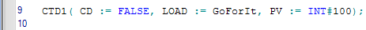
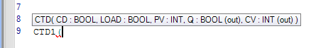

# Functions/Function Blocks: Inserting

## Basic function call syntax

In ST, a function call basically has the following syntax:

`OutVariable := functionName(InVar1, InVar2);`

The names of the required input variables (formal parameters) have to be specified in parentheses after the function name. The return value (result) of the function must be assigned to a variable.

All formal parameters of a function have to be specified.

## Basic function block call syntax

A function block call in ST basically has the following syntax:

`instance(invar1:=1, invar2:=2);`

`a:= instance.outvar1;`

`b:= instance.outvar2;`

In this example, the FB with the instance name 'instance' is called with its input parameters invar1 and invar2 (each with assigned value). The FB instance writes its results to the output parameters outvar1 and outvar2. The result values are stored to the variables a and b.

Input and output formal parameters of FBs can be omitted as they are not mandatory.

Other calling variants of the above example would therefore be:

`instance(invar2:=2);`

or

`instance();`

Optionally, values can be assigned to FB input formal parameters. If omitted, the default init value of the expected data type is used.

## How to call functions/function blocks

Inserting functions and function blocks with the Edit Wizard

1. Drag the element from the Edit Wizard into the text editor and drop it at the desired code position.
2. When inserting a **function block**:

   A dialog appears when dropping the code element proposing a name for the new FB instance. Select or enter a name and confirm the dialog.

   On insertion of the FB code, its instance variable is inserted in the local variables worksheet.
3. Replace all placeholders with the "real" variables.

Inserting a function/function block call by typing it using IntelliSense

1. To call a function block, first add an instance variable in the local variables worksheet of the ST POU.

   Example: variable CTD1 as an instance of the CTD function block ('Data type' CTD):

   

   For a function no instance variable is needed.
2. In the ST code worksheet, type the function/function block call.

   Example for a function block call:

   

   [IntelliSense](intellisensefunctioninthetexteditor.html#intellisensefunctioninthetexteditor) helps you finding and inserting the correct names of functions/function blocks and variables during entering text.

   The tooltip, which appears when typing the left parenthesis, shows the required syntax for the function/function block call including the parameters.

   Example:

   

   If you have completed the function/function block call, you can show the syntax again by deleting and retyping the left parenthesis.
3. If you have assigned input variables to formal parameters or formal parameters to output variables, declare them in the local variables worksheet of your ST POU.

## Mixing safety-related and standard variables in ST

Safety-related and standard variables can be mixed within one ST statement if particular rules are observed. Generally, safety-related variables can be assigned to standard variables but not vice versa.

**Further Information:**

Refer to the topic ["Mixing safety-related and standard variables in ST"](ST_MixingSafeAndNonSafeVariables.html#ST_MixingSafeAndNonSafeVariables) for details.

EIO0000002147.09