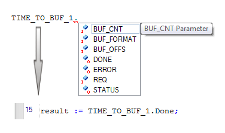

# IntelliSense function

IntelliSense facilitates the insertion of names into ST code worksheets and helps to prevent typing errors. The following names and identifiers are supported by IntelliSense:

* Keywords
* Variable names (already declared)
* Function/function block names (including their formal parameters)

A variable or FB instance name can only be inserted using IntelliSense if it is already declared.

The principle of IntelliSense is to select an element from a selection box after entering its first (or more) letter(s), thus simply completing an already started text entry. This selection box opens automatically after entering the first character in the active text editor. It offers the names of keywords as well as of all available functions and already declared variables/FB instances and data types which are applicable, i.e., suitable in the present editing context. For the marked list element, a tooltip provides a short description.

To be able to distinguish the offered element types at a glance, each item is displayed with an own icon in the selection box (see [table](intellisensefunctioninthetexteditor.html#intellisensefunctioninthetexteditor__symbolsintheintellisenselistbox)).

**NOTE:**

The IntelliSense function does not support [ST iteration statements](elementsintheSTeditor.html#elementsintheSTeditor__ST_IterationStatement).

**NOTE:**

The IntelliSense function does not support [ST selection statements, RETURN and EXIT](elementsintheSTeditor.html#elementsintheSTeditor__ST_StatementsOnSystemLevel).

How to use IntelliSense

1. Type the first (or more) letter(s) of the name to be inserted. The IntelliSense selection box opens automatically. In the box, the first entry starting with the entered character is marked.

   Press <Ctrl> + <Space> to open the IntelliSense selection box without having entered a character before.

   When entering further characters, the selection box follows your entry by marking the most matching entry.

   **NOTE:**

   IntelliSense is not case sensitive.
2. Double-click the desired entry or select it using the arrow keys and press <Enter>.

Additional steps for inserting POU formal parameters

IntelliSense also supports the insertion of POU formal parameters. For that purpose additional steps, as shown in the subsequent sample of a user-defined FB, are required:

Proceed as follows:

1. Enter the instance name standing in front of the dot using IntelliSense as described above ('TIME\_TO\_BUF\_1' in the example below).
2. Type the dot separating the instance name from the parameter name.

   IntelliSense recognizes that the name to be inserted is a POU formal parameter. The possible parameter names are shown in another selection box. The selection box contains only names which relate to the POU type entered before the dot.
3. Double-click the formal parameter or select it using the arrow keys and press <Enter>.

**Example**:

TIME\_TO\_BUF\_1.DONE - 'DONE' is an output parameter of the user-defined 'TIME\_TO\_BUF' function block. The instance name of this function block in our example is TIME\_TO\_BUF\_1.

## Symbols in the IntelliSense drop-down combo box

|  |  |
| --- | --- |
|  | Keyword (e.g. ST statement) |
|  | Local variable (VAR) |
|  | Input variable of the present POU (VAR\_INPUT) or input formal parameter in the context of a function/FB call |
|  | Output variable of the present POU (VAR\_OUTPUT) or output formal parameter in the context of an FB call |
|  | Declared instance of a function block POU (developed in the present project or contained in an announced library) |
|  | Standard function from an announced firmware library |
|  | Safety-related function from an announced firmware library |

EIO0000002147.09