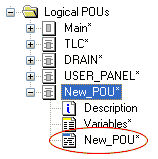

# ST Code Development

When programming POUs in the IEC 61131 programming language ST (Structured Text) by typing the [ST expressions and statements](elementsintheSTeditor.html#elementsintheSTeditor) in the textual code editor, the required variables have to be [declared manually in the related local variables worksheet](declaringvariables.html#declaringvariables). After the declaration, they can be inserted into the code using the [IntelliSense function](intellisensefunctioninthetexteditor.html#intellisensefunctioninthetexteditor). Functions and function blocks can be inserted using the Edit Wizard. In doing so, FB instance names are declared during insertion.

To open a code worksheet, double-click the desired icon:

**Verified user POUs**: After verifying the code of a POU, the particular POU can be marked as verified via context menu. When the verification flag is set, the POU is write-protected and shown with a different tree icon: 

Refer to the topic ["POU Verification"](POUverification.html#POUverification).

## Safety-related peculiarities in ST

The following restrictions apply:

* ST code is only allowed for function block POUs. The program POU ('Main') must be programmed in FBD/LD.
* Global variables cannot be processed in ST POUs. Therefore, no I/O variables can be used in ST code.
* Rules must be observed when [mixing safety-related and standard data types in ST](ST_MixingSafeAndNonSafeVariables.html#ST_MixingSafeAndNonSafeVariables).
* Each ST instruction must be terminated by a semicolon.

  Start each instruction in a new code line to improve the readability of the ST code.
* The size of POUs in ST is limited to 5,000 instruction lines.
* Within an ST selection statement (IF or CASE) no access to FB formal parameters is allowed and also no FB calls.

## Features of the Text Editor

* The text editor is operated like a common programming editor. Default Windows mouse functions and keyboard shortcuts, such as double-click to select a word or <Ctrl> + <C> to copy text, are supported. A context menu provides these and further editing functions.
* Continuous automatic compiler verifications in the background: While editing ST code the compiler continuously verifies the identifiers and the syntax. Detected errors are listed in the 'Background Check' tab of the message window.

  Additional verifications are performed when [compiling the project](compiling.html#compiling). Resulting errors or alerts are listed in the 'Errors'/'Warnings' tab in the message window. Any detected errors are underlined in the worksheet.
* Code objects, such as functions and function blocks can be inserted as prepared code templates from the Edit Wizard via [drag & drop](TE_Functions_Insert.html#TE_Functions_Insert). After having inserted such a template, you simply have to overwrite the placeholders with the real values and names. In case of function blocks, a dialog appears where you declare the related FB instance in the local variables worksheet.
* The IntelliSense function simplifies entering identifiers and keywords in the code. Names to be inserted can be completed automatically by special selection boxes. Refer to the topic ["IntelliSense function in the text editor"](intellisensefunctioninthetexteditor.html#intellisensefunctioninthetexteditor) for details.
* Syntax highlighting: Statements, keywords, names, etc. can easily be distinguished by means of their color (keywords, for example, are displayed blue, comments are green).
* Code outlining/folding: The editor provides syntax-based folding, collapsing and expanding of particular code blocks. To collapse an element, click the '-' icon in the text editor. To expand an element, click '+'.
* The text editor supports the [event log](eventanderrorlog.html#eventanderrorlog). An entry is written to the project event log when the worksheet has been modified and/or saved.
* Finding and replacing text: Machine Expert – Safety provides two possibilities of searching and replacing text elements in code and variables worksheets of the project: The local and the global text search/replacement. Finding/replacing text elements locally only affects the active worksheet. The global find/replace operation considers several or all worksheets. For both, local and global operation, the '[Find/Replace](findingtextelementsdialogfind.html#findingtextelementsdialogfind)' dialog is used.

  **NOTE:**

  In ST, no text replacements using the 'Find and Replace' function can be done. You can only find text and overwrite it manually.

  Furthermore, only the search direction 'Down' is supported.
* Undo/Redo: You can undo the last editing steps performed in the editor by selecting 'Edit > Undo' or pressing <Ctrl> + <Z>, or clicking 'Undo' on the toolbar. To execute an action again, i.e., to revoke the 'undo' operation, either select 'Edit > Redo' or press <Ctrl> + <Y>.
* The editor supports two modes:

  Offline mode = edit mode: In offline mode, the editor is used to develop the application code.

  Online mode = variable status/debug mode: After having completed the Safety Logic Controller application program, you have to generate the Safety Logic Controller code by compiling it. After compiling and downloading the application to the Safety Logic Controller, you can use the code editor in online mode to display online values (variable status) and perform debug operations. In online mode, it is not possible to edit worksheets.

  Refer to the topic ["Debugging the project in online mode"](debuggingtheproject.html#debuggingtheproject) for detailed information on debugging.

  **NOTE:**

  In online mode, the search function is not available.

**NOTE:**

Code and variables can only be edited if you have [logged-on at 'Development' level using the correct project password](PasswordProtection.html#PasswordProtection) ('Project > Project Log On' menu item).

**NOTE:**

Machine Expert – Safety provides a certification manager for certifying the completed project after successful commissioning. A certified project is protected by password against modifications. (Such modifications would result in a new project acceptance procedure and certification.)

If you can't edit the project although you are logged-on correctly, verify whether the project is already certified. This is indicated in the status bar (rightmost):

Refer to the topic "[Project certification](CertificationManager.html#CertificationManager)" for detailed information.

Click here for related topics

EIO0000002147.09