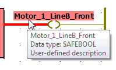

# Contact and Coil

Contacts and coils are basic elements of LD networks.

## Contact

A contact copies the Boolean value from its left to its right according to the state of the associated variable. The name of the associated variable is indicated above the contact (refer to the note at the end of this topic).

The following contact types are available:

| **Symbol** | **Name** | **Description** |
| --- | --- | --- |
|  | Normally open contact | The Boolean value is copied from the left to the right if the state of the associated variable is TRUE. |
|  | Normally closed contact | The Boolean value is copied from the left to the right if the state of the associated variable is FALSE. |

## Coil

A coil copies the state of the element on its left to the element on its right without any modification. It stores an appropriate function of the state or transition of the left connection line into the associated Boolean variable. The name of the associated variable is indicated above the coil (refer to the note at the end of this topic).

The following coil types are available:

| **Symbol** | **Name** | **Description** |
| --- | --- | --- |
|  | Coil | The Boolean value is copied from the left to the right and to the associated variable. |
|  | Negated coil | The Boolean value is copied from the left to the right. The negated Boolean value is copied to the associated variable. |
|  | SET coil | The Boolean value is copied from the left to the right. The associated variable is set if the left connection line is TRUE. |
|  | RESET coil | The Boolean value is copied from the left to the right. The associated variable is reset if the left connection line is TRUE. |

To edit the properties of contacts/coils, the 'Variable' dialog has to be used which is called by double-clicking on the object.

After inserting a contact/coil into the code worksheet, it appears without an associated variable. Using the 'Variable' dialog, you can either associate and declare a new variable or assign an already declared variable.

## Representation of contact/coil names in the code - Tooltips

In the FBD/LD code, the width of a contact or coil depends on the basic graphical editor setting 'Contact width', defined in the 'Options' dialog ('Project > Options... | Graphical editor' tab).

Long LD object names (i.e., variable names) may be cut and are not displayed fully. In these cases, an asterisk as last character indicates that the name cannot be completely displayed.

For each LD object a tooltip is available showing the entire name as well as additional information on the object. To display this tooltip, hover the mouse pointer over the object. The tooltip also includes the user-defined description specified in the properties dialog of the object ('Variable' dialog) or in the related declaration line of the variables worksheet.

EIO0000002147.09