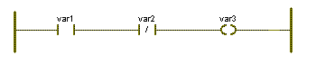

# FBD/LD Networks

Code programmed in the graphical language LD (Ladder Diagram) is composed of contacts and coils.

According to IEC 61131-3, different types of contacts and coils can be used. Contacts lead (according to their type) the power from the left to the right. Coils store the incoming value. Both, contacts and coils, are assigned to Boolean variables. Contacts and coils are connected via lines and they are bounded on the left with a power rail.

Each LD network must consist of at least a left power rail and one coil and has to be "terminated" either by a right power rail or by an FBD object.

The state of the left power rail is considered ON all the time. In LD networks, the power flows from the left power rail (considered as being 'TRUE') to the right power rail.

Serial connections and parallel branches are allowed. Parallel branches are also called wired-ORs.

When inserting objects in an LD network the size of the network is adapted automatically. If you have connected an FBD network to the LD network, the size of the LD network is **not** adapted automatically. In these cases you have to modify the size of the network manually by [moving objects](handlingobjectsinthegraphiceditor.html#handlingobjectsinthegraphiceditor).

Example for a simple LD network

The first contact (NO, Normally Open) passes the incoming value from the left to the right if the value of variable 'var1' is TRUE. The second contact (NC, Normally Closed) passes the incoming value if the value of variable 'var2' is FALSE. The coil stores the incoming value to the assigned variable 'var3'.

Code programmed in the graphical language FBD (Function Block Diagram) is composed of [functions and function blocks](functionandfunctionblock.html#functionandfunctionblock) which are connected to each other, or to [variables](variable.html#variable), constants, etc. via [lines](line.html#line). These lines can also be connected to each other. It is not possible to connect outputs to outputs. The set of connected objects is called FBD network. The execution order in FBD networks is displayed inside the function and function block symbols.

The inputs and outputs of functions/function blocks are called formal parameters.

FBD and LD can be mixed, i.e., their objects can be used together in one code worksheet, networks of both languages can be connected.

Comments can be inserted to improve the comprehensibility of the code.

**NOTE:**

Safety-related and standard variables can be mixed in FBD/LD networks. In such mixed networks, leading safety-related signal paths are visually distinguished. Some [rules and restrictions must be observed](MixingSafeAndNonSafeVariables.html#MixingSafeAndNonSafeVariables).

**NOTE:**

Explicit feedbacks are not allowed.

**NOTE:**

Implicit feedbacks are allowed using feedback variables. For these variables, the 'Feedback' flag must be intentionally set in the declaration of the variable (['Variable' dialog](dialog_variable.html#dialog_variable) and according column in [variables worksheet](columnsinvariablesgridworksheets.html#columnsinvariablesgridworksheets)). For further information, refer to the topic ["Implicit feedbacks in FBD"](ExplicitFeedback.html#ExplicitFeedback).

**Further Information:**

Refer to the topic ["FBD/LD code development"](editinginfbd_ldusingthegraphiceditor.html#editinginfbd_ldusingthegraphiceditor) for detailed editing procedures.

EIO0000002147.09