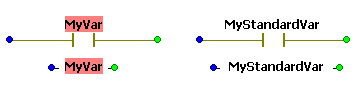

# Variables

According to the IEC 61131-3 standard, the safety logic in Machine Expert – Safety is developed using variables instead of directly addressing inputs, outputs, or flags.

**Further Information:**

Also refer to the topic ["IEC 61131 Implementation - Variables"](VariablesinSafeFox.html#VariablesinSafeFox) for further general information on variables.

This topic contains information on the following:

* [Types: Local variables, global symbolic variables and global I/O variables](variable.html#variable__VariableTypes_SE)
* [Safety-related and standard variables](variable.html#variable__Variables_Safe_NonSafe)
* [Variables as LD objects](variable.html#variable__Variables_AsLDobjects)
* [Handling variables](variable.html#variable__Variables_Handling)
* [Tooltips for variables in the FBD/LD code](variable.html#variable__Variables_Tooltips)

## Types: Local variables, global symbolic variables and global I/O variables

New local variables can be inserted directly into the code using the 'Variable' dialog. This way, the necessary declaration of the variable is automatically inserted into the corresponding local variables worksheet at the same time. Refer to the topic ["Declaring and inserting variables"](DeclaringVarsWhileEditingCode.html#DeclaringVarsWhileEditingCode).

Alternatively, local variables can be declared manually in the local variables worksheet of the POU where they are going to be used (see the topic "Declaring variables"). Afterwards they can be inserted and used in the code.

Two different types of global variables are distinguished:

* Global **symbolic** variables. Like local variables, these are normal symbolic variables without a physical I/O address, i.e., not assigned to any device terminal.

  Like local variables, these global variables can be inserted directly into the code using the 'Variable' dialog (declaration is auto-inserted in the global variables worksheet) or declared manually in the global variables worksheet of the project. Refer to the topic ["Declaring and inserting variables"](DeclaringVarsWhileEditingCode.html#DeclaringVarsWhileEditingCode).
* Global **I/O** variables. In contrast to symbolic variables, I/O variables are assigned to a physical device terminal, i.e., to a process data item. This means that a value read from/written to an I/O variable is read from/written to the assigned physical address. The IEC 61131 standard designates these variables as **located**.

  In Machine Expert – Safety, global I/O variables cannot be created in the same way as symbolic variables.

  A global I/O variable is automatically created in the global variables worksheet when dragging a process data item (i.e., device terminal) from the 'Devices' window into the code. (Process data items are passed from Machine Expert to Machine Expert – Safety together with the safety-related device information and data.)

  This behavior applies to both safety-related and standard process data items.

Both global symbolic and I/O variables can be used in each graphical POU of the project (in contrast to local variables which can only be used within the particular POU where they are declared).

**NOTE:**

Global variables cannot be used in the programming language ST (Structured Text).

## Safety-related and standard variables

**NOTE:**

Term definition: Standard = non-safety-related.

The term "standard" always refers to non-safety-related items/objects. Examples: a standard process data item is only read/written by a non-safety-related I/O device, i.e., a standard device. Standard variables/functions/FBs are non-safety-related data. The term "standard controller" designates the non-safety-related controller.

Safety-related and standard code is strictly distinguished in Machine Expert – Safety. Therefore, also safety-related and standard variables, or more precise, safety-related and standard data types, are distinguished. It is, for example, not possible to connect a variable with a standard data type to a formal parameter which expects a safety-related variable.

For easier distinction of standard and safety-related variables, safety-related variables are displayed with a red background in the FBD/LD code. Variables of standard data types are shown without background.

**NOTE:**

Safety-related and standard variables can be mixed in FBD/LD networks. In such mixed networks, leading safety-related signal paths are visually distinguished. Some [rules and restrictions must be observed](MixingSafeAndNonSafeVariables.html#MixingSafeAndNonSafeVariables).

## Variables as LD objects

Each LD object (contact or coil) must have an associated variable which is considered as object name.

When inserting contacts/coils by means of the toolbar icons, the objects appear without a name. You have to assign a variable by double-clicking the LD object and selecting/declaring a variable in the appearing 'Variable' dialog. After confirming the dialog, the name of the variable is shown above the contact or coil.

When dragging an already declared Boolean variable from a variables worksheet into a code worksheet, this variable can be inserted as contact. For that purpose, hold the <Ctrl> key down when releasing the mouse button after dragging the variable from the grid into the code worksheet. The variable now appears as contact which can directly be connected to a formal parameter.

## Handling variables

Generally, variables can be [handled](handlingobjectsinthegraphiceditor.html#handlingobjectsinthegraphiceditor) like any other FBD/LD code object.

In order to modify the properties of a variable, right-click on the variable in the code and select 'Go to definition...' from the context menu to open the variables worksheet. Here, you can edit the corresponding attributes in the declaration grid line.

For replacing a variable by another in the code, double-click on the particular variable and select another variable from the combo box in the 'Variable' dialog.

## Tooltips for variables in the FBD/LD code

A tooltip is available for each variable showing the entire name as well as additional information on the object. To display this tooltip, hover the mouse pointer over the object (without clicking it). The tooltip appears below the mouse pointer. This tooltip also includes the user-defined description specified in the properties dialog of the object ('Variable' dialog) or in the related declaration line of the variables worksheet.

EIO0000002147.09